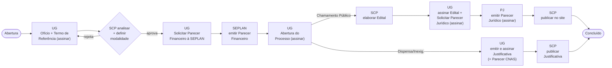

# Plataforma de Gestão de Parcerias - PGP

> **Instrução para IA:** Este README é um documento vivo. Sempre que realizar qualquer trabalho neste projeto, atualize as seções `## O que foi feito` e `## O que está sendo feito` antes de encerrar a conversa. Não omita etapas concluídas — o histórico completo importa para quem continuar o trabalho.

---

## Sobre o projeto

Plataforma web em **Laravel** para gestão completa de parcerias públicas entre Secretarias Municipais e OSCs (Organizações da Sociedade Civil). Cobre todo o ciclo: planejamento → proposta → análise → formalização → execução → monitoramento → prestação de contas.

**Repositório:** https://github.com/IsaacMRodrigues/gestaoParcerias  
**Stack:** Laravel 13, MySQL, TailwindCSS, Blade  
**Pacotes principais:** Laravel Breeze (auth), Spatie Laravel Permission (perfis), simple-qrcode (validação), dompdf (PDF dos documentos)  
**Equipe:** 2 desenvolvedores

---

## Setup do projeto (para quem clonar)

```bash
composer install
npm install && npm run build
cp .env.example .env
php artisan key:generate
# Configurar DB_DATABASE, DB_USERNAME, DB_PASSWORD no .env
php artisan migrate
php artisan db:seed
```

---

## Ordem de desenvolvimento planejada

1. [x] Estrutura base Laravel + autenticação + perfis/permissões
2. [x] Cadastro de usuários (CRUD + atribuição de perfil)
3. [x] Cadastro institucional (Órgãos/Secretarias e OSCs)
4. [x] Banco de Programas e Chamamentos Públicos
5. [x] Propostas + Plano de Trabalho
6. [x] Workflow de Análise e Aprovação
7. [x] Formalização (geração de instrumentos + assinatura eletrônica)
8. [x] Portal público + auto-cadastro de OSC + upload de documentos
9. [x] Módulo Unidade Gestora — 2.1 Planejamento (Processos, Termo de Referência, trâmite entre setores)
10. [x] Módulo Unidade Gestora — 2.2 Seleção/Celebração e 2.3 Execução do Concedente (incl. Ordem de Pagamento)
11. [~] Execução financeira (repasses, despesas, notas fiscais — falta integração bancária)
12. [ ] Monitoramento e Fiscalização
13. [ ] Prestação de Contas
14. [ ] Integrações externas (bancária, Diário Oficial)

---

## Fluxograma do sistema

### Ciclo da parceria (visão macro)

Do planejamento interno até a prestação de contas. As etapas tracejadas ainda não foram implementadas (fases 11–13).


### Trâmite interno do Planejamento (Módulo UG 2.1)

O trâmite **bifurca na análise do SCP (etapa 1)**, quando a modalidade é decidida. As etapas 0–4
são comuns às duas rotas; a partir da 5 o caminho muda (`Processo::ETAPAS` × `ETAPAS_DISPENSA`,
resolvidos por `$processo->etapas()`). O SCP pode **devolver** para a UG. Use sempre
`$processo->etapas()` — nunca a constante estática.



> O número do processo segue o padrão `UG.Sequencial.Ano.Esfera` (ex.: `0206.0133.2026.01`).
> **Rota Chamamento Público (9 etapas):** a **Procuradoria Jurídica (`pj`)** entra no trâmite — no
> mesmo passo em que assina o Edital, a UG preenche e assina a **Solicitação de Parecer Jurídico**
> (Modelo VI) e encaminha à PJ, que emite o **Parecer Jurídico** e devolve à SCP para publicação.
> **Rota Dispensa/Inexigibilidade (7 etapas):** no lugar do Edital+Jurídico, a **UG emite e assina a
> Justificativa** de Dispensa/Inexigibilidade (art. 30–32 da Lei 13.019/2014) — com o **Parecer
> Técnico CNAS** opcional, só nas parcerias do SUAS — e o SCP publica.

---

## Perfis de usuário (lista oficial — Módulo 1)

São 21 perfis. Um usuário pode ter **vários**; os marcados 🔒 são **exclusivos** de um setor
(só atribuíveis a quem é lotado nele).

| Slug | Perfil | 🔒 Setor | Permissões |
|---|---|---|---|
| `administrador_setorial` | Administrador Setorial | TI | todas |
| `responsavel_unidade_gestora` | Responsável da Unidade Gestora | UG | planejamento, chamamentos, propostas, decisão, formalização |
| `analista_tecnico_scp` | Analista Técnico do SCP | SCP | planejamento, chamamentos |
| `responsavel_publicacao` | Responsável pela Publicação | SCP | chamamentos |
| `analista_orcamentario_financeiro` | Analista Orçamentário Financeiro | SEPLAN | planejamento |
| `analista_juridico` | Analista Jurídico | — | parecer jurídico, planejamento (acesso à caixa) |
| `analista_viabilidade_tecnica` | Analista de Viabilidade Técnica | — | parecer técnico |
| `analista_aditivo_apostilamento` | Analista de Aditivo e Apostilamento | — | formalização |
| `analista_prestacao_contas_previa` | Analista de Prestação de Contas Prévia | — | prestação de contas |
| `comissao_selecao` | Comissão de Seleção | Com. Seleção | propostas, parecer técnico, decisão |
| `comissao_monitoramento_avaliacao` | Comissão de Monitoramento e Avaliação | Com. Avaliação | monitoramento |
| `gestor_parceria` | Gestor da Parceria | gestor | planejamento, monitoramento |
| `cadastrador` | Cadastrador | — | chamamentos, propostas, formalização |
| `contador` | Contador | — | prestação de contas |
| `encaminhador` | Encaminhador | — | formalização |
| `operador_ordem_pagamento` | Operador de Ordem de Pagamento | — | *(futuro: pagamento)* |
| `aprovador_assinatura_eletronica` | Aprovador de Assinatura Eletrônica | — | *(futuro: assinatura)* |
| `auditor_externo` | Auditor Externo | — | todas (**somente leitura**) |
| `auditor_geral` | Auditor Geral | — | todas (**somente leitura**) |
| `analista` | Analista (em descontinuação) | — | acesso básico |
| `responsavel_legal` | Responsável Legal | OSC | só portal |

### O que cada área de permissão libera (em telas)

| Permissão | Dá acesso a |
|---|---|
| `cadastros` | Menu **Cadastros**: Usuários, Órgãos/Secretarias, OSCs |
| `planejamento` | Menu **Planejamento**: Processos, Termo de Referência, peças e **Caixa de Entrada** (trâmite) |
| `chamamentos` | Menu **Programas**: Programas, Chamamentos e **Seleção** (checklist 2.2) |
| `propostas` | Menu **Propostas**: Propostas + Plano de Trabalho (metas/etapas) |
| `pareceres_tecnico` | Emitir **Parecer Técnico** na análise da proposta |
| `pareceres_juridico` | Emitir **Parecer Jurídico** na análise da proposta |
| `pareceres_decisao` | Emitir a **Decisão/Seleção** final da proposta |
| `formalizacao` | Menu **Instrumentos**: Instrumentos, Aditivos, Apostilamento e Documentação (2.3) |
| `ordem_pagamento` | Emitir **Ordens de Pagamento** no instrumento vigente (2.3.1) |
| `execucao` | **Execução Financeira**: repasses, despesas, notas fiscais e saldo (4.4) |
| `monitoramento` | Monitoramento e Fiscalização *(módulo futuro)* |
| `prestacao_contas` | Prestação de Contas *(módulo futuro)* |

> As permissões são definidas em `RolesSeeder`, aplicadas por middleware nas rotas + `@can`
> na navegação (o usuário só vê no menu o que pode acessar). **Auditores** veem tudo mas não
> gravam (middleware `readonly`). **Responsável Legal** só acessa o portal (middleware `staff`).
> Setor de lotação do usuário em `User::LOTACOES`; exclusivos em `User::PERFIS_EXCLUSIVOS`.

---

## O que foi feito

- [2026-07-29] **Modais no lugar de `alert()`/`confirm()` nativos** — UX consistente em todo o sistema
  - Módulo global `resources/js/confirm-modal.js` + estilos `.cmodal-*` em `resources/css/app.css`
    (tema claro/escuro, variante *danger* vermelho, animação, fecha por Esc/backdrop/Cancelar)
  - **Sem JS na página**: os forms usam atributos — `data-confirm="..."` (pergunta antes de enviar),
    `data-confirm-variant="danger"`, `data-confirm-title`, `data-confirm-text`; links `<a data-confirm>`
    também são interceptados. O variante *danger* é inferido por palavras (Remover/Excluir/Recusar…)
  - Validação "selecione ao menos um" (download de peças em lote) virou `data-require-checked` +
    `data-require-checked-message` (antes era `alert()`)
  - Converteu **25 `confirm()`** e **1 `alert()`** em 17 views; `requestSubmit()` preserva a validação
    nativa dos campos obrigatórios (ex.: modalidade na aprovação do SCP)

- [2026-06-16] Especificação inicial recebida (`txt.txt`) e analisada
- [2026-06-16] Repositório privado criado no GitHub
- [2026-06-16] Projeto Laravel 13 criado com Breeze (Blade + TailwindCSS)
- [2026-06-16] Spatie Laravel Permission instalado e configurado
- [2026-06-16] `User` model atualizado com `HasRoles`
- [2026-06-16] `RolesSeeder` criado com os 9 perfis do sistema
- [2026-06-16] `.env` configurado para MySQL e locale `pt_BR`
- [2026-06-16] CRUD de usuários completo (listagem, criação, edição, remoção)
  - Campos: nome, e-mail, CPF, telefone, senha, perfil, status
  - Paginação, feedback de sucesso, confirmação de remoção
  - Link "Usuários" adicionado na navegação principal
- [2026-06-16] Cadastro institucional completo (Órgãos/Secretarias e OSCs)
  - Órgãos: nome, sigla, CNPJ, e-mail, telefone, endereço completo, status
  - OSCs: nome, tipo, CNPJ, contato, endereço, responsável legal, status
  - Componente reutilizável `x-address-fields` para bloco de endereço
  - Componente `x-flash-message` para mensagens de sessão
  - Dropdown "Cadastros" na navegação com Órgãos e OSCs

---

- [2026-06-16] Banco de Programas e Chamamentos Públicos
  - Programas: tipo de instrumento (Fomento/Colaboração/Cooperação), órgão, valor, vigência, status
  - Chamamentos: aninhados ao programa, tipo, valor, datas, status com 6 etapas
  - Chamamentos acessados por `/programas/{id}/chamamentos`
  - Navegação reorganizada: Usuários entrou no dropdown Cadastros; Programas no topo

---

- [2026-06-16] Propostas e Plano de Trabalho
  - Proposta vincula Chamamento + OSC com dados financeiros e datas
  - Botão "Submeter Proposta" muda status e registra timestamp
  - Plano de Trabalho: Metas (indicador, meta quantitativa, datas)
  - Etapas dentro de cada Meta (responsável, período, recursos)
  - Página show da proposta concentra todo o plano em uma única tela
  - Rotas aninhadas: propostas → metas → etapas

---

- [2026-06-16] Workflow de Análise e Aprovação
  - Pareceres: Técnico → Jurídico → Decisão Final (cada um desbloqueia o próximo)
  - Resultados: Aprovado / Aprovado com Ressalvas / Reprovado / Diligência
  - Transições de status automáticas na proposta via mapa de transições no model
  - Diligência criada junto ao parecer; OSC responde na página da diligência
  - Proposta volta para `em_analise` automaticamente quando todas as diligências são respondidas
  - Seção "Análise" aparece no show da proposta com botões contextuais por etapa

---

- [2026-06-16] Formalização — Instrumentos e Termos Aditivos
  - Models `Instrumento` e `Aditivo` com constantes TIPOS, STATUS, STATUS_COLORS
  - Instrumento vincula Proposta (1-para-1), registra número, tipo, objeto, valores, vigência
  - Método `dataFimVigente()` considera o último aditivo de prazo
  - Botão "Formalizar Instrumento" aparece na proposta aprovada sem instrumento
  - Botão "Ver Instrumento" aparece na proposta que já tem instrumento
  - Fluxo de status: Minuta → Assinado → Vigente (via publicação no DOE)
  - PATCH `assinar` e PATCH `publicar` para transições rápidas de status
  - Termos aditivos aninhados ao instrumento (prazo, valor, objeto, apostilamento)
  - Minuta para impressão (view sem layout, botão nativo de print)
  - "Instrumentos" adicionado na navegação principal
  - Tabelas `instrumentos` e `aditivos` migradas com sucesso

---

- [2026-06-17] Portal público, auto-cadastro de OSC e upload de documentos
  - Portal `/portal` lista chamamentos `publicado`/`em_inscricao` sem login
  - `status_efetivo` deriva "em inscrição" a partir das datas de inscrição
  - Auto-cadastro `/cadastro/osc` cria User (representante_legal) + Osc vinculados
  - Upload de documentos na proposta (admin e portal), download e remoção
  - Middleware `staff`: representante_legal só acessa o portal, não a área admin

---

- [2026-06-17] Módulo Unidade Gestora — 2.1 Planejamento (Processos)
  - `Processo` com número automático (NNNN/AAAA), vinculado à Unidade Gestora (Órgão)
  - `TermoReferencia` estruturado com as 5 seções do documento (2.1–2.5)
  - `ProcessoPeca`: Ofício, Parecer Financeiro, Abertura de Processo (texto + assinatura)
  - **Assinatura simples**: registra quem assinou e data/hora (carimbo)
  - **Trâmite real entre setores** (UG → SCP → SEPLAN → SPC) com caixa de entrada
    - Campo `setor` no usuário define em qual caixa ele recebe os processos
    - Histórico de tramitação (enviar / receber / parecer por setor)
    - Só o setor que está com o processo pode encaminhá-lo
  - Alertas automáticos de conformidade (🔴 dotação, objeto genérico, meta sem indicador,
    sem justificativa, sem valor / 🟢 apto para abertura)
  - UG conclui o planejamento com "Marcar Apto" quando não há pendências
  - Tabelas: `processos`, `termo_referencias`, `processo_pecas`, `tramitacoes` + `setor` em `users`

---

- [2026-06-17] Módulo Unidade Gestora — 2.2 Seleção/Celebração e 2.3 Execução
  - **Motor genérico de peças documentais** (`Peca`, polimórfico via `pecaable`)
    - Cada item é "modelo padrão" (texto + assinatura simples) ou "arquivo" (upload)
    - Templates por categoria em `Peca::TEMPLATES`; `sincronizar()` cria o checklist (idempotente)
    - Progresso calculado sobre itens obrigatórios preenchidos
  - **2.2 Seleção e Celebração** anexada ao Chamamento (`/chamamentos/{id}/selecao`)
    - Template escolhido pelo tipo: Chamamento Público vs Dispensa/Inexigibilidade
    - Edital, comissão, pareceres, publicações, resultados, homologação, etc.
    - Link "Seleção" na listagem de chamamentos
  - **2.3 Execução** anexada a cada Aditivo (`.../aditivos/{id}/documentacao`)
    - Apostilamento usa checklist próprio; demais aditivos usam checklist de aditivo
    - Link "Documentação" em cada aditivo no show do instrumento
  - **Adiado**: 2.3.1 Ordem de Pagamento (envolve dados bancários — integração bancária
    foi definida para a última fase do projeto)
  - Tabela: `pecas` (polimórfica)

---

- [2026-06-17] Controle granular de acesso por perfil
  - Novo perfil **Administrador** (acesso total, gerencia usuários/órgãos/OSCs)
  - 10 permissões por área definidas em `RolesSeeder` e atribuídas via matriz
  - Rotas admin agrupadas por `permission:<área>`; navegação filtrada com `@can`
  - **Controle Interno**: acesso de leitura a tudo, escrita bloqueada (middleware `readonly`)
  - Pareceres autorizados por tipo (técnico/jurídico/decisão) no controller
  - Campo `setor` no usuário (já existente) continua governando o trâmite do planejamento
  - Antes: qualquer servidor autenticado fazia tudo. Agora cada perfil vê/faz só a sua área.

---

- [2026-06-18] Numeração padronizada do Processo — `UG.Sequencial.Ano.Esfera`
  - Número do Processo passa a seguir o padrão municipal `UG.NNNN.AAAA.EE` (ex.: `0206.0133.2026.01`)
    - UG = código da Unidade Gestora (4 díg.) · Sequencial = contador contínuo e global (nunca reinicia)
      · Ano = ano de abertura do processo · Esfera = concedente (01 Município, 02 Estado, 03 União, 04 Outros)
  - Campo `codigo` adicionado ao cadastro de Órgãos; de-para das 26 UGs em `UnidadesGestorasSeeder`
  - Esfera como constante `Processo::ESFERAS`, selecionável no formulário (default Município)
  - `Processo::proximoSequencial()` + `Processo::formatarNumero()`; geração no `ProcessoController@store`
    (valida esfera e exige que a UG tenha código)
  - Migrations: `codigo` (único) em `orgaos`; `sequencial` (único) + `esfera` em `processos`
  - **A confirmar com a área:** ano usado é o de abertura do processo (não do instrumento, que ainda não
    existe nessa fase); e qual UG entra quando há fundo (ex.: FIA `0213` vs Sec. de Trabalho `0209`)

---

- [2026-06-19] Perfis do Módulo 1 (reescrita do controle de acesso)
  - Substituídos os 9 perfis antigos pelos **21 perfis oficiais do Módulo 1**
  - Usuário pode ter **vários perfis** (cadastro com seleção múltipla)
  - **Perfis exclusivos** travados por setor de lotação (`User::PERFIS_EXCLUSIVOS`)
  - Setor de lotação ampliado (`User::LOTACOES`: UG, SCP, SEPLAN, PJ, TI, Comissões, Gestoria, OSC)
  - Auditores (Externo/Geral) com acesso somente leitura; Responsável Legal só portal
  - Permissões por área inalteradas — apenas remapeadas para os novos perfis
  - Setores do trâmite (Módulo 2) corrigidos: SCP/SEPLAN/PJ (SPC era erro); fluxo atualizado
  - Respostas do cliente registradas em `Docs. Desenvolvimento/respostas-cliente.md`

---

- [2026-06-19] Módulo 2 — Trâmite guiado (fiel ao fluxo do cliente)
  - 7 etapas em `Processo::ETAPAS`: UG → SCP → SEPLAN → UG → SCP → UG → SCP (publicação)
  - Coluna `etapa` controla a posição no fluxo (setores se repetem)
  - **Encaminhar** avança automaticamente para o próximo setor (sem escolha livre)
  - **Devolver** retorna à etapa anterior exigindo motivo; **Receber** registra o recebimento
  - 1ª etapa só avança com o planejamento **apto** (alertas de conformidade)
  - Última etapa (SCP) → **Concluir** marca o processo como publicação (trâmite externo)
  - Stepper visual no topo do processo mostrando a etapa atual
  - Só o setor que está com o processo pode movimentá-lo (validação no controller)

---

- [2026-06-19] Módulo 2 alinhado às respostas da cliente + modelos (Arquivos I–V)
  - **Termo de Referência** reescrito conforme o modelo real (Arquivo II): descrição da
    realidade, justificativa, objeto, objetivos, orçamento (valor/dotação/ficha/fonte), prazo
  - 🆕 Peça **Pedido de Parecer Financeiro** (Arquivo III) — SCP, na etapa de análise
  - 🆕 Peça **Edital** — SCP elabora (editor de texto) e **UG assina** na etapa seguinte
  - Documentos abrem **pré-preenchidos com o texto-modelo** do cliente (`ProcessoPeca::MODELO`)
  - Cada peça travada por **setor + etapa**; edição e assinatura podem ser de setores diferentes
    (`podeEditarConteudo` × `podeAssinar`) — caso do Edital (SCP edita, UG assina)
  - **UG automática**: usuário ganha `orgao_id` (Secretaria); na abertura do processo a UG
    vem preenchida da lotação (fallback: seleção manual p/ quem não tem UG)
  - Modelos do cliente em `Docs. Desenvolvimento/Modelos/`; respostas em `respostaduvidas.md`

---

- [2026-06-19] Módulo 2 — editor rico, documentos modelo e refinos do fluxo
  - **Editor rico TinyMCE** (self-hosted, `license_key: gpl`, offline) substitui o textarea,
    com **suporte a tabelas** (usado no Parecer Financeiro), fonte, alinhamento, listas, etc.
    Init em `resources/js/editor.js` sobre `textarea[data-editor-rico]`
  - **Termo de Referência virou documento modelo** (peça `termo_referencia`) editável no
    editor rico, igual ao Ofício — removidos model/tabela/controller estruturados antigos
  - Todos os documentos modelo são **HTML** (`ProcessoPeca::MODELO`), pré-preenchidos e fiéis
    aos Arquivos I–V; **brasão** (`https://pmsgra.net/logo.png`) no cabeçalho em tabela (logo ao lado)
  - **Fluxo corrigido (8 etapas)**: UG (Ofício+TR) → SCP **analisa e aprova/rejeita** → UG
    **solicita o Parecer** (Pedido de Parecer) → SEPLAN (Parecer) → UG (Abertura) → SCP (Edital)
    → UG (assina Edital) → SCP (publicação externa)
  - Etapa de análise do SCP com botões **Aprovar** / **Rejeitar** (`Processo::etapaEhAnalise`)
  - **Recebimento obrigatório**: só edita/assina após “Registrar Recebimento”
    (`Processo::aguardandoRecebimento` em `podeEditarConteudo`/`podeAssinar`)
  - Alertas de conformidade são **consultivos** (não bloqueiam encaminhar)

> **Editor:** TinyMCE self-hosted via npm (`npm install`), empacotado pelo Vite — **rode
> `npm run build`** após clonar. Interface do editor em inglês (ícones universais); pacote
> pt-BR pode ser adicionado depois. O brasão vem de URL pública (precisa de internet ou baixar local).

---

- [2026-06-25] Identidade visual unificada (PGP) e UX
  - Login com gradiente indigo + marca PGP; navegação rebrandizada com badge PGP e chip de
    usuário (avatar de iniciais + perfil + setor)
  - **Dashboard real** (substitui o stub): cards de métricas por permissão, caixa de entrada
    do setor e atalhos rápidos (`x-stat-card`, `x-quick-link`)
  - Portal público enriquecido: hero, empty-state e seção "Como participar"
  - Botões/links no tema indigo; shell com título PGP e rodapé

- [2026-06-25] Ordem de Pagamento (Módulo UG 2.3.1)
  - `OrdemPagamento` (várias por instrumento vigente): documento modelo padrão com assinatura
    eletrônica (carimbo + QR + validação pública) e anexo de dados bancários
  - Validação pública (`/validar`) estendida para reconhecer OP além das peças de processo
  - Permissão `ordem_pagamento` (perfil `operador_ordem_pagamento` + Responsável da UG)

- [2026-06-25] Preenchimento automático ("puxar") dos modelos
  - `App\Support\Modelo` substitui marcadores `{{token}}` pelos dados conhecidos ao criar o
    documento: nº do processo, Unidade Gestora, responsável, data; na OP: nº da OP, instrumento,
    OSC favorecida. O conteúdo autoral/orçamentário permanece manual. Nº do Ofício é manual
    (numeração externa ao sistema).

- [2026-06-25] Execução Financeira (Módulo 4.4 — fase 11, parcial)
  - `Repasse` e `Despesa` (com **natureza de despesa** e upload de **nota fiscal**) no instrumento
  - **Painel de saldo**: total repassado, total gasto, saldo, % executado + alertas de
    inconsistência (saldo negativo, despesa sem NF) e resumo por natureza
  - Permissão `execucao` (Responsável da UG + Gestor da Parceria)
  - Falta: rendimentos, conciliação/integração bancária (fase 14), auto-relato pela OSC

- [2026-06-25] Acesso do jurídico à caixa (permissão `planejamento` ao `analista_juridico`) e
  **tela 403 amigável** (`errors/403.blade.php`) na identidade PGP, exibindo a mensagem específica
  do `abort()` quando houver.

- [2026-06-29] Módulo 2 — etapa da Procuradoria Jurídica no trâmite (8 → 9 etapas)
  - Depois do Edital, antes da publicação, o trâmite ganha o Jurídico em `Processo::ETAPAS`:
    **(7) UG** assina o Edital **e**, no mesmo passo, preenche e assina a **Solicitação de Parecer
    Jurídico** (Modelo VI, texto do Arquivo VI do cliente) e encaminha à PJ; **(8) PJ** preenche e
    assina o **Parecer Jurídico** e devolve à SCP; **(9) SCP** publica
  - Duas peças novas em `ProcessoPeca` (`solicitacao_parecer_juridico`, `parecer_juridico`) com modelo
    pré-preenchido (a da PJ é modelo-padrão em branco, a definir com a Procuradoria), assinatura
    carimbo+QR e validação pública — reaproveitam todo o motor de peças/tramitação existente
  - Migration `add_etapa_juridico_to_processos`: cria as peças nos processos já abertos e remapeia
    quem estava na antiga última etapa (7 = publicação) para a nova (8)
  - **Setup:** o usuário que atua na etapa do PJ precisa de **lotação `pj`** + perfil com permissão
    `planejamento` (ex.: `analista_juridico`)

- [2026-06-29] Módulo 2 — modalidade da seleção definida pelo SCP na análise
  - Na etapa de análise (SCP), ao **Aprovar**, o setor escolhe a **modalidade** que define o caminho
    do processo: **Chamamento Público**, **Dispensa** ou **Inexigibilidade** (`Processo::MODALIDADES`,
    com descrições em `MODALIDADES_DESC`); obrigatório para aprovar (validado em `TramitacaoController`)
  - Coluna `modalidade` em `processos`; a escolha aparece no card do fluxo e orienta o passo do Edital
    (Edital × justificativa de dispensa/inexigibilidade) e o checklist de Seleção 2.2
  - Cabeçalho (brasão) + título "PEDIDO DE PARECER FINANCEIRO" no modelo do `pedido_parecer`, que era
    o único documento financeiro sem cabeçalho — alinhado aos demais

- [2026-06-29] Checklists 2.2/2.3 — "puxar do módulo Gestão de Parcerias"
  - Itens de arquivo marcados como puxáveis (`Peca::PUXAVEIS`) agora podem ser preenchidos a partir
    dos documentos que a OSC já enviou na proposta, além do upload manual
  - Seleção 2.2 (Dispensa/Inexigibilidade): Plano de trabalho, Documentos de habilitação;
    Aditivo/Apostilamento 2.3: Manifestação da OSC, Plano atualizado, Orçamento, Extratos, etc.
  - Origem resolvida por `Peca::documentosDisponiveis()` (Chamamento → propostas; Aditivo →
    instrumento → proposta); `PecaController@puxar` copia o arquivo para a peça (rota `pecas.puxar`)
  - UI no partial compartilhado `pecas/_checklist` (vale para Seleção e Documentação do Aditivo)

- [2026-06-29] Processo — baixar peças selecionadas em PDF (individual)
  - Checkbox ao lado de cada documento preenchido na lista "Peças do Processo" + botão
    "Baixar selecionados (PDF)" → **1 documento** baixa o PDF direto; **vários** vêm num **ZIP com
    um PDF separado por documento** (download individual), nomeados na ordem oficial
  - PDF gerado no servidor com **dompdf** (`ProcessoPecaController@imprimirLote` → `pdfDaPeca`), brasão
    remoto + carimbo de assinatura + QR (SVG embutido) nos assinados; view `processos/peca-pdf`
  - `imprimirLote` valida que as peças pertencem ao processo e ignora as vazias

- [2026-06-29] Validação pública mostra uma cópia do documento
  - Em `/validar/{codigo}` (pelo QR ou pelo código), além dos metadados de autenticidade, a página
    agora exibe a **cópia fiel do documento assinado** (conteúdo HTML renderizado com brasão/tabelas)
  - `ValidacaoController@mostrar` passa o `conteudo`; vale para peça de processo e ordem de pagamento

- [2026-06-29] Onboarding de usuários com aprovação do administrador
  - **Auto-cadastro** (`/register`) reescrito para servidores internos: informa dados, **setor**,
    **Secretaria/UG** (lista de Órgãos) e **escolhe a própria senha** → cria usuário **pendente, sem
    perfil e sem login**. OSC continua pelo portal (`/cadastro/osc`)
  - **Trava de login** (`LoginRequest`/`User::podeAutenticar`): pendente, recusado ou inativo não
    autentica, com mensagem explicando o motivo (antes o login não checava `status`)
  - **Aprovação pelo admin** (permissão `cadastros`): tela `usuarios/pendentes` lista os cadastros,
    o admin **atribui os perfis** (confirma setor/UG) e **aprova**, ou **recusa** com motivo
    (`UserController@pendentes/aprovar/recusar`); badge de contagem na navegação e na lista de Usuários
  - **Subusuários da UG**: o `responsavel_unidade_gestora` cadastra usuários da sua Secretaria
    (`/meus-usuarios`, `SubusuarioController`) — herdam a UG, ficam **pendentes** e o admin define os
    perfis na aprovação
  - Migration `add_approval_to_users` (`approval_status` default `aprovado`, `approved_at/by`,
    `created_by`, `solicitacao_obs`, `rejeitado_motivo`) — usuários existentes seguem aprovados.
    Usuários criados pelo admin (CRUD) e OSCs entram já aprovados

- [2026-06-29] Interface em pt-BR + política de senha
  - `APP_LOCALE=pt_BR` (estava `en`); senha mínima **6 caracteres** (texto e/ou números, sem
    complexidade) via `Password::defaults()` no `AppServiceProvider` + ajustes em UserRequest/OscRegistro
  - Traduções: `lang/pt_BR.json` (strings do Breeze: login, perfil, etc.) e
    `lang/pt_BR/{validation,auth,passwords,pagination}.php` (mensagens do framework); rótulo
    "Dashboard" → "Painel". Mensagens de validação e telas de auth/perfil agora em português

- [2026-06-29] Refinamentos de UI do onboarding
  - **Navbar responsiva** corrigida (estava espremida): quebra de linha desligada nos itens,
    container mais largo (`max-w-screen-2xl`) e breakpoint do menu `sm` → `lg` (menu completo só
    em telas grandes; hambúrguer nas demais)
  - **Matrícula** virou campo **obrigatório** e **Função/observação** passou a exigir preenchimento
    no cadastro de subusuário da UG (`SubusuarioController` + view); migration `add_matricula_to_users`
    (`matricula` única, opcional no modelo)

- [2026-07-03] Módulo 2 — rota de **Dispensa/Inexigibilidade** no trâmite (Lei 13.019/2014, arts. 30–32)
  - Quando o SCP decide **Dispensa** ou **Inexigibilidade** na análise (etapa 1), o trâmite passa a
    seguir uma rota própria de **7 etapas** (`Processo::ETAPAS_DISPENSA`), em vez das 9 do Chamamento:
    depois da Abertura, no lugar de *Edital → Solicitação/Parecer Jurídico*, a **UG emite e assina a
    Justificativa** de Dispensa/Inexigibilidade e o **SCP publica**. Etapas 0–4 são idênticas nas duas rotas
  - `ETAPAS` virou **ciente da modalidade**: `Processo::etapas()`/`ehDispensa()` resolvem a sequência;
    todos os consumidores (`etapaInfo`, `proximoSetor`, `setorAnterior`, `totalEtapas`, `pendenciasParaAvancar`,
    `TramitacaoController@avancar/devolver`, stepper e lista de peças no `show`) passaram a usar `etapas()`
  - Duas peças novas em `ProcessoPeca`: **Justificativa de Dispensa/Inexigibilidade** (UG, etapa 5,
    modelo com cabeçalho + fundamento legal) e **Parecer Técnico (CNAS)** — opcional, só parcerias do SUAS.
    Reaproveitam o motor de assinatura (carimbo+QR), validação pública e PDF já existentes
  - Migration `add_rota_dispensa_pecas`: cria as peças nos processos abertos e **realinha** os de
    dispensa/inexigibilidade que já estavam além da rota curta (a publicação final 8→6; Edital/Jurídico 5–7→5)
  - Peças opcionais têm fonte única em `ProcessoPeca::OPCIONAIS` (não bloqueiam o avanço) + badge "opcional" no `show`

- [2026-07-03] Ponte **Processo → Seleção 2.2** para a rota de dispensa (itens 7–18 do checklist)
  - A partir da Justificativa (etapa ≥ 5) o processo de dispensa ganha o card **"Seleção 2.2 — Celebração"**
    (`processos/{processo}/selecao`), reunindo plano de trabalho, habilitação, pareceres, minuta e termo
  - Reusa **integralmente** o motor `Peca` ancorando o checklist `dispensa_inexigibilidade` **ao próprio
    Processo** (relação polimórfica `Processo::pecasSelecao()`), já que na dispensa não há Chamamento
    competitivo. `Peca::sincronizar()` ganhou parâmetro de relação (default `pecas`) para não colidir com
    as peças do trâmite. O partial `pecas/_checklist` e as rotas `pecas.*` (por id) servem sem alteração
  - Guardas: `abort 404` fora da modalidade dispensa; `abort 403` antes da etapa da Justificativa
    (`Processo::podeVerSelecao()`). O "puxar do módulo Gestão de Parcerias" fica indisponível (sem proposta
    ligada ao Processo) — o partial já degrada com aviso; upload/assinatura manuais funcionam normalmente

- [2026-07-03] Modelos oficiais VII–XI encaixados na rota de dispensa
  - **Trâmite** (`ProcessoPeca::MODELO`): a **Justificativa** (Modelo VIII, art. 30, VI / 32) e o **Parecer
    Técnico CNAS** (Modelo IX, Res. 21/2016) trocaram o texto-placeholder pelos **textos oficiais** do
    cliente (HTML com cabeçalho/brasão + tokens `{{...}}`)
  - **Seleção 2.2** ganhou pré-preenchimento: novo `Peca::MODELO` (por categoria→chave) semeado no
    `sincronizar()` — **Certidão de Autuação** (VII), **Parecer Técnico da UG p/ celebração** (X) e
    **Protocolo ao Jurídico** (XI), além de Justificativa e Parecer CNAS. Motor `Peca` não tinha modelo;
    agora as peças "modelo" nascem com o texto oficial (texto puro, pois a Seleção usa textarea simples)
  - Migration `seed_modelos_selecao_dispensa`: preenche as peças de Seleção vazias e re-semeia as peças
    do trâmite que ainda tinham placeholder — **conservador**: nunca sobrescreve conteúdo assinado ou editado

- [2026-07-09] Rota de Dispensa/Inexigibilidade conferida com o checklist oficial e commitada
  - Cruzamento com `Docs. Desenvolvimento/checklist_dispensa⁄inexigibilidade.pdf` (Lei 13.019/2014,
    arts. 30–32): itens **1–14** cobertos (trâmite 1–6 + Seleção 2.2 itens 7–14); item **15** parcial
    (upload de extrato, sem integração DOE/GovBr); itens **16–18** ainda não implementados
    (autorização de início à OSC, solicitação de dados bancários, Nota de Empenho Global)
  - Código, migrations, view `processos/selecao`, modelos VII–XI e PDFs de checklist versionados
    no GitHub (`main`)

- [2026-07-13] Modelos padrão da Seleção/Documentação preenchidos com os arquivos oficiais
  - Novos textos em `Peca::MODELO`: Chamamento (Edital + Parecer jurídico), Dispensa (+ Parecer
    jurídico), Aditivo (Parecer financeiro, Certidão, Protocolo, Parecer jurídico). Restam 13
    sem arquivo do cliente (aprovação plano, minutas, termos, justificativas/autorizações)

- [2026-07-13] Ponte **Processo concluído → Chamamento** no módulo Programas
  - Ao **Concluir** o trâmite, o sistema cria automaticamente um `Chamamento` (status
    `publicado`) vinculado ao Processo (`processo_id`) e a um Programa da UG (criado se
    necessário). Card no `processos/show` com links; botão **Gerar Chamamento** para
    processos já concluídos sem publicação. Portal público lista só `chamamento_publico`

- [2026-07-13] Modelos da Seleção 2.2 com **HTML + brasão + TinyMCE** (igual ao trâmite)
  - `Peca::MODELO` passou de texto puro para HTML com cabeçalho/brasão; checklist usa
    `data-editor-rico`; migration converte peças não assinadas ainda em TXT
  - Assinatura da Seleção ganhou **carimbo + QR + código de validação** (`codigo_validacao`
    em `pecas`, validação pública em `/validar`) — antes só gravava quem/quando

- [2026-07-15] Unificação da Seleção 2.2 e ligações da cadeia completa
  - **Seleção 2.2 unificada no Chamamento**: como todo processo concluído passou a gerar um
    Chamamento (que já carrega a Seleção), a ponte antiga que ancorava o checklist da dispensa
    **no Processo** virou duplicata — removida (`processos.selecao`, `Processo::pecasSelecao/
    categoriaSelecao/podeVerSelecao`, view `processos/selecao`). Migration
    `remover_selecao_ancorada_no_processo` apaga as peças órfãs (preserva assinadas). Agora
    dispensa e chamamento_publico usam o **mesmo** caminho: `chamamentos/{chamamento}/selecao`
  - **Backlink Chamamento → Processo**: a listagem de chamamentos mostra "← originado do
    Processo NNNN" com link (`ChamamentoController@index` faz eager-load de `processo`)
  - **Atalho Processo → Termo**: o `processos/show` lista os Instrumento(s) formalizados desta
    parceria (`Processo::instrumentosDaParceria()`, via Chamamento → Proposta → Instrumento)
    com status e OSC, linkando para o Termo
  - **Cadeia verificada ponta a ponta** (chamamento_publico): concluir → Chamamento `publicado`
    → aparece no Portal. ⚠️ o chamamento nasce **sem período de inscrição**; enquanto a UG não
    o define, não aceita propostas — o `show` agora exibe aviso com link "Definir datas"

- [2026-07-27] Ajustes de UX e base para **anexos das peças do trâmite** (em andamento)
  - **"Peças do Processo" → "Documentos do Processo"** no `processos/show` e na Documentação do
    Aditivo — "peça" é jargão interno; a tela agora fala a língua do usuário
  - **Cadastro de OSC**: blocos reordenados — *Dados da OSC* primeiro, *Dados do Representante
    Legal* depois (quem se cadastra pensa primeiro na entidade, depois em quem responde por ela)
  - **Modelos oficiais XII–XX recebidos do cliente** e versionados em
    `Docs. Desenvolvimento/Modelos/`: Relatório da Comissão de Seleção, Ata, Resultado
    provisório e definitivo do Edital, Aprovação do Plano de Trabalho, Termo de Adjudicação e
    Homologação, Ordem de Pagamento GLOBAL e PARCIAL. **Ainda não encaixados** em `Peca::MODELO`
    — reduzem a lista dos 13 modelos pendentes, mas o texto precisa ser transposto para HTML
  - **Limpeza dos assets**: removidos 5 CSS antigos de `public/build/assets` que não eram mais
    referenciados pelo `manifest.json` (sobras de builds anteriores versionadas por engano)
  - **Base (ainda não ligada na interface) para peças do tipo ARQUIVO**: tabela
    `processo_peca_anexos` (1:N) + model `ProcessoPecaAnexo`, e duas peças novas em
    `ProcessoPeca` — **Portaria da Comissão de Seleção** (UG, etapa 6) e **Comprovante de
    Publicação** (SCP, etapa 8, Diário Oficial + site). Constantes `ProcessoPeca::ARQUIVO`
    (peça é só upload, sem editor nem assinatura — preenchida quando tem ≥ 1 anexo) e
    `COM_ANEXOS` (peça de texto que também aceita anexos — caso do Edital)
  - ⚠️ **Falta para concluir**: relação `anexos()` em `ProcessoPeca`; rotas/controller de
    upload, download e remoção; exibir as duas peças no `$ordem` do `processos/show` e tratar o
    tipo ARQUIVO na tela de edição; considerar os anexos em `pendenciasParaAvancar`; e migration
    que cria as peças novas nos processos já abertos (hoje só nascem em processos novos)

- [2026-07-27] **Anexos das peças do trâmite — concluído** (fechou a lista "Falta para concluir" acima)
  - `ProcessoPeca::anexos()` (HasMany p/ `ProcessoPecaAnexo`) + helpers `ehArquivo()`,
    `aceitaAnexos()`, `temAnexo()` e `podeAnexar()` (mesma regra de `podeEditarConteudo`, mas
    para arquivos). `podeEditarConteudo()` agora ignora peças ARQUIVO (não têm texto)
  - **Upload / download / remoção** de anexos: `ProcessoPecaController@anexar|baixarAnexo|removerAnexo`
    e rotas `processos.pecas.anexos.{store,download,destroy}` (disco `local`, em
    `processo-pecas/{peca_id}/`, mesmos limites do motor de peças: PDF/Word/Excel/JPG/PNG, 10 MB)
  - **Interface**: partial reutilizável `processos/_anexos.blade.php`; `processos/peca` mostra a
    seção de anexos (peça ARQUIVO substitui o editor; o **Edital** mostra editor **e** anexos);
    `processos/show` inclui `portaria_comissao` e `comprovante_publicacao` no `$ordem` do
    Chamamento (ordenadas por etapa) com rótulo "Anexar" e status por nº de arquivos
  - **Bloqueio de avanço**: na etapa 6 (Chamamento), a **Portaria da Comissão de Seleção** exige
    ≥ 1 anexo para encaminhar. O Comprovante de Publicação (etapa final) **não** bloqueia o
    "Concluir" — a prova de publicação é anexada depois de publicar
  - **Backfill**: migration `2026_07_27_120000_seed_pecas_arquivo_processos_existentes` cria as
    duas peças ARQUIVO nos processos já abertos (nos novos já nascem pelo `store`)

- [2026-07-29] Portal público, publicação por modalidade e clareza do checklist de Seleção
  - **Documentos no portal público**: `portal/chamamento` ganhou a seção **"Documentos do Chamamento"**,
    que lista as peças assinadas do processo de origem (Edital / Justificativa de Dispensa / Parecer
    CNAS) com link para a **página oficial de validação** (`validacao.mostrar`), onde a OSC lê o teor
    completo e confere a assinatura. `PortalController@chamamento` monta `$documentosPublicos`
    (peças `assinado()` + `codigo_validacao`) a partir de `processo.pecas`
  - **Card "Dados do Chamamento"** na tela interna de Seleção (`chamamentos/selecao`): objeto, tipo/status,
    órgão, valor, datas, requisitos e atalhos (processo de origem, editar, ver no portal).
    `ChamamentoController@selecao` passou a carregar a relação `processo`
  - **Publicação com modalidade escolhida no ato**: correção do **422** ao gerar publicação/chamamento
    quando o processo estava concluído sem `modalidade`. `TramitacaoController@publicar` agora aceita e
    valida `modalidade` (`Rule::in(Processo::MODALIDADES)`) quando ausente, e `processos/show` mostra o
    seletor de modalidade antes de gerar
  - **Checklist de Seleção mais claro** (`pecas/_checklist`): toda peça exibe selo explícito —
    🔴 **obrigatório** ou ⚪ **opcional** — em vez de só marcar as opcionais. Fecha a dúvida do "2/7":
    o percentual só chega a 100% no fim do ciclo (resultado definitivo + termo de homologação), o que
    é o comportamento correto — a publicação já é travada pela **conclusão do trâmite do processo**
  - **Portal x usuário interno**: `User::temAcessoInterno()` (qualquer papel além de `responsavel_legal`).
    O layout do portal (`layouts/portal`) passa a renderizar o **menu administrativo** (`layouts/navigation`)
    no topo quando um usuário interno navega pelo portal, em vez do header simplificado — mantendo a
    navegação do sistema. Os CTAs **"Cadastre sua OSC"** (hero, estado vazio, "Como participar", bloco
    de inscrições e submenu do usuário) agora só aparecem para **visitantes** (`@guest`)
  - **Participação só para OSC**: o botão **"Submeter Proposta"** aparece apenas para usuários com OSC
    (`auth()->user()->osc`); o usuário interno vê um aviso de que a submissão é exclusiva das OSCs e
    o visitante vê "Entrar para Participar". `PortalController@participar` redireciona o interno de volta
    ao chamamento com flash `info` (em vez de mandá-lo ao cadastro de OSC, que não se aplica a ele)

- [2026-07-29] Cadastro completo de OSC (Módulo 1.2) e Matrícula do usuário interno
  - **Usuário interno (1.1)**: campo **Matrícula** no formulário (`usuarios/_form`), validação `unique`
    em `UserRequest` e persistência no `UserController` (a coluna já existia)
  - **OSC — dados básicos**: novas colunas **Data de abertura do CNPJ**, **CNAE primário** e
    **CNAE secundário** (migration `add_cadastro_fields_to_oscs_table`)
  - **OSC — representante legal**: **endereço completo** próprio (`resp_*`) — o componente
    `x-address-fields` ganhou props `prefix`/`title` e é reaproveitado para os dois endereços
  - **OSC — anexos** (disco privado `local`, PDF/JPG/PNG até 10 MB): **Cartão CNPJ** e, do
    representante, **CPF**, **Comprovante de endereço** e **Ata da diretoria**. Componente
    `x-osc-anexo` (upload + link do arquivo atual); rota `oscs.anexo` e `OscController@baixarAnexo`
    para download autenticado; `destroy` limpa a pasta `oscs/{id}`
  - **OSC — Membros/Diretoria**: nova tabela `osc_membros` + model `OscMembro` (relação `Osc::membros`),
    repeater dinâmico (Alpine.js) no formulário; `OscController` recria os membros a cada gravação
    (ignora linhas em branco)

- [2026-07-29] Ajustes na navbar administrativa (`layouts/navigation`)
  - **Execução** deixou de ser botão morto: agora é link para **Instrumentos / Termos** (onde ficam
    repasses, despesas e saldo), quando o usuário tem `formalizacao` — no desktop e no mobile
  - Corrigido o rótulo **"Monitoramento & Avaliação"** (aparecia `&amp;` escapado em dobro)
  - Logo enxuto: removido o texto "Gestão de Parcerias / Sistema público municipal" (a trilha de
    etapas tem prioridade de espaço)
  - Menu do usuário reduzido a **apenas o avatar** (iniciais), com o nome no `title`; nome completo e
    perfil saíram do topo (continuam dentro do dropdown)

- [2026-07-30] **Execução** ganha tela própria e correções de lançamento
  - A opção **Execução** da sidebar apontava para a lista de Instrumentos — clicava e caía na
    Celebração, sem sentido próprio. Agora existe **`/execucao`**: lista as parcerias já assinadas com
    **repassado, gasto, saldo e % executado**, filtros por OSC/termo/objeto e situação; clicando, abre
    a execução daquela parceria. Passou a ser gated por `permission:execucao` (era `formalizacao`)
  - **Despesa lançada sem nota fiscal não podia mais receber a nota** — caso corriqueiro, já que a
    despesa costuma ser registrada antes de a nota chegar. Novo `updateDespesa`: permite **anexar
    depois**, **substituir** ou **remover** a nota, além de corrigir data, valor, natureza, fornecedor
    e descrição. Na listagem, quem está sem nota mostra o botão **"anexar NF"**
  - **Repasses também não tinham edição** — novo `updateRepasse` corrige parcela, data, valor e
    documento/OB
  - Edição **inline** na própria tabela: cada linha vira um `<tbody>` com escopo Alpine próprio,
    alternando entre leitura e formulário (HTML válido, sem modal)

- [2026-07-30] Tela **Modelos padrão** — catálogo de apoio do TI
  - Nova tela `/modelos`, **exclusiva do perfil Administrador Setorial** (`role:administrador_setorial`
    na rota e `@role` no link da sidebar, sob a seção "Tecnologia da Informação"): reúne num só lugar
    **todos os textos-modelo** que alimentam as peças dos trâmites
  - Agrupados por origem: **Planejamento** (trâmite do Processo), **Seleção**, **Celebração**,
    **Dispensa/Inexigibilidade**, **Aditivo**, **Apostilamento** e **Ordem de Pagamento** —
    54 itens no total, dos quais **42 já têm texto**
  - Cada linha mostra a chave, o **setor responsável** e a **etapa** em que o documento é preenchido;
    quem ainda não tem texto fica marcado como **"sem texto"** (é a lista de modelos a pedir ao cliente)
  - `modelos.show` faz a **pré-visualização** do documento como ele nasce na peça, com brasão e tudo
  - `ModeloController` monta o catálogo a partir das próprias constantes (`Peca::TEMPLATES`/`MODELO`,
    `ProcessoPeca::MODELO`, `OrdemPagamento::MODELO*`) — não duplica conteúdo, então a tela reflete
    automaticamente qualquer modelo novo

- [2026-07-30] Ajuste do uso da cor — **neutro na base, marca nos detalhes**
  - Os blocos grandes de verde saturado (splash da tela principal, hero do portal, cabeçalho da
    Transparência, fundo do login e header/footer do portal) davam ar de site de campanha, não de
    ferramenta institucional. Todos passaram a **fundo neutro** (branco / `gray-50`) com texto escuro
  - A marca aparece agora como **detalhe**: faixa institucional de 4px no topo de todos os layouts
    (gradiente **verde → laranja**, mostrando as duas cores sem dominar), botões, estados ativos,
    links, ícones em chips `brand-50` e bordas de destaque
  - **O laranja ganhou função**, em vez de enfeite: identifica a **consulta pública** (cartões Cidadão /
    Parlamentar / Conselho na tela principal, com borda superior laranja), o selo da **Transparência**,
    o total de valor pactuado e os **badges de pendência** na sidebar
  - Tela principal redesenhada como página institucional: cabeçalho com a marca, chamada, e os acessos
    em **cartões** separados por finalidade (Acesso ao sistema × Consulta pública) em vez de pílulas
    sobre um fundo colorido
  - A sidebar passou a `top-1` para não cobrir a faixa institucional

- [2026-07-30] **Identidade visual da Prefeitura** e **sidebar** no lugar da navbar
  - **Paleta oficial** no `tailwind.config.js`: `brand` (verde **#00A859**, escuro **#008A48**, claro
    **#E6F9F0**) e `accent` (laranja **#EE7736**, escuro **#D4622A**, claro **#FEF3EC**), com as escalas
    50–900 interpoladas. O antigo índigo foi substituído pelo verde da marca em **590 ocorrências**
    nas views, mais os mapas de cor dos models (`STATUS_COLORS`) e o componente `stat-card`
  - **`safelist` no Tailwind**: as classes montadas em tempo de execução (`bg-{{ $color }}-100`, vindas
    dos `STATUS_COLORS`) não aparecem no código-fonte e vinham sobrevivendo à purga por acaso, porque
    as mesmas classes existiam literalmente em outro lugar. Agora estão garantidas
  - **Marca**: novo componente `x-marca` com o `logotipo.png` oficial (variante `branco` para fundos
    escuros) no lugar do badge de texto "PGP", e **favicon** `ico.png` em todos os layouts
  - Gradientes que terminavam em roxo passaram ao verde escuro da marca; os botões de consulta pública
    da tela principal (Cidadão, Parlamentar, Conselho) passaram ao **laranja de destaque**
  - **Navegação por sidebar**: a área administrativa deixou a barra horizontal (que espremia a trilha de
    6 etapas) e passou a `layouts/sidebar` — coluna fixa de 256px com a marca, o ciclo da parceria
    numerado, Cadastros e os badges de pendências; no topo restou apenas o menu do usuário (avatar).
    No celular vira gaveta com sobreposição (Alpine). A sidebar vale **também no portal** para o usuário interno; visitante e OSC seguem
    com o cabeçalho verde da marca. A barra horizontal (`layouts/navigation`) foi **removida**

- [2026-07-30] Conferência dos 8 modelos da pasta `Modelos novos` contra os `.docx` originais
  - Verificação trecho a trecho de cada modelo já incorporado. **Uma divergência encontrada e
    corrigida**: o texto do **Relatório da Comissão de Seleção** havia sido condensado demais e perdeu
    as menções ao **controle interno e ao TCE/MG** (alíneas "c" e "e") e o parágrafo de fecho sobre
    rastreabilidade e risco de glosa — restaurados
  - Migration `ressemeia_relatorio_comissao_controle_interno` atualiza as peças ainda **não assinadas**
    (peça assinada é documento definitivo e não é alterada)
  - Os demais 7 modelos conferem integralmente com o original

- [2026-07-30] **Assinatura das partes** e **Parecer da SCP** (fecha os itens que faltavam da Celebração)
  - **Contra-assinatura do Termo (assinatura das partes)**: o Fluxo Celebração diz "SCP encaminha para
    assinatura das partes", mas só a Administração assinava. A peça passou a guardar a **segunda
    assinatura** (`contra_assinado_por/em` + `codigo_validacao_contra`), com o mapa
    `Peca::CELEBRACAO_CONTRA_ASSINATURA` e `podeContraAssinar()` — o Termo é assinado pelo **Município**
    (SCP, etapa 8) e **contra-assinado pela OSC** (etapa 9). Só a OSC daquela parceria contra-assina, e
    só depois da assinatura da Administração
  - **Parecer da SCP** (conferência final): novo modelo com checklist de 9 itens conferindo plano,
    habilitação, pareceres e minuta, com conclusão favorável / com ressalvas / devolução
  - A Celebração foi de **14 para 15 etapas** — entrou a etapa 9 (OSC contra-assina) e as seguintes
    deslocaram +1; a migration reajusta as celebrações em andamento e cria a peça nova
  - Checklist da Celebração: 17 → **18 itens**; a peça mostra o estado da contra-assinatura
    (⏳ aguardando / assinado por, com o código de validação próprio)

- [2026-07-30] **Recurso administrativo da OSC** (item que faltava do Fluxo Seleção)
  - O Fluxo Seleção prevê "UG … analisa os recursos, se houver, emite resposta e envia a OSC", e o
    próprio modelo do Resultado Provisório promete que "o recurso deverá ser protocolado
    eletronicamente por meio do PGP" — o sistema não fazia nem uma coisa nem outra
  - Novo **motor de recursos** (tabela `recursos` + model `Recurso`): a **OSC protocola** pelo portal
    (fundamentação + peça recursal em PDF único) e a **UG responde** com resultado
    (**provido / parcialmente provido / improvido**) e fundamentação, gerando **código de validação**
  - Substitui a peça única "Recursos" do checklist, que não dava conta de vários recursos de OSCs
    diferentes, cada um com a sua resposta — o checklist de Seleção foi de 13 para 12 itens
  - **Fase recursal** controlada pelo trâmite: abre na etapa 3 da Seleção (após a publicação do
    resultado provisório) e só então a OSC participante pode recorrer; um recurso por OSC
  - **Trava de avanço**: a UG não emite o resultado definitivo enquanto houver recurso sem resposta
  - Isolamento: a OSC só protocola se apresentou proposta e só baixa/vê o **próprio** recurso
  - Interface: formulário e resposta na página pública do chamamento (lado da OSC) e card **Recursos**
    na tela de Seleção, com o julgamento de cada um (lado da UG)

- [2026-07-30] **Tela principal por perfil** e **Transparência pública** (fecha o `Atualizações.txt`)
  - `/` deixou de redirecionar ao portal e passou a ser a **tela principal** (`landing`), com os cinco
    acessos do modelo enviado pelo cliente: **Prefeitura** e **OSC** (levam ao login) e **Cidadão**,
    **Parlamentar** e **Conselho** (consulta livre, sem cadastro). Quem já está logado é redirecionado
    ao seu destino — interno vai ao Painel, OSC vai ao portal
  - Nova página pública **`/transparencia`** — as **parcerias celebradas**, que o texto do modelo promete:
    OSC, objeto, órgão, valor do repasse, vigência e publicação no DOE, com totalizadores (nº de
    parcerias e valor pactuado) e filtros por pesquisa, tipo de instrumento e exercício
  - **Só instrumentos assinados são públicos** (`assinado`, `vigente`, `encerrado`) — minuta não aparece
  - Link **Transparência** no menu do portal; a tela principal também atalha para cadastro de OSC,
    chamamentos abertos e validação de documentos

- [2026-07-30] **Trâmite da Celebração** (Fluxo Etapa de Celebração) — com a OSC dentro do fluxo
  - Ancorado na **proposta aprovada** (é ela que vira a parceria): `celebracao_etapa`,
    `celebracao_setor`, `celebracao_iniciada_em`/`concluida_em` em `propostas` e histórico em
    **`celebracao_tramitacoes`**
  - **`Proposta::ETAPAS_CELEBRACAO`** — 14 etapas, agora incluindo a própria **OSC** como setor:
    UG convoca → **OSC** (plano de trabalho + habilitação) → UG (aprova o plano) → SCP (pede parecer)
    → SEPLAN (parecer financeiro) → UG (portarias + parecer técnico) → SCP (protocolo) → PJ (parecer)
    → SCP (termo + assinatura das partes + publicação) → SCP (autorização de início) → **OSC** (dados
    bancários) → SCP (OP Global) → UG (assina a OP) → SCP (comprovante de empenho) → conclui
  - **Nova categoria de peças `celebracao`** com 17 documentos. Os textos-modelo são **reaproveitados**
    das categorias equivalentes via `Peca::modeloTexto()` (a rota Dispensa cobre os mesmos documentos;
    o Pedido/Parecer Financeiro vêm do trâmite do Processo; a OP Global vem de `OrdemPagamento`),
    e só os próprios da etapa são novos: **Convocação da OSC**, **Termo de Parceria** e
    **Autorização de Início de Execução**
  - **Motor de peças generalizado**: `Peca` deixou de ser específico da Seleção — `donoEmTramite()` e os
    mapas por categoria atendem Seleção (Chamamento) e Celebração (Proposta), com a interface uniforme
    `tramiteEtapaAtual()`/`tramiteEncerrado()`/`tramiteSetorLabel()` nos dois donos
  - **Segurança da vez da OSC**: quando a etapa é da OSC, além de setor + etapa exige-se que seja a
    **OSC daquela parceria** (`oscDona`); `podeVer()` impede que uma OSC baixe peça de outra. A OSC
    **não devolve** o trâmite (bloqueado no controller, não só na interface)
  - As rotas `pecas.*` saíram do grupo `permission:chamamentos|formalizacao` para `auth`: a autorização
    passou ao `PecaController` — peça em trâmite é liberada por setor + etapa (o que abre a vez da OSC);
    peça fora de trâmite continua exigindo a permissão da área
  - Tela `celebracao/show` serve **os dois públicos** (`x-dynamic-component`): layout administrativo para
    a equipe e layout do portal para a OSC. Trilha extraída para o componente reutilizável
    `x-tramite-trilha`. Link "Celebração" na proposta (interno) e em Minhas Propostas, com selo
    **"sua vez"** quando a bola está com a OSC

- [2026-07-30] **Trâmite da Seleção** (Fluxo Seleção) e perfil do **Prefeito Municipal**
  - **Perfil novo `prefeito_municipal`** (Módulo 1): lotação **`pm` — Gabinete do Prefeito**, perfil
    exclusivo desse setor, com as permissões `chamamentos` e `formalizacao`. Assina o Termo de
    Adjudicação e Homologação que encerra a Seleção
  - **`Chamamento::ETAPAS_SELECAO`** — 5 etapas, só no Chamamento Público:
    1. **UG** emite Relatório da Comissão + Ata + Resultado Provisório (assina) → SCP
    2. **SCP** anexa o comprovante de publicação do provisório → UG
    3. **UG** analisa recursos (se houver) e emite o Resultado Definitivo (assina) → SCP
    4. **SCP** anexa o comprovante do definitivo e **emite** o Termo de Adjudicação e Homologação → PM
    5. **Prefeito** assina o Termo → encerra a Seleção e devolve à UG para a Celebração
  - Campos `selecao_etapa`/`selecao_setor`/`selecao_concluida_em` em `chamamentos` e histórico em
    **`selecao_tramitacoes`** (quem encaminhou/devolveu, quando e o motivo)
  - **`SelecaoController`** com `avancar`, `devolver` e `concluir`: só o setor que está com a Seleção
    movimenta; devolução exige motivo; encaminhar exige as peças da etapa prontas. Ao encerrar, o
    chamamento vai a `encerrado` com `data_resultado` preenchida
  - **Peça designada por setor + etapa**: `Peca::SELECAO_SETOR`, `SELECAO_ETAPA` e `SELECAO_ASSINATURA`
    (o Termo é emitido pela **SCP** na etapa 4 e assinado pelo **Prefeito** na 5). `podePreencher()`,
    `podeAssinar()` e `motivoTrava()` travam a peça fora da vez — validado também no `PecaController`
    (salvar/assinar/upload/puxar/remover), não só na interface
  - Fora do Chamamento Público (Dispensa, Aditivo, Apostilamento) **nada muda**: sem trâmite, quem tem
    a permissão da tela continua editando
  - Interface: **trilha das 5 etapas** com etapa atual/concluídas, lista de pendências, botões
    Encaminhar/Devolver/Encerrar e histórico de movimentações na tela de Seleção; no checklist as peças
    travadas mostram 🔒 com o motivo

- [2026-07-30] `Atualizações.txt` — protocolo pela SCP e modelos novos de Seleção/Celebração
  - **Protocolos passam à SCP** (linha 4 do documento): `pedido_parecer` e
    `solicitacao_parecer_juridico` mudaram de `ug` para `scp` em `ProcessoPeca::SETOR_RESPONSAVEL`
  - **Rota do Chamamento ganhou uma etapa** (10 no total): a UG revisa/assina o Edital e anexa a
    Portaria da Comissão (etapa 6) e encaminha **à SCP**, que emite e assina o **Protocolo
    (Solicitação de Parecer Jurídico)** na nova etapa 7 e então segue à Procuradoria (8) e publica (9).
    Consequência: ao devolver, o PJ volta para a **SCP**, que devolve à UG se houver pendência
  - Etapa 2 (Pedido de Parecer Financeiro) passou a ser da **SCP** nas duas rotas — fecha o
    "SCP recebe, analisa e envia SEPLAN" do Fluxo CP
  - Migration `reajusta_etapas_protocolo_juridico_scp` desloca +1 as etapas 7→8 e 8→9 dos processos
    já existentes na rota Chamamento
  - **Modelos novos da Seleção** (`Peca::TEMPLATES['chamamento_publico']` passou de 11 para 13 itens):
    novos **Relatório da Comissão de Seleção** e **Ata da Comissão**; o **Resultado provisório**, o
    **Resultado definitivo** e o **Termo de Adjudicação e Homologação** deixaram de ser "arquivo" e
    viraram **modelo padrão assinável**, com o texto oficial dos `.docx` em `Peca::MODELO`
  - **Aprovação do Plano de Trabalho** (Celebração) ganhou o texto-modelo com o checklist de 15 itens
  - Migration `atualiza_pecas_selecao_modelos_novos` realinha rótulo/tipo/obrigatoriedade/ordem das
    peças já criadas e semeia os textos (mantém como arquivo o que já tinha upload, para não órfãos)
  - **Ordem de Pagamento ganhou tipo**: **Global** (empenho do exercício, uma vez por instrumento) e
    **Parcial** (subempenho de cada parcela), cada um com seu texto-modelo; seletor na tela do
    Instrumento e selo do tipo na listagem

- [2026-07-30] Filtros na tela de Programas Governamentais (`programas/index`)
  - Barra de filtros por **pesquisa** (nome/sigla), **órgão**, **tipo** e **status**;
    `ProgramaController@index` aplica com `when()`, preserva a query na paginação (`withQueryString`)
    e devolve `$orgaos`/`$filtros`. Contador de resultados, "Limpar filtros" e mensagem de vazio
    específica quando há filtro sem resultado

---

## O que está sendo feito

### 📌 Última entrega — `Docs. Desenvolvimento/Modelos novos/` e `Atualizações.txt`

O trabalho mais recente do projeto foi a implementação **completa** da pasta **`Modelos novos`** e do
arquivo **`Atualizações.txt`** que o cliente entregou (30/07/2026). Foi executado nesta ordem — as
entradas correspondentes estão em `## O que foi feito`, da mais antiga para a mais recente:

1. **Protocolos passam à SCP** (linha 4 do documento) + os **modelos novos** de Seleção/Celebração e a
   Ordem de Pagamento **Global × Parcial**
2. **Trâmite da Seleção** (UG → SCP → UG → SCP → Prefeito) e o novo perfil **Prefeito Municipal**
3. **Trâmite da Celebração**, com a **OSC dentro do fluxo**
4. **Tela principal por perfil** (Prefeitura, OSC, Cidadão, Parlamentar, Conselho) e a **Transparência**
   pública das parcerias celebradas
5. **Recurso administrativo da OSC** — protocolo eletrônico pelo portal e resposta da UG
6. **Assinatura das partes** no Termo (contra-assinatura da OSC) e o **Parecer da SCP** ← *última*

Todos os 8 modelos da pasta foram incorporados: Relatório da Comissão, Ata, Resultado Provisório,
Resultado Definitivo, Termo de Adjudicação e Homologação, Aprovação do Plano de Trabalho, Ordem de
Pagamento Global e Parcial, além da Tela principal.

**Única pendência do documento é uma decisão do cliente, não código:** como a UG passou a encaminhar à
**SCP** (e não direto ao PJ), a devolução do Parecer Jurídico por pendência agora vai para a **SCP**,
que devolve à UG — o texto do Fluxo CP dizia "envia para UG". Funciona, mas é um desvio da letra.

### Próximos passos

- Próximos blocos do roadmap, em ordem: **Monitoramento (4.5)** e **Prestação de Contas (4.6)**
  — apoiada nas despesas/saldo da Execução —, e **Notificações/e-mails (4.7)**. São o que falta para
  fechar o ciclo da parceria.
- **Fluxo real de assinatura eletrônica**: hoje assina-se direto na peça; falta a *solicitação* de
  assinatura com aprovação pelo perfil **Aprovador de Assinatura Eletrônica** (o perfil existe, o
  workflow não), com aprovação automática para o Responsável Legal.
- Pedir ao cliente os **modelos padrão ainda sem arquivo** — restam os de **aditivo e apostilamento**
  (justificativas, autorizações, minutas e termos).
- Fechar o checklist de dispensa: itens **16–18** (autorização à OSC, dados bancários, Nota de
  Empenho) e completar a **publicação do Termo** (item 15 — DOE / site / GovBr).
- Pendência transversal: **trilhas de auditoria / logs imutáveis** (requisito não-funcional).
- Itens finos: campos **Exercício** e **Prazo de Execução** no Chamamento (2.2.1 do módulo 2);
  reajuste/reequilíbrio na Formalização.
- Definir com o cliente o que **Parlamentar** e **Conselho** veem de diferente na tela principal —
  hoje ambos apontam para a Transparência, por falta dessa definição.

---

## Decisões técnicas registradas

- **Framework:** Laravel 13
- **Permissões:** Spatie Laravel Permission v8
- **Auth/UI:** Laravel Breeze (Blade) + TailwindCSS
- **Integrações bancárias:** deixadas para a última fase
- **Assinatura eletrônica:** solução a definir (GOV.BR, D4Sign, etc.)

---

## Contexto importante

- Inspirado no Transferegov (federal) e SIGCON-SAÍDA (MG), adaptado para municípios
- Multi-secretaria e multi-OSC no mesmo ambiente
- LGPD, MFA e logs imutáveis são requisitos não funcionais obrigatórios
