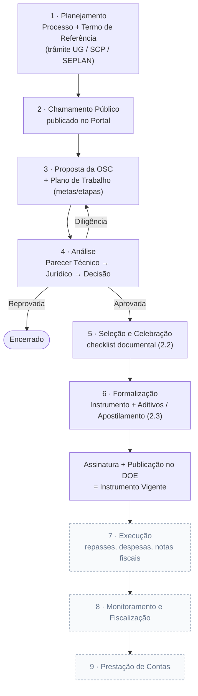

# Plataforma de Gestão de Parcerias - PGP

> **Instrução para IA:** Este README é um documento vivo. Sempre que realizar qualquer trabalho neste projeto, atualize as seções `## O que foi feito` e `## O que está sendo feito` antes de encerrar a conversa. Não omita etapas concluídas — o histórico completo importa para quem continuar o trabalho.

---

## Sobre o projeto

Plataforma web em **Laravel** para gestão completa de parcerias públicas entre Secretarias Municipais e OSCs (Organizações da Sociedade Civil). Cobre todo o ciclo: planejamento → proposta → análise → formalização → execução → monitoramento → prestação de contas.

**Repositório:** https://github.com/IsaacMRodrigues/gestaoParcerias  
**Stack:** Laravel 13, MySQL, TailwindCSS, Blade  
**Pacotes principais:** Laravel Breeze (auth), Spatie Laravel Permission (perfis), simple-qrcode (validação), dompdf (PDF dos documentos)  
**Equipe:** 2 desenvolvedores

---

## Setup do projeto (para quem clonar)

```bash
composer install
npm install && npm run build
cp .env.example .env
php artisan key:generate
# Configurar DB_DATABASE, DB_USERNAME, DB_PASSWORD no .env
php artisan migrate
php artisan db:seed
```

---

## Ordem de desenvolvimento planejada

1. [x] Estrutura base Laravel + autenticação + perfis/permissões
2. [x] Cadastro de usuários (CRUD + atribuição de perfil)
3. [x] Cadastro institucional (Órgãos/Secretarias e OSCs)
4. [x] Banco de Programas e Chamamentos Públicos
5. [x] Propostas + Plano de Trabalho
6. [x] Workflow de Análise e Aprovação
7. [x] Formalização (geração de instrumentos + assinatura eletrônica)
8. [x] Portal público + auto-cadastro de OSC + upload de documentos
9. [x] Módulo Unidade Gestora — 2.1 Planejamento (Processos, Termo de Referência, trâmite entre setores)
10. [x] Módulo Unidade Gestora — 2.2 Seleção/Celebração e 2.3 Execução do Concedente (incl. Ordem de Pagamento)
11. [~] Execução financeira (repasses, despesas, notas fiscais — falta integração bancária)
12. [ ] Monitoramento e Fiscalização
13. [ ] Prestação de Contas
14. [ ] Integrações externas (bancária, Diário Oficial)

---

## Fluxograma do sistema

### Ciclo da parceria (visão macro)

Do planejamento interno até a prestação de contas. As etapas tracejadas ainda não foram implementadas (fases 11–13).



### Trâmite interno do Planejamento (Módulo UG 2.1)

O trâmite **bifurca na análise do SCP (etapa 1)**, quando a modalidade é decidida. As etapas 0–4
são comuns às duas rotas; a partir da 5 o caminho muda (`Processo::ETAPAS` × `ETAPAS_DISPENSA`,
resolvidos por `$processo->etapas()`). O SCP pode **devolver** para a UG. Use sempre
`$processo->etapas()` — nunca a constante estática.


> O número do processo segue o padrão `UG.Sequencial.Ano.Esfera` (ex.: `0206.0133.2026.01`).
> **Rota Chamamento Público (9 etapas):** a **Procuradoria Jurídica (`pj`)** entra no trâmite — no
> mesmo passo em que assina o Edital, a UG preenche e assina a **Solicitação de Parecer Jurídico**
> (Modelo VI) e encaminha à PJ, que emite o **Parecer Jurídico** e devolve à SCP para publicação.
> **Rota Dispensa/Inexigibilidade (7 etapas):** no lugar do Edital+Jurídico, a **UG emite e assina a
> Justificativa** de Dispensa/Inexigibilidade (art. 30–32 da Lei 13.019/2014) — com o **Parecer
> Técnico CNAS** opcional, só nas parcerias do SUAS — e o SCP publica.

---

## Perfis de usuário (lista oficial — Módulo 1)

São 22 perfis. Um usuário pode ter **vários**; os marcados 🔒 são **exclusivos** de um setor
(só atribuíveis a quem é lotado nele).

| Slug | Perfil | 🔒 Setor | Permissões |
|---|---|---|---|
| `administrador_setorial` | Administrador Setorial | TI | todas |
| `responsavel_unidade_gestora` | Responsável da Unidade Gestora | UG | planejamento, chamamentos, propostas, decisão, formalização |
| `analista_tecnico_scp` | Analista Técnico do SCP | SCP | planejamento, chamamentos |
| `responsavel_publicacao` | Responsável pela Publicação | SCP | chamamentos |
| `analista_orcamentario_financeiro` | Analista Orçamentário Financeiro | SEPLAN | planejamento |
| `analista_juridico` | Analista Jurídico | — | parecer jurídico, planejamento (acesso à caixa) |
| `analista_viabilidade_tecnica` | Analista de Viabilidade Técnica | — | parecer técnico |
| `analista_aditivo_apostilamento` | Analista de Aditivo e Apostilamento | — | formalização |
| `analista_prestacao_contas_previa` | Analista de Prestação de Contas Prévia | — | prestação de contas |
| `comissao_selecao` | Comissão de Seleção | Com. Seleção | propostas, parecer técnico, decisão |
| `comissao_monitoramento_avaliacao` | Comissão de Monitoramento e Avaliação | Com. Avaliação | monitoramento |
| `gestor_parceria` | Gestor da Parceria | gestor | planejamento, monitoramento |
| `cadastrador` | Cadastrador | — | chamamentos, propostas, formalização |
| `contador` | Contador | — | prestação de contas |
| `encaminhador` | Encaminhador | — | formalização |
| `operador_ordem_pagamento` | Operador de Ordem de Pagamento | — | *(futuro: pagamento)* |
| `aprovador_assinatura_eletronica` | Aprovador de Assinatura Eletrônica | — | *(futuro: assinatura)* |
| `auditor_externo` | Auditor Externo | — | todas (**somente leitura**) |
| `auditor_geral` | Auditor Geral | — | todas (**somente leitura**) |
| `analista` | Analista (em descontinuação) | — | acesso básico |
| `responsavel_legal` | Responsável Legal | OSC | só portal |
| `membro_osc` | Membro da OSC | OSC | só portal (prepara; **não submete nem recorre**) |

### Quem atribui os perfis

Quem **cadastra** escolhe os perfis — é quem sabe o que a pessoa vai fazer no setor. A tela
`usuarios/pendentes` virou **apenas aprovar ou recusar**: mostra os perfis indicados (somente
leitura) e quem os indicou, sem formulário de perfis nem de lotação. Atribuir perfil acontece em
dois lugares, nunca na aprovação — na **criação** (responsável do setor) e em
**Cadastros → Usuários** (administrador).

- `User::perfisQuePodeConceder()` deriva a lista das regras, em vez de repetir um rol: tira os
  papéis de OSC, os de `PERFIS_VEDADOS_AO_CHEFE` e os exclusivos de **outro** setor (o subusuário
  herda a lotação de quem o cadastra, então conceder perfil de outro setor seria dar algo
  inexercível). Para um chefe de UG sobram 9 perfis operacionais.
- **`User::PERFIS_VEDADOS_AO_CHEFE`** — só a TI concede: `administrador_setorial`,
  `auditor_externo`, `auditor_geral`, `prefeito_municipal`, `responsavel_unidade_gestora`
  (senão um chefe nomearia outro) e `analista` (em descontinuação).
- A validação usa a lista **do servidor**, não a do formulário: forjar o POST com
  `administrador_setorial` é rejeitado, não ignorado em silêncio.
- O usuário nasce com os perfis mas `approval_status = 'pendente'`, e `podeAutenticar()` exige
  aprovado **e** ativo — ter papel antes da aprovação não dá acesso a nada.
- `aprovar()` não recebe mais perfis; confere a invariante que a tela antiga garantia (perfil
  exclusivo exige o setor correspondente) e recusa a aprovação com instrução, em vez de corrigir
  em silêncio.
- **Auto-cadastro (`/register`) não passa por chefe**, então chega sem perfil algum. A tela avisa
  que a pessoa entrará sem acesso a módulo nenhum e aponta para a edição do usuário — antes esse
  caso era resolvido no próprio formulário de aprovação, que deixou de existir.
- `membro_osc` não pode ser oferecido a servidor (o tornaria externo). As listas de perfis do
  admin excluem `User::PAPEIS_OSC`, não um nome de papel específico.

### A OSC como setor do trâmite (`User::setorNoTramite()`)

Os fluxos designam etapas a setores, e **um deles é a própria OSC** — na Celebração ela elabora
o Plano de Trabalho, anexa a habilitação, assina o Termo e informa os dados bancários (4 peças e
3 das 15 etapas). Mas OSC não tem lotação: `users.setor` é **NULL**.

Quem comparava `$user->setor === 'osc'` obtinha sempre falso. Efeito: quando a UG encaminhava a
Celebração à OSC, o item saía da caixa do município e **não entrava em lugar nenhum** — o trâmite
parecia ter sumido, a OSC não via que era a sua vez, não podia preencher nenhuma das suas peças e
não tinha botão para devolver. Beco sem saída: ninguém no sistema podia movimentar a parceria.

`setorNoTramite()` é o único lugar que traduz isso — devolve `'osc'` para representante de OSC e
`setor` para o resto. Aplicado em `CelebracaoController::autorizarSetor()`, em `Peca`
(`podePreencher`, `podeAssinar`, `motivoNaoPodePreencher`, fase prévia) e no guard da view
`celebracao/show`. Planejamento e Seleção seguem com `setor` cru: 'osc' não é setor daqueles fluxos.

- **Caixa de Entrada agora serve a OSC**: `CaixaDeEntrada::para()` devolvia vazio para não-interno.
  Passa a listar as Celebrações paradas com ela, nas suas próprias parcerias.
- **Faixa "É a sua vez"** no layout do portal, em qualquer página — não dá para supor que a OSC vá
  procurar. Mostra a etapa, a ação esperada e o link para continuar.

### Documentos da proposta: a OSC apresenta, o município confere

São documentos **da OSC** (estatuto, certidões, ata, habilitação). O envio é exclusivo dela;
ao município cabe **baixar, aprovar ou recusar** — `documentos.analisar` (PATCH).

- Antes os dois lados viam o mesmo botão **Remover**: o servidor apagava o documento da OSC,
  sem registro de quem apagou nem por quê, e a OSC não sabia o que refazer. Recusar guarda o
  arquivo, o autor da decisão e o **motivo** (obrigatório na recusa: `required_if`).
- `Documento::podeSerRemovido()` — a OSC retira enquanto está pendente ou recusado (retirar é
  parte de corrigir); **aprovado** já integra a instrução do processo e sai do alcance dela.
- `Proposta::aceitaDocumentosDaOsc()` — o envio era limitado a `rascunho`, o que fechava a porta
  justamente quando ela precisa estar aberta: reenviar o que foi recusado e anexar a habilitação
  na **Celebração etapa 2**, com a proposta já aprovada. Agora só fecha em `reprovada`/`cancelada`.

### Equipe da OSC (contas da organização)

OSC é organização, e organização tem equipe. O vínculo mora em **`users.osc_id`**
(vários usuários → uma OSC); **`oscs.user_id`** ficou com o sentido estrito de
*responsável legal* — quem responde juridicamente pela entidade.

> Antes o vínculo existia só em `oscs.user_id`, o que amarrava cada OSC a uma conta:
> cadastrar um segundo usuário significaria reapontar a coluna e desvincular o primeiro.
> Na prática a saída era compartilhar a senha, e todo mundo atuava sob a mesma identidade.

| Quem | Faz | Não faz |
|---|---|---|
| **Responsável legal** (`oscs.user_id`) | tudo do portal + **cadastra e suspende** a equipe | — |
| **Membro** (`membro_osc`) | prepara proposta, anexa documentos, acompanha | **submeter proposta**, **protocolar recurso**, administrar acessos |

- Tela: **Portal → Usuários** (`portal.usuarios.*`), visível só para o responsável legal.
- O acesso vale na hora — a Prefeitura não gerencia o quadro de pessoal de entidade privada,
  e o alcance é contido: o membro só enxerga a OSC a que pertence.
- Em vez de excluir, **suspende-se** (`status`): a conta continua respondendo pelo que
  enviou e assinou, mas para de autenticar.
- Quem decide se alguém é "de dentro" é **`User::temAcessoInterno()`** — os middlewares
  `staff` e `osc` são espelhos que perguntam a ele. Ao criar outro papel de OSC, some-o a
  **`User::PAPEIS_OSC`** e os dois portões acompanham sozinhos.

### O que cada área de permissão libera (em telas)

| Permissão | Dá acesso a |
|---|---|
| `cadastros` | Menu **Cadastros**: Usuários, Órgãos/Secretarias, OSCs |
| `planejamento` | Menu **Planejamento**: Processos, Termo de Referência, peças e **Caixa de Entrada** (trâmite) |
| `chamamentos` | Menu **Programas**: Programas, Chamamentos e **Seleção** (checklist 2.2) |
| `propostas` | Menu **Propostas**: Propostas + Plano de Trabalho (metas/etapas) |
| `pareceres_tecnico` | Emitir **Parecer Técnico** na análise da proposta |
| `pareceres_juridico` | Emitir **Parecer Jurídico** na análise da proposta |
| `pareceres_decisao` | Emitir a **Decisão/Seleção** final da proposta |
| `formalizacao` | Submenu **Instrumentos**: Instrumentos, Aditivos, Apostilamento e Documentação (2.3) |
| `ordem_pagamento` | Emitir **Ordens de Pagamento** no instrumento vigente (2.3.1) |
| `execucao` | **Execução Financeira**: repasses, despesas, notas fiscais e saldo (4.4) |
| `usuarios_setor` | Menu **Meus usuários**: cadastrar a equipe do próprio setor (o administrador aprova) |
| `monitoramento` | Monitoramento e Fiscalização *(módulo futuro)* |
| `prestacao_contas` | Prestação de Contas *(módulo futuro)* |

> O menu **Celebração** é a exceção à régua por permissão: quem o abre é quem participa do
> trâmite (`User::participaDaCelebracao()` — os setores de `Proposta::ETAPAS_CELEBRACAO` mais
> quem tem `formalizacao`), porque SCP, SEPLAN e PJ conduzem etapas do fluxo sem ter aquela
> permissão. **Instrumentos** é subitem dele e continua exigindo `formalizacao`.

> As permissões são definidas em `RolesSeeder`, aplicadas por middleware nas rotas + `@can`
> na navegação (o usuário só vê no menu o que pode acessar). **Auditores** veem tudo mas não
> gravam (middleware `readonly`). **Responsável Legal** só acessa o portal (middleware `staff`).
> Setor de lotação do usuário em `User::LOTACOES`; exclusivos em `User::PERFIS_EXCLUSIVOS`.

---

## O que foi feito

- [2026-08-28] **Cadastros: a Secretaria e a sua gente na mesma tela** (`orgaos.index`, `oscs.index`)
  - Eram três listagens que ninguém consultava separadas — Usuários, Órgãos/Secretarias e OSCs. Para
    saber quem responde por uma Secretaria, abria-se Usuários e procurava-se pela coluna de órgão;
    para saber quem entra em nome de uma OSC, a mesma caça na lista geral
  - **Órgãos e usuários** virou uma tela só: cada Secretaria traz as contas dela logo abaixo,
    recuadas. As contas da OSC foram para a tela de **OSCs**, ao lado da organização a que pertencem
  - Quem atende o Município inteiro não é de Secretaria nenhuma, e sem cuidado a fusão faria a SCP, a
    Procuradoria e o próprio administrador **desaparecerem da tela** — daí o bloco "Sem Secretaria",
    no fim, com os setores transversais
  - Conta ativa **sem perfil** passa a aparecer em laranja: não vê módulo nenhum, é defeito de
    cadastro e não estado normal. O aviso de "setores sem chefia" veio junto para cá
  - `usuarios.index` virou redirecionamento (link salvo continua funcionando) e a view saiu; na busca
    global as duas entradas viraram uma, com as palavras das duas — quem procura "usuários" e quem
    procura "secretaria" chega ao mesmo lugar
  - **Recolhidas por padrão**: são 27 Secretarias, quase todas com uma conta só, e a lista aberta
    virava rolagem longa para achar uma. O contador na linha ("1 usuário") diz quanto há sem abrir, e
    o cabeçalho tem um "Recolher todos" que abre e fecha tudo de uma vez — cada uma segue podendo ser
    aberta sozinha depois. Secretaria com **zero contas** aparece em laranja
  - Conferido: as cinco telas rendem, a Secretaria mostra a sua gente, o bloco transversal traz
    SEPLAN/TI/Gabinete, e as duas contas da OSC aparecem na linha dela

- [2026-08-28] **Setor transversal deixou de ser cegado pela própria lotação** (`User::SETORES_TRANSVERSAIS`)
  - A visibilidade de processos, propostas e manifestações era medida só por `orgao_id`: quem tem
    Secretaria vê a dela, quem não tem vê tudo. Isso funcionava por omissão — SCP, SEPLAN e
    Procuradoria enxergavam o Município inteiro **porque estavam sem órgão nenhum**
  - Ao registrar onde esses setores de fato ficam (a SCP dentro da Secretaria de Planejamento, a
    Procuradoria dentro do Jurídico), eles parariam de ver Educação, Obras e todas as demais — o
    oposto do que fazem: a SCP conduz a Seleção e a Celebração de todas as parcerias, a SEPLAN emite
    o Parecer Financeiro de todas, a Procuradoria o Parecer Jurídico de todas
  - `podeVerTodosOrgaos()` passa a conhecer os **setores transversais** (scp, seplan, pj, pm, ti).
    Sede não é recorte de trabalho; só a Unidade Gestora é, de fato, de uma Secretaria
  - Estrutura acertada junto: `planejamento@` deixou de ser Unidade Gestora e virou a conta da
    **SEPLAN** (o perfil de Responsável da UG é exclusivo de `ug` e não poderia acompanhar a conta);
    a **SCP** passou a constar dentro da Secretaria de Planejamento; e nasceu
    `procurador@saogoncalo.mg.gov.br` como **Procuradoria Jurídica**, sediada no Jurídico —
    `juridico@` segue Unidade Gestora daquela Secretaria, que é outra coisa
  - Conferido com dois processos e duas manifestações, de Educação e de Obras: SEPLAN, SCP e
    Procuradoria veem os dois; cada UG vê só o seu

- [2026-08-28] **A busca do login deixou de adivinhar pelo formato** (`LoginRequest::colunaDeAcesso`)
  - A escolha entre procurar por e-mail ou por nome de usuário vinha de `FILTER_VALIDATE_EMAIL`, o
    formato do que foi digitado. `admin@parcerias` — o login da conta de administração — só não caía
    na coluna errada porque o filtro do PHP recusa domínio sem ponto. Bastaria alguém cadastrar
    `admin@parcerias.net` para a conta sumir do login, sem explicação
  - Agora a pergunta é direta: existe usuário com esse `login`? Então é por `login`; senão, por
    e-mail. Uma consulta a mais por tentativa, e não se erra
  - A arroba entrou no formato aceito do nome de usuário — `admin@parcerias` não é endereço, é nome
    de conta

- [2026-08-26] **Entrada por nome de usuário, ao lado do e-mail** (`users.login`, `LoginRequest`)
  - A conta principal de administração precisava de um identificador curto (`admin_parcerias`), que
    não é endereço de ninguém. Gravar isso na coluna `email` quebraria o que depende dela ser um
    e-mail de verdade: recuperação de senha, notificações e a própria validação do cadastro
  - Coluna `users.login` nova, **nula para todo mundo**: quem tem e-mail continua entrando por ele e
    nada muda para as contas existentes. Formato restrito (minúsculas, números, ponto, hífen,
    sublinhado) para não haver duas grafias do mesmo acesso, e única no sistema
  - Um campo só na tela de entrada, agora "E-mail ou usuário": quem digita um endereço é procurado
    por `email`, o resto por `login`. O `type` do campo virou `text` — com `type="email"` o navegador
    barrava o nome antes de o formulário sequer ser enviado
  - **Fusão das duas contas de administrador em `admin_parcerias`.** O script mantém a conta que TEM
    histórico e apaga a que não tem — `processos.created_by` e as demais colunas de autoria apontam
    para um id, e trocar de conta apagaria o registro de quem fez o quê. Se as duas tivessem
    histórico ele pararia, em vez de escolher por conta própria
  - Conferido: entra por `admin_parcerias` e pelo e-mail antigo, recusa senha errada, recusa a conta
    apagada; o formato rejeita maiúscula, espaço e acento; e o login duplicado é barrado
  - **Ressalva registrada**: a senha definida (`123456`) é fraca para uma conta de acesso total num
    sistema com documentos de OSC, CPFs e dados bancários. Foi pedido assim; vale trocar no primeiro
    acesso

- [2026-08-26] **Etapa 2 do ciclo virou recolhível na barra lateral** (`layouts/sidebar`)
  - Seleção é a única etapa com três subitens (Chamamentos, Manifestações, Propostas). Para quem
    trabalha em outra fase do ciclo, eram três linhas fixas empurrando o resto do menu para baixo
  - Seta própria ao lado do rótulo: o texto continua levando ao primeiro subitem, e só a seta
    recolhe. O botão fica por cima do link, com o `pr-9` reservando o lugar — botão dentro de link
    não existe em HTML
  - A escolha fica no navegador de cada um (`localStorage`), mas **estar dentro da seção manda**:
    esconder o item aberto agora seria tirar da vista onde a pessoa está. Sem `localStorage` — janela
    anônima, site bloqueado — abre, que é o estado de sempre
  - Conferido: a expressão Alpine roda como JS puro (abre por padrão, alterna, persiste, e devolve
    "aberto" quando o `localStorage` lança), e a barra rende certo para UG, SCP e PJ — que continua
    vendo a etapa cadeada, sem seta

- [2026-08-26] **Proposta voltou a ser ato da OSC** (`PropostaController`)
  - A Unidade Gestora tinha CRUD completo de propostas: criava escolhendo a OSC num dropdown,
    editava, removia e **submetia no lugar dela**. Na prática, o município podia redigir uma proposta
    em nome de terceiro, apresentá-la por ele e depois aprová-la — sem que nada registrasse quem de
    fato propôs
  - Criar, editar, remover e submeter saíram do módulo interno, **rotas inclusive** (`->only(['index',
    'show'])`), não só os botões: esconder o botão deixaria a URL funcionando. `create`, `edit`,
    `_form` e o `PropostaRequest` foram removidos por terem virado código morto
  - A listagem passa a se apresentar pelo que é — "apresentadas pelas OSCs no portal, aqui elas são
    analisadas" — e a ação da linha virou **Analisar**. No detalhe, rascunho da OSC agora se explica
    em vez de oferecer um botão de submeter que não cabe ao município
  - Fica o que é do município: ler, analisar (parecer, diligência, decisão) e editar o plano de
    trabalho. **Pendência conhecida**: metas e etapas ainda são montadas pelo município, não pela OSC
    — na manifestação de interesse é o contrário. Vale unificar

- [2026-08-26] **"Programas e Chamamentos" virou "Chamamentos"** (sidebar, painel, busca)
  - Um nome mais curto para o que a tela é. Na busca global, "programas" continua valendo como
    palavra-chave, para quem procurar pelo nome antigo ainda encontrar

- [2026-08-26] **Gestor e Comissões voltaram a ser designáveis pela Unidade Gestora** (`User::PERFIS_DE_DESIGNACAO`)
  - Gestor da Parceria e as duas Comissões (Lei nº 13.019/2014, art. 2º, VI, X e XI) estavam
    modelados como perfis exclusivos de três "setores" — Gestoria de Parcerias, Comissão de Seleção,
    Comissão de Avaliação — que ninguém nunca ocupou, nem aqui nem em produção
  - O efeito: a UG **publica a portaria de designação dentro do próprio sistema** (portaria do gestor
    e da Comissão de Monitoramento são peças da Celebração dela; a da Comissão de Seleção é peça do
    Chamamento) e não conseguia criar a conta. O perfil não aparecia na lista dela, e atribuí-lo pelo
    cadastro exigiria tirar a pessoa da Unidade Gestora — de onde ela não sai
  - Os três deixam de ser lotação e viram **encargo**: acumulam sobre o perfil do setor, como a
    chefia. Só o setor que publica a portaria os concede (`setorQueDesigna`), e a trava do cadastro
    passa a conhecer essa regra, com mensagem própria
  - Os três "setores" saíram de `LOTACOES`: eram armadilha — lotar alguém ali o deixava fora de todos
    os trâmites, que só conhecem ug, scp, seplan, pj, pm e osc. Zero usuários afetados
  - Conferido ponta a ponta: a UG cria um gestor pela tela "Meus usuários", ele nasce lotado na UG
    com os dois encargos, e a aprovação do administrador passa — antes a invariante barrava. SCP e PJ
    seguem sem poder conceder esses perfis

- [2026-08-26] **Manifestações de Interesse no painel** (`dashboard`, `x-stat-card`)
  - A manifestação chega pelo portal e fica esperando o município encaminhar, ouvir a Secretaria e
    decidir. A única porta era o item de menu, e nada no painel dizia que havia OSC aguardando
    resposta — a fila só aparecia para quem lembrasse de ir olhar
  - Card **"Manifestações a decidir"** com a fila (submetidas, em análise e analisadas — as decididas
    saem da conta) e o total recebido, mais o atalho na fileira de baixo, como todos os outros
    módulos têm. Laranja, pela regra da paleta: é trabalho parado esperando alguém
  - `visiveisPara` mantém o recorte por Secretaria — a UG vê a fila do próprio órgão, a SCP vê tudo
  - Ícone próprio no `x-stat-card`: mão levantada, que é literalmente o gesto de manifestar interesse
  - Conferido nos três setores: SCP conta 2 de 3 (a deferida fica de fora), UG vê o card com a fila
    do próprio órgão, SEPLAN não vê nem card nem atalho por não ter `chamamentos`

- [2026-08-26] **O administrador passa a ver quais setores não têm quem cadastre a equipe** (`usuarios.index`)
  - Cadastrar a própria equipe deixou de ser exclusividade da UG em 24/08, mas depende de alguém
    receber o perfil **Chefe de Setor** — e nada avisava que isso não tinha sido feito. O resultado
    era uma porta que existe e ninguém encontra: o servidor da SCP entrava, não via "Meus usuários",
    e não tinha como saber que faltava um clique na tela do administrador
  - A listagem de Usuários agora nomeia os setores em que ninguém pode cadastrar, e diz o que fazer.
    Só conta setor que já tem gente lotada e ativa: designar chefia de setor vazio não é pendência
  - O TI fica de fora da conta por definição — quem tem `cadastros` cria e aprova direto ali, e a
    porta do setor nem aparece para ele (ver `User::podeCadastrarNoSetor`)

- [2026-08-26] **A Seleção deixou de pedir de novo o que o Planejamento já fez** (`Peca::ORIGEM_PLANEJAMENTO`)
  - O Edital nasce, é revisado, assinado pela UG e publicado dentro do processo de Planejamento. Ao
    chegar na Seleção, o checklist pedia tudo outra vez — o mesmo edital, a mesma portaria da
    comissão, o mesmo parecer jurídico, o mesmo comprovante de publicação
  - Redigitar um documento assinado **cria um segundo original**: dois textos, duas assinaturas, dois
    códigos de validação para o que é uma peça só do processo. A Seleção passa a **guardar a
    referência**, não uma cópia — coluna `pecas.origem_processo_peca_id`
  - A linha do checklist diz "Vem do Planejamento — processo nº X", com a assinatura que o documento
    já tem, e abre o documento do processo em leitura. Não há editor, upload nem botão de assinar:
    para alterar, é no Planejamento que se mexe
  - **Quem decide o que a linha mostra é o tipo do item, não o da origem.** Item de modelo herda o
    texto e exige que ele esteja assinado; item de arquivo herda os anexos e exige ao menos um. É
    isso que faz "Edital" e "Anexos" apontarem para a mesma peça do processo e cada linha mostrar o
    que o rótulo promete
  - **Trabalho manual manda**: se alguém já digitou, anexou ou assinou no item da Seleção, ele não é
    ligado — apontar para o processo esconderia esse trabalho sem aviso. O modelo semeado pelo
    sistema não conta como trabalho de alguém (era o que deixava justamente o Edital e o Parecer
    Jurídico de fora, os dois que mais interessavam)
  - Vale para as duas rotas: Chamamento Público (edital, anexos, comissão, parecer jurídico,
    publicação do extrato) e Dispensa/Inexigibilidade (justificativa, parecer CNAS, parecer
    jurídico, publicação do extrato)
  - Rota própria para baixar o anexo da origem (`pecas.origem.anexo`): a do módulo de Processos exige
    `planejamento`, e quem conduz a Seleção nem sempre tem — o Prefeito, que assina a homologação,
    não tem
  - Conferido no processo real 0206.0006.2026.01: as 5 peças ligam, nenhuma delas aceita preencher ou
    assinar, o Edital mostra o texto e o "Anexos" mostra o arquivo, sincronizar de novo não muda nada,
    o item com texto próprio não é ligado, anexo de outra peça dá 404, e Celebração (15 etapas) e
    Seleção seguem desenhando a numeração sem buraco

- [2026-08-25] **Selo de papel parou de quebrar ao meio** (`portal/usuarios/index`)
  - "Responsável Legal" não cabia na largura que a coluna recebia e a pílula quebrava em duas linhas,
    com metade do fundo verde em cada — quebrado assim, deixa de parecer selo
  - A coluna passa a ceder (`whitespace-nowrap`), não o selo; a função por extenso abaixo dele
    continua quebrando, com largura máxima própria. As cinco colunas ganharam `align-top`, para as
    linhas não flutuarem no meio quando a de Funções cresce

- [2026-08-25] **Equipe da OSC: cada integrante com as funções que lhe cabem** (`User::FUNCOES_OSC`)
  - A equipe da OSC era um bloco só: quem entrava podia tudo o que a organização pode. Entidade não
    trabalha assim — quem escreve o projeto não é quem cuida das certidões, e os dados bancários da
    Celebração não são assunto de todo mundo
  - No cadastro do integrante, e depois na listagem, o responsável legal marca **quatro funções**:
    Propostas e plano de trabalho, Documentos da organização, Manifestações de interesse e Celebração
    da parceria. São permissões Spatie com prefixo `osc_`, concedidas **por pessoa** e não pelo papel —
    um papel por combinação não terminaria nunca
  - **Ver é de toda a equipe; agir é do que estiver marcado.** Sem nenhuma função, a pessoa acompanha
    as propostas e o andamento e não altera nada. A régua fica na rota, em grupos `permission:osc_*`;
    onde a tela é compartilhada com o município (documentos da proposta, peças do trâmite) a checagem
    é no controller, com `User::oscSemFuncao()`, para que o servidor continue medido pelas permissões dele
  - **O que não virou caixa é deliberado**: submeter proposta, protocolar recurso e contra-assinar o
    Termo vinculam juridicamente a entidade e seguem com o responsável legal, que tem as quatro pelo papel
  - Botões que a pessoa não pode usar somem, e onde havia espaço entrou o motivo — clicar e levar 403
    sem explicação é o que a tela existe para evitar
  - **Migração de compatibilidade**: quem já está cadastrado como membro recebe as quatro. Ligar a
    checagem sem isso tiraria acesso de gente que trabalha, inclusive no meio de uma Celebração em
    andamento; quem deve perder função perde pela tela, por decisão do responsável legal
  - Conferido: membro só com "propostas" passa no gate dela e é barrado nas outras (rota e controller),
    a tela do chamamento troca o botão pelo aviso, POST forjado com `cadastros` é recusado na validação,
    as funções do responsável legal não são alteráveis nem por ele, e servidor da SCP/UG segue atuando
    normalmente nas peças

- [2026-08-25] **Espaço extra de anexo também na Seleção e na Dispensa** (`SelecaoController::adicionarAnexo`)
  - O botão de abrir mais um espaço de anexo existia só na Celebração. Nos comprovantes de
    publicação do chamamento — extrato do edital, resultado provisório, resultado definitivo — o
    template prevê um campo cada, e quantas publicações um chamamento exige não é regra fixa:
    republicação, errata, segunda edição do Diário. Anexar a segunda apagava a primeira
  - O botão aparece em **dois lugares, com regras diferentes**: na etapa corrente do trâmite, para
    quem está com a vez (mesma régua de avançar e devolver); e nos **documentos gerais**, onde moram
    as peças sem etapa — a fase do edital e a Dispensa inteira, que não passa por julgamento. O
    formulário diz em qual bloco nasce, porque não dá para deduzir: o mesmo usuário pode estar com a
    vez na etapa e ainda assim querer um documento geral
  - Fora da etapa, o anexo **segue a regra dos vizinhos**: no chamamento público as peças prévias têm
    dono (segregação de função — quem pede o parecer não o emite), na Dispensa nunca tiveram. Dar
    dono ali travaria justamente quem a pessoa abriu o espaço para atender
  - `Peca::emTramite()` passou a exigir setor **e** etapa. Nos mapas do template as duas andam
    juntas, mas o anexo avulso da fase prévia guarda só o setor: sem esse ajuste ele cairia no bloco
    da etapa 1 por falta de número. Os três testes de "está fora do trâmite?" espalhados pelo model
    viraram uma chamada a `emTramite()`, para não divergirem de novo
  - Conferido: SCP com a vez vê os dois botões, quem não está com a vez vê só o dos gerais, UG
    tentando criar na etapa da SCP leva 403, re-sincronizar não apaga nem move os extras, e a
    numeração das etapas continua sem buraco (Seleção 1–5, Celebração 1–15)

- [2026-08-25] **Dinheiro se digita como se escreve** (`x-input-dinheiro`, `NormalizaValoresMonetarios`)
  - Os 12 campos monetários do sistema eram `type="number"`: sem "R$" à vista, com ponto no lugar da
    vírgula e sem separador de milhar. Quem digitava 40000 não tinha como conferir a ordem de
    grandeza, e a vírgula do teclado numérico simplesmente não entrava
  - **Componente `<x-input-dinheiro>`**: prefixo R$ fixo, digitação da direita para a esquerda (como
    caixa eletrônico) e o valor formatado em português enquanto se escreve. Campo visível com
    máscara + campo oculto com o número — o que a pessoa lê não é o que o banco guarda
  - **`resources/js/money.js`**: o padrão `data-money` já existia, mas o script vivia dentro de UMA
    view. Agora é comportamento do sistema, por delegação no documento — pega inclusive campos que
    aparecem depois, como os das linhas de repasse e despesa
  - **Middleware `NormalizaValoresMonetarios`** converte no servidor o que chegar em português
    ("R$ 1.234,56" → 1234.56), então o campo funciona mesmo sem JavaScript e ninguém precisa
    lembrar de tratar isso em cada FormRequest. Conservador com o ponto, que é milhar em português e
    decimal em inglês: "40.000" vira 40000; "40.00" fica 40.00
  - Convertidos: proposta, chamamento, programa, instrumento, aditivo, manifestação, ordem de
    pagamento, repasse e despesa — incluindo as edições em linha, onde cada campo ganhou id próprio
    porque há vários na mesma página
  - **Defeito encontrado no caminho**: em `portal/participar` o par visível+oculto existia com o
    script no rodapé — mas era a única tela com ele. Passou a usar o componente
  - `disabled` passa a valer também para o campo oculto: desabilitar só o visível deixava o valor
    sendo enviado num formulário que a tela mostra como bloqueado (é o caso da OP assinada)
  - Conferido: oito formatos de entrada convertem certo, campos que parecem número mas não são
    dinheiro (`parcela`, `meta_quantitativa`: "1.200 atendimentos") ficam intactos, e a edição de
    instrumento mostra 1.251,25 para o 1251.25 do banco

- [2026-08-25] **Barra do portal parou de quebrar em duas linhas** (`layouts/portal`)
  - Com os itens novos, eram cinco links mais o nome do usuário em `max-w-6xl`: os rótulos longos
    ("Chamamentos abertos", "Minhas participações") quebravam no meio, cada um terminava com uma
    altura e a barra inteira saía desalinhada
  - Três zonas de largura previsível — marca, links, conta —, `whitespace-nowrap` nos links e
    `max-w-7xl` no container. O nome do usuário virou avatar com iniciais, e o nome por extenso só
    aparece a partir de `lg`
  - **Usuários da OSC saiu da barra para o menu da conta**, com o nome da organização por cima:
    administrar equipe é configuração, não navegação diária — e era o quinto link a disputar espaço
  - Abaixo de `md` os links viram gaveta (botão de menu), em vez de espremer. Um único array `$navItens`
    alimenta as duas formas, então não há lista duplicada para divergir
  - Conferido nos quatro casos: responsável legal, membro da OSC, servidor navegando o portal e
    visitante — cada um vê o que lhe cabe

- [2026-08-25] **Portal da OSC: a vitrine e as participações, separadas** (`portal.index`, `minhas-propostas`)
  - "Minhas Propostas" listava tudo numa fila só, sem dizer de onde cada coisa vinha — e desde a
    manifestação de interesse são **três caminhos com regras diferentes**: chamamento público
    (concorrência), dispensa/inexigibilidade (parceria direta) e manifestação (que ainda não é
    proposta). Na lista corrida, a OSC não distinguia o que estava disputando do que já era seu
  - A tela virou **Minhas participações**, com um bloco para cada origem, contador e vazio próprio —
    o de dispensa explica que ela nasce de manifestação deferida ou de convite do município; o de
    manifestações leva a criar uma
  - A **vitrine pública** (`/portal`) segue sendo a lista de tudo o que está aberto publicamente, e
    ganhou o convite que faltava: sem chamamento aberto na área da OSC, o caminho previsto em lei é
    manifestar interesse — agora há botão para isso ali, para quem está logado como OSC
  - Menu do portal renomeado para dizer o que cada tela é: **Chamamentos abertos** e
    **Minhas participações**
  - Card de proposta virou partial (`portal/_card-proposta`), reaproveitado nos dois blocos, e passou
    a mostrar o número do Termo quando já existe instrumento, com atalho para a Celebração

- [2026-08-25] **Manifestação de Interesse: a OSC propõe sem chamamento aberto** (MROSC, arts. 18–21)
  - Faltava a porta de entrada para a parceria que nasce da sociedade civil: sem chamamento
    publicado, a OSC não tinha como apresentar nada, e a dispensa/inexigibilidade só existia como
    processo aberto por dentro do município
  - **Portal da OSC** (`Manifestar Interesse`): dossiê completo — dados, Secretaria a que se dirige,
    plano de trabalho (metas e etapas) e documentos de habilitação. Enquanto é rascunho, edita-se
    tudo; **submeter é ato do responsável legal**, e só com o dossiê fechado (a Secretaria não tem
    como opinar sobre interesse público sem plano nem habilitação)
  - **Município**: a SCP recebe → encaminha à Secretaria da área → a Secretaria emite manifestação
    técnica (favorável ou não, com fundamentação) → a SCP decide. Entra na caixa de entrada dos dois
    setores, pelo mesmo `setor_atual` dos demais trâmites
  - **O deferimento é que faz o fluxo nascer**: cria o Chamamento no tipo escolhido (dispensa ou
    inexigibilidade), dentro de um programa da mesma Secretaria, e a Proposta já submetida — com as
    **mesmas** metas e documentos, que trocam de dono em vez de serem copiados. Daí em diante corre
    o fluxo de sempre, com o checklist de dispensa/inexigibilidade
  - Indeferimento exige motivo, e é ele que a OSC lê no portal
  - **Tabela própria, não proposta sem chamamento**: `propostas.chamamento_id` é a espinha por onde o
    sistema descobre o órgão dono (visibilidade, caixa, Celebração, minuta). Proposta órfã de
    chamamento seria proposta órfã de órgão em todas essas telas
  - `metas` e `documentos` ganharam `manifestacao_id` (e `proposta_id` virou anulável): duas chaves
    em vez de relação polimórfica, para as dezenas de telas que consultam `proposta_id` seguirem
    funcionando sem uma linha alterada
  - Conferido de ponta a ponta em transação: criar → montar dossiê → submeter → caixa da SCP →
    encaminhar → parecer da UG → deferir como inexigibilidade → chamamento e proposta criados com o
    plano migrado. E as travas: outra OSC não abre, membro da OSC não submete, e a SCP não defere
    antes de ouvir a Secretaria

- [2026-08-24] **Devolução dirigida: volta para a etapa que errou** (`CelebracaoController@devolver`)
  - A devolução andava um passo por vez. Com o trâmite na etapa 9 e o erro na 6, a SCP teria de
    devolver três vezes, e três setores reprocessariam o que estava certo — ou passariam o problema
    adiante para não refazer trabalho alheio
  - O formulário ganhou um **seletor com as etapas já vencidas** (número, setor e ação), começando na
    imediatamente anterior: sem escolha, o comportamento é o de sempre
  - Volta só para trás — `lt:etapa_atual` na validação, e a lista da tela só mostra o que já passou
  - O salto entra no histórico por escrito ("Devolvido da etapa 9 para a etapa 6." antes do motivo),
    senão quem lesse depois veria o trâmite reaparecer três etapas atrás sem explicação
  - Vale para qualquer setor interno com a vez, não só a SCP — a OSC segue sem devolver, como antes

- [2026-08-24] **Comprovante de publicação vira dois campos + anexos avulsos** (Celebração, etapa 11)
  - Diário Oficial e site do Município são veículos distintos e exigidos em separado, mas havia **um
    campo só**: anexar o segundo comprovante apagava o primeiro. Agora são
    `comprovante_publicacao_doe` e `comprovante_publicacao_site`, ambos obrigatórios. A migration
    renomeia a peça existente para a do Diário Oficial, **preservando o arquivo já enviado**
  - **Espaço de anexo sob demanda**: o checklist é fechado — vem do template — e quando a etapa pede
    um documento não previsto (a publicação saiu em duas edições, a Procuradoria pediu mais um
    ofício), o servidor anexava por fora do sistema ou sobrescrevia outro campo. O botão *"Adicionar
    espaço de anexo nesta etapa"* cria o campo com o nome que a pessoa der
  - Só aparece na **etapa corrente** e para **quem está com a vez**; o anexo nasce **opcional**, de
    propósito: complementa a instrução e não pode travar o encaminhamento. Vem marcado como
    *"anexo avulso"* e quem pode preencher pode excluí-lo — peça de template não se apaga, voltaria
    na próxima sincronização
  - `pecas` ganhou `extra`, `setor`, `etapa` e `criado_por`: setor e etapa moram na linha porque os
    mapas de `Peca` são indexados pela chave do template, que o anexo avulso não tem
  - Conferido em transação: os dois comprovantes na etapa 11 (com o arquivo antigo no do Diário
    Oficial e a pendência cobrando o do site), anexo criado cai no bloco da própria etapa, não entra
    nas pendências, e o botão só aparece uma vez na tela

- [2026-08-24] **Dispensa/Inexigibilidade: as vias que instruem o pedido de parecer** (`Peca::TEMPLATES`)
  - A minuta do termo e a certidão de autuação só existiam como documento **gerado** no PGP, e a
    publicação do extrato ficava no topo da lista — longe do Protocolo na Unidade Jurídica, que é
    onde as três precisam estar à mão para instruir o pedido
  - Cada uma ganhou **campo de anexo** ao lado do documento gerado (`minuta_termo_anexo`,
    `certidao_autuacao_anexo`): o PGP produz a via, e a via oficial que volta assinada entra como
    arquivo. A publicação do extrato foi **movida** para o mesmo bloco, sem duplicar
  - A ordem do checklist passou a ser: … Parecer técnico → Minuta (modelo) → Certidão (modelo) →
    **Publicação do extrato da justificativa · Minuta (arquivo) · Certidão (arquivo)** → Protocolo na
    Unidade Jurídica → Parecer jurídico → Termo → Publicação do extrato do termo
  - Os dois "Publicação do extrato" homônimos viraram *"da justificativa"* e *"do termo"*
  - **`Peca::sincronizar()` passou a sincronizar rótulo, ordem e obrigatoriedade** das peças já
    criadas. Antes eles só valiam no `firstOrCreate`: mudar o template reordenava apenas os
    registros novos e deixava os chamamentos antigos embaralhados, metade em cada ordem. Conteúdo,
    arquivo e assinatura seguem intocados — o que se sincroniza é a regra, não o trabalho
  - Conferido em transação com um chamamento de dispensa: 18 itens na ordem nova, os três anexos
    imediatamente antes do Protocolo, e uma peça com ordem/rótulo antigos volta ao lugar sozinha

- [2026-08-24] **Cada setor cadastra a própria equipe** (`chefe_setor`, `SubusuarioController`)
  - A porta "Meus usuários" existia só para o chefe da Unidade Gestora. SCP, SEPLAN, PJ, Gabinete e
    Gestoria dependiam do administrador criar conta por conta — quem conhece a equipe não era quem
    cadastrava, e o TI virava gargalo de um trabalho que não é dele
  - Nova permissão **`usuarios_setor`** e novo perfil **`chefe_setor`** ("Chefe de Setor"), que **não
    concede módulo nenhum**: acumula-se com o perfil técnico da pessoa (o chefe da PJ é
    `analista_juridico` + `chefe_setor`), para a chefia não virar atalho de permissão. A chefia da UG
    já traz a permissão, então nada muda para as Secretarias
  - A trava da tela deixou de ser o **órgão** e passou a ser a **lotação**: fora da UG ninguém tem
    `orgao_id` (SCP, SEPLAN, PJ e Gabinete são transversais), e exigir órgão trancava a tela
    justamente para os setores que ela veio atender. O usuário criado herda setor e órgão de quem
    cadastra — não há campo para escolher outro
  - O administrador **só aprova**: o cadastro nasce `pendente`, não autentica, e os perfis são os que
    a chefia escolheu. `chefe_setor` entrou em `PERFIS_VEDADOS_AO_CHEFE` — chefe não nomeia chefe; e
    o perfil exige lotação na validação, senão seria concedido para uma tela que não abre
  - Conferido em transação: chefe do SCP vê o menu, abre a tela com o nome do seu setor, cria usuário
    `pendente` com `setor=scp` e o perfil escolhido, e a tentativa de forjar `administrador_setorial`
    no POST é barrada ("Perfil fora do que você pode conceder")
  - **Para valer em cada setor, o administrador precisa atribuir "Chefe de Setor"** a alguém em
    Cadastros → Usuários. Em produção, exige rodar o `RolesSeeder` (já faz parte do deploy)

- [2026-08-21] **Modelos chegavam com `{{marcadores}}` à mostra** (`Peca::sincronizar`)
  - Sintoma: a Ordem de Pagamento Global abria escrita *"Ofício n.: {{op_numero}}/{{ano}}"*,
    *"parceria com a {{favorecido}}"*, *"{{responsavel_nome}}"*
  - Causa: `ProcessoPeca::conteudoInicial()` e `OrdemPagamento::conteudoInicial()` passam o modelo
    por `Support\Modelo::preencher()`; **o motor de peças não passava**. Gravava o texto cru. Só
    aparecia nos modelos emprestados de outros módulos (o ofício da OP Global, o pedido de parecer
    e o parecer financeiro) — os modelos próprios do motor não usam marcador
  - `Peca::tokensDe()` resolve o que o sistema sabe, conforme o dono da peça (Proposta, Chamamento
    ou Aditivo): OSC favorecida, número do instrumento, Unidade Gestora, número do processo, cidade,
    data e ano
  - O que o sistema não tem como saber — número do ofício, nome de quem assina — vira **"XXXXX"**,
    o mesmo marcador de digitação do resto do modelo. Apagar deixaria a frase truncada
    ("parceria com a , Termo de")
  - **Peças já semeadas** com o texto cru são corrigidas na próxima abertura da tela, desde que
    ninguém as tenha editado (conteúdo idêntico ao modelo) e **não estejam assinadas** — documento
    assinado não se reescreve. O Parecer Financeiro da parceria de teste, assinado com `{{ano}}` no
    corpo, ficou como está: corrigi-lo exigiria reemissão
  - Idempotente: conferido que a segunda passada não reescreve nada (a data não fica mudando) e que
    a Seleção, cujos modelos não têm marcador, não teve peça nenhuma tocada

- [2026-08-21] **Checklist parava de pular etapas** (`pecas/_checklist`, `Peca::etapaDaProximaAcao`)
  - Sintoma: na Celebração a lista ia da **etapa 12 para a 14** — e, antes, da 9 para a 11. O fluxo
    tem 15 etapas na trilha logo acima, então parecia buraco no trâmite
  - Causa: o checklist só desenhava blocos que tinham documento. A Ordem de Pagamento é elaborada
    pela SCP (etapa 13) e assinada pela UG (etapa 14); quando ela migra para o bloco da assinatura,
    a etapa 13 fica sem peça nenhuma e **sumia da tela**. Mesma coisa na etapa 10, cuja única ação é
    a OSC contra-assinar o Termo emitido na 9
  - Agora a lista desenha **todas as etapas do fluxo** (`tramiteEtapas()` na interface uniforme de
    trâmite, em `Proposta` e `Chamamento`). A etapa sem documento próprio aparece dizendo o que se
    faz nela — *"Elaborar a Ordem de Pagamento Global e encaminhar à UG"* —, em cinza
  - **Contra-assinatura pendente virou próxima ação**: o Termo assinado e à espera da OSC ficava no
    bloco de quem já assinou, marcado "etapa vencida", enquanto a OSC não via nada como seu na etapa
    dela. É o mesmo defeito que a assinatura do Prefeito teve na Seleção. `minhaVez` do cabeçalho
    passa a contar `podeContraAssinar()`
  - Duas frases que se contradiziam no mesmo bloco: a trava dizia *"Disponível na etapa 13 do
    trâmite (Unidade Gestora)"* — número do preenchimento (SCP) com setor da assinatura (UG); e o
    modo leitura dizia *"a etapa deste documento já passou"* de um documento que estava justamente
    na vez. Agora: *"Ação do setor responsável: Unidade Gestora"* e *"já foi preenchido — falta a
    assinatura de Unidade Gestora, na etapa 14"*
  - Conferido: Celebração com 15 blocos contínuos; Seleção com 5; a UG vê "é a sua vez" e o botão de
    assinar na etapa 14

- [2026-08-21] **Selo de situação parava de se partir ao meio** (`celebracao/show`)
  - Com um setor de nome longo — *"Com Setor de Convênios e Parcerias (SCP)"* — o selo quebrava em
    duas linhas e a moldura quebrava junto: duas meias caixas, cada uma com metade da borda e do
    arredondamento, uma sobrando para fora do card
  - Era um `<span>` inline: o navegador desenha uma caixa por linha ocupada. Com `inline-block` o
    texto quebra dentro de uma caixa só, e `leading-snug` fecha o espaço entre as duas linhas
  - Os selos irmãos do sistema ("Ativa", "Em análise", "Assinada") são curtos e ficam em células
    largas — conferi e nenhum corre o mesmo risco

- [2026-08-21] **Atalhos de rolagem na Celebração** (`components/atalhos-rolagem`)
  - A tela tem trilha de 15 etapas, histórico e checklist de 18 documentos: depois de descer até o
    último item, voltar ao trâmite — onde ficam encaminhar e devolver — era rolagem cega
  - Par de setas fixo na lateral direita, centralizado na altura da janela. Cada uma **some quando
    não teria efeito**: sem "subir" no topo, sem "descer" no fim (Alpine, ouvindo `scroll`/`resize`)
  - Oculto abaixo de `lg` (no celular o botão flutuante cobriria o texto) e em impressão
  - **No fluxo da OSC também**: as duas telas de trabalho dela no portal — a proposta (plano, metas,
    etapas e documentos) e o chamamento (edital, cronograma, fase recursal). A Celebração já valia
    para os dois lados, que compartilham a mesma view
  - Numa página que cabe na janela as duas setas somem sozinhas, então o componente não incomoda
    telas curtas
  - Reaproveitável — a Seleção e o Processo têm telas igualmente longas
  - Exigiu `npm run build`: as classes de posicionamento (`right-5`, `top-1/2`, `-translate-y-1/2`,
    `lg:flex`, `print:hidden`) não existiam no CSS compilado

- [2026-08-21] **Carimbo do Termo passa a mostrar as duas assinaturas** (`processos/_carimbo`)
  - O Termo de Parceria é assinado pelas **duas partes**, mas o carimbo ao pé do documento nomeava
    só o Município. Quem lia o Termo não via de quem era a contra-assinatura nem quando foi dada —
    o código da OSC aparecia solto, fora do documento, numa linha do checklist
  - O partial virou um laço sobre as assinaturas do documento: cada uma com nome, cargo, data, hora,
    fundamento legal, código e QR Code próprios. A segunda encosta na primeira com filete leve, para
    ler como o mesmo carimbo. `method_exists` porque `ProcessoPeca` e `OrdemPagamento` usam o mesmo
    partial e não têm assinatura das partes — conferido que continuam idênticos
  - Quem assina pela OSC agora aparece com a **entidade**: *"Responsável Legal — TESTE OSC"*. Antes o
    cargo saía da lotação e do órgão, que a OSC não tem, e o carimbo diria só o nome da pessoa
  - **Furo que isso revelou**: o código da contra-assinatura **não validava**. `ValidacaoController`
    buscava apenas por `codigo_validacao`, então o portal respondia *"documento não encontrado"* para
    um código autêntico impresso no próprio documento. Agora a busca aceita os dois códigos e a
    página de validação mostra quem contra-assinou, quando e sob qual código
  - De quebra: peça de Celebração tem `Proposta` como dona, caso que faltava no `match` da
    referência — a validação exibia "—" no lugar do nome da parceria

- [2026-08-21] **Contra-assinatura da OSC destravada** (`Peca::podeContraAssinar`)
  - Sintoma: o Termo de Parceria ficava parado em *"Aguardando a contra-assinatura da OSC"* e **não
    havia botão para assinar** — para ninguém, nem para a OSC
  - Causa: `podeContraAssinar()` comparava `$user->setor !== 'osc'`. Era o **último ponto do motor
    de peças a ler `users.setor` direto** — e a OSC não tem lotação (`setor` é NULL), então a
    comparação era sempre verdadeira e o botão nunca renderizava. Mesmo defeito que
    `setorNoTramite()` já tinha corrigido em `podePreencher()`, `podeAssinar()` e no botão de
    encaminhar da Celebração; este passou despercebido
  - Junto: **quem assina pela OSC é o responsável legal**, não qualquer membro da equipe. O próprio
    Termo diz "representada por seu(sua) representante legal", e é a mesma régua de submeter
    proposta e interpor recurso (`ehResponsavelLegalOsc()`)
  - `motivoNaoPodeContraAssinar()` dá o motivo em português, no lugar do botão ausente: o membro da
    OSC lê *"Somente o responsável legal da OSC pode assinar o Termo"* e o servidor, *"A assinatura
    das partes é da OSC parceira"*. O 403 do controller passa a usar a mesma frase
  - O bloco do documento **abre sozinho** quando é a vez de contra-assinar — o botão mora dentro
    dele, e recolhido não havia nada visível em que clicar
  - Conferido na parceria de teste (etapa 10, vez da OSC): responsável legal vê o botão e um único
    bloco aberto; membro da OSC e SCP veem o aviso, sem botão

- [2026-08-21] **Assinar um documento deixa de jogar a tela para o topo** (`PecaController`, `pecas/_checklist`)
  - O checklist da Celebração tem **18 itens**: assinar o de baixo devolvia a página ao cabeçalho e
    obrigava a rolar tudo de novo — a cada documento
  - Causa: as seis ações da peça terminavam em `back()`, e a URL anterior nunca traz fragmento (o
    navegador não o envia ao servidor). Sem âncora, o navegador carrega no topo
  - Cada linha do checklist virou **`id="peca-{id}"`** e `voltarParaPeca()` repõe o fragmento com
    `withFragment()` — salvar, assinar, contra-assinar, enviar, puxar e remover arquivo
  - `scroll-margin-top: 7rem` na linha para o cabeçalho fixo não cobrir o item de destino
  - Vale também para a Seleção e a Documentação de Aditivos, que usam o mesmo partial

- [2026-08-21] **Celebração deixa de ser cadeado para quem conduz o trâmite** (`layouts/sidebar`)
  - Sintoma: a SCP recebia na caixa de entrada *"Etapa 7/15 — conferir o processo e emitir o
    Protocolo na Unidade Jurídica"* e, no menu ao lado, via **Celebração com cadeado**
  - Causa: o item era gateado por `@can('formalizacao')` e apontava para `instrumentos.index`.
    Mas a Celebração passa por setores que não têm essa permissão — a **SCP conduz 7 das 15
    etapas**, a **SEPLAN** emite o Parecer Financeiro e a **PJ** o Parecer Jurídico. Era o mesmo
    defeito que a caixa de entrada já tinha corrigido, sobrevivendo no menu
  - `User::participaDaCelebracao()`: participa quem aparece em `ETAPAS_CELEBRACAO` (fora a OSC,
    que chega pelo portal) ou quem tem `formalizacao`. Uma régua só, usada no menu e no controller
  - Novo **`/celebracao`** (`CelebracaoController@index`): lista as parcerias com trâmite de
    Celebração visíveis ao usuário — em andamento primeiro, com a etapa/setor da vez e o selo
    *"Com o seu setor"*. Recorte por órgão pelo mesmo `visiveisPara()` das outras telas
  - **Instrumentos** virou subitem de Celebração (padrão da Seleção), ainda sob `formalizacao` —
    era ele, e não o trâmite, que a permissão sempre governou
  - Conferido nos usuários reais: SCP, SEPLAN, PJ e UG abrem a lista; só a UG (que tem
    `formalizacao`) vê o subitem Instrumentos; a PJ, com a vez, vê o selo *"Com o seu setor"*
  - De quebra: `instrumentos.execucao` é rota do trâmite 4 e acendia **Celebração e Execução ao
    mesmo tempo** no menu — agora é excluída do casamento de `instrumentos.*`

- [2026-08-17] **Etapa do Gabinete do Prefeito ativada** (encerramento da Seleção)
  - O fluxo já previa tudo: `Chamamento::ETAPAS_SELECAO[4]` = PM, `Peca::SELECAO_ASSINATURA` manda o
    Termo de Adjudicação e Homologação ser assinado pelo setor `pm` na etapa 5, `SelecaoController`
    é genérico e a view já troca o botão por *"Encerrar Seleção (homologar)"* na última etapa
  - **O que faltava era só o papel no banco**: `prefeito_municipal` está no `RolesSeeder` (com
    `chamamentos` e `formalizacao`) mas nunca foi semeado — 21 papéis no banco, 22 no seeder. Sem
    ele ninguém podia ocupar o setor `pm`, e a etapa 5 era inalcançável
  - Antes de rodar o seeder, conferi papel a papel que a matriz bate com o banco (o `syncPermissions`
    sobrescreveria ajustes manuais): **nenhuma divergência**, então a semeadura só acrescentou
  - Criado o usuário de teste `prefeito@gmail.com` (setor `pm`), no mesmo padrão dos demais
  - **Defeito encontrado no agrupamento novo do checklist**: as peças eram agrupadas pela etapa de
    PREENCHIMENTO, e o Termo é emitido pela SCP na etapa 4 mas assinado pelo Prefeito na etapa 5.
    Com o trâmite na etapa 5, o Prefeito abria a tela e via **todos os blocos como "etapa vencida"**,
    sem nada marcado como dele — justamente a assinatura que ele precisa dar. `Peca::etapaDaProximaAcao()`
    e `setorDaProximaAcao()` corrigem: peça preenchida e não assinada é agrupada pela etapa da
    ASSINATURA. Agora aparece *"Etapa 5 · Gabinete do Prefeito (PM) — ETAPA ATUAL — é a sua vez"*
  - Fluxo verificado de ponta a ponta num chamamento de teste na etapa 5, depois removido:
    assinar o Termo → **403 para SCP, 302 para o Prefeito**; encerrar a Seleção → **403 para a UG,
    302 para o Prefeito**; chamamento passa a `encerrado` com `selecao_concluida_em` e o trâmite
    `pm → ug (concluído)` registrado

- [2026-08-17] **Checklist de peças passa a ter ordem e leitura de estado** (`pecas/_checklist`)
  - Relato: não dava para saber, batendo o olho, qual documento preencher agora e qual é de depois —
    "não tem uma ordem definida na tela e tudo tem as cores iguais"
  - Diagnóstico: a lista saía na ordem do template, **misturando etapas** (um documento da etapa 4
    entre dois da etapa 1), todos com a mesma aparência. A informação existia — cada peça sabe a sua
    etapa —, mas a tela não a usava para nada, porque não sabia em que etapa o trâmite está
  - `Peca::etapaAtualDoTramite()`, `tramiteJaEncerrado()` e `rotuloDoSetor()` expõem o que faltava
    (o dono do trâmite era privado)
  - A lista virou **blocos por etapa, na ordem do fluxo**, e cada bloco declara o seu estado:
    `Etapa vencida` (verde) · `ETAPA ATUAL — é a sua vez` / `— aguardando SCP` (faixa laranja) ·
    `depois` (recuado a 60% de opacidade). Documentos fora do trâmite ficam num bloco "Documentos
    gerais" no topo
  - A trava por linha ("Disponível na etapa 2 do trâmite (SCP)") **sumiu quando repete o cabeçalho**
    do grupo; segue apenas nas travas da etapa corrente, que dizem de quem é a vez
  - **Degrada para a lista simples de antes** quando nenhuma peça é governada por trâmite (Dispensa,
    Aditivo, Apostilamento). Verificado nos dois caminhos: Dispensa → 0 cabeçalhos, 16 peças em
    lista corrida; Chamamento Público → 5 blocos, com a etapa atual destacada e a futura recuada

- [2026-08-17] **Peça de arquivo bloqueada deixa de ser beco sem saída** (`pecas/_checklist`)
  - Sintoma: nas linhas *Publicação do resultado provisório* e *definitivo* não havia nada em que
    clicar — nem botão, nem link. Só o cadeado e "Nenhum arquivo enviado"
  - Causa: assimetria entre os dois tipos de peça. As de **modelo** sempre renderizam o botão (que
    abre em leitura quando bloqueado); as de **arquivo** só renderizavam o bloco de envio sob
    `@elseif($podePreencher && ! $peca->temArquivo())` — sem permissão e sem arquivo, **nada era
    renderizado**. Ao lado de linhas bloqueadas que *tinham* botão, lia-se como interface quebrada
  - Novo ramo `@elseif(! $ehModelo && ! $podePreencher)`: botão *"Por que não posso enviar?"* com o
    motivo vindo de `Peca::motivoNaoPodePreencher()`. Só quando o usuário não pode agir — com envio
    liberado e arquivo presente, o cabeçalho da linha já traz Baixar/Remover e repetir seria ruído
  - Medido no navegador contando as ações de cada linha (não só `<details>`): **0 linhas sem
    nenhuma saída**, antes 2, para SCP e para UG
  - No caso relatado o bloqueio estava correto: o trâmite está na **etapa 1, com a UG**, e as duas
    peças são da **SCP nas etapas 2 e 4**

- [2026-08-17] **Caixa de entrada passa a servir todos os setores** — e aos três trâmites
  - A caixa nasceu olhando só para o **Planejamento** (`Processo::where('setor_atual', ...)`), então
    servia aos quatro setores daquele fluxo e **mentia para todos os demais**: quem tinha trabalho
    parado na Seleção ou na Celebração lia "nenhum processo aguardando"
  - Caso mais claro: o **Gabinete do Prefeito** assina o Termo de Adjudicação e Homologação na
    Seleção e nunca teve caixa nenhuma — não aparece em `Processo::SETORES`
  - **`App\Support\CaixaDeEntrada`** consulta os três trâmites (`setor_atual`, `selecao_setor`,
    `celebracao_setor`) **e a análise de propostas**, devolvendo uma lista só, do que espera há mais
    tempo para o mais recente
  - **Quarta fonte — "Análise"**: proposta submetida pela OSC era o único trabalho do sistema **sem
    fila nenhuma**. Chegava pelo portal, caía na listagem de Propostas e ficava lá: a caixa só olhava
    os três trâmites e o card do painel contava apenas `em_analise`, marcando **zero** com proposta
    parada. Agora entram `submetida` e `em_analise` (as duas são pendência; sair da fila é decidir),
    para quem é `setor === 'ug'` e tem `can('propostas')`, recortadas por `visiveisPara()` — o mesmo
    escopo da listagem, para a caixa nunca mostrar o que a tela esconde. A espera conta de
    `submitted_at`, não de `updated_at`, que faria a proposta parecer recém-chegada a cada edição
  - O card do painel virou **"Propostas a analisar"** (`submetida` + `em_analise`). Marcar "Em
    Análise" continua sendo ato explícito de quem analisa — abrir a proposta não muda status
  - Rota nova **`/caixa`**, fora dos grupos `permission:` — o que define a caixa é a **lotação**, não
    a permissão de um módulo. Amarrada a `permission:planejamento`, ela excluía o Responsável pela
    Publicação (só tem `chamamentos`), que nem abria a tela. `processos/caixa` redireciona para lá
  - Na sidebar deixou de ser subitem do Planejamento e virou item próprio, com contador — ela
    atravessa os três trâmites, não pertence a um
  - **Furo encontrado no próprio código novo**: filtrei a Celebração por `can('propostas')` e a **PJ
    voltou a zero**, embora emita o Parecer Jurídico na etapa 8 — ela só tem `pareceres_juridico`.
    Como `celebracao.show` exige apenas `auth`, o filtro saiu. Planejamento e Seleção mantêm o
    filtro porque as rotas de destino exigem permissão: sem ele o item apareceria e daria 403
  - Verificado numa transação desfeita ao final, com trabalho plantado em cada trâmite:
    SCP 1 (Seleção) · **PJ 1 (Celebração)** · SEPLAN 2 (Planejamento + Celebração) · UG 0.
    Auditoria e OSC, que não têm lotação, seguem sem caixa (403/302)

- [2026-08-17] **Trâmite sobe para cima dos documentos** (`processos/show`)
  - O bloco *Trâmite entre Setores* ficava no fim da página, e é ele que contém a ação que
    **destrava a tela**: sem registrar o recebimento, as dez peças acima ficam todas em modo
    leitura. O usuário percorria os documentos sem conseguir mexer em nenhum e só descobria o
    motivo depois de rolar tudo
  - O botão *Registrar Recebimento* saiu de ~1800px para **725px** — passa a aparecer na primeira
    tela, acima da lista de documentos
  - Celebração e Seleção já traziam o trâmite antes dos documentos; a tela de Processo era a
    exceção e agora segue o mesmo arranjo

- [2026-08-14] **"Modo leitura" passa a dizer POR QUE** — nas peças do Processo e do checklist
  - Sintoma relatado: usuário da SCP abre o *Pedido de Parecer Financeiro*, que é **da SCP**, e a
    tela responde *"esta peça é preenchida pelo setor SCP na etapa correspondente. Você está no
    modo leitura."* — lê-se como contradição
  - **Não era bug de permissão.** O processo estava na etapa 1/10 com a UG; o documento é preenchido
    pela SCP na etapa 3. A regra estava certa; a mensagem é que nomeava o setor e **omitia a etapa**,
    justamente o dado que explica o bloqueio
  - `ProcessoPeca::motivoNaoPodeEditar()` devolve o motivo real, com os fatos do caso — qual etapa
    preenche o documento, em que etapa o processo está e com quem. Cobre os seis bloqueios:
    processo encerrado, recebimento não registrado, já assinado, setor errado, etapa ainda por vir e
    etapa já passada
  - `Peca::motivoNaoPodePreencher()` faz o mesmo no checklist de Seleção/Celebração, que era pior:
    mostrava o documento num bloco cinza **sem explicação nenhuma**
  - As frases se ancoram em *"o setor X"*, e não em *"pelo X"*, porque o nome do setor tem gênero
    variável ("pelo Unidade Gestora" saía errado)
  - Verificado com o processo real do relato (SCP, UG, SEPLAN e PJ) e, numa transação desfeita ao
    final, os casos de etapa certa (libera a edição), etapa já passada e processo concluído

- [2026-08-14] **Exclusão bloqueada por vínculo deixa de virar erro 500**
  - Sintoma: apagar um chamamento com propostas devolvia a tela de erro do Laravel com o SQL do
    `SQLSTATE[23000] ... 1451` na cara do usuário. O banco estava certo — o `ON DELETE RESTRICT`
    protegeu propostas que OSCs enviaram. Errado era o controller chamar `delete()` sem perguntar
  - Não era um caso isolado: **os 14 métodos `destroy` do sistema** apagavam sem checar nada.
    Levantando as FKs no `information_schema`, **seis tabelas** podem barrar a exclusão —
    `chamamentos`, `programas`, `orgaos`, `oscs`, `propostas` e `users` (esta com 7 FKs de histórico)
  - **Trait `ImpedeExclusaoComVinculos`**: cada model declara o que o segura, e a checagem acontece
    ANTES do delete — então a mensagem diz o motivo e a quantidade, não só que falhou.
    Ex.: *"Este órgão não pode ser excluído: há 1 programa e 2 processos."*
  - A frase de abertura vem inteira do model, não montada a partir de um rótulo: português exige
    concordância, e "Esta OSC não pode ser excluída" não sai da mesma fôrma que "Este chamamento
    não pode ser excluído"
  - Para **usuário** a saída sugerida é outra — *desative a conta* —, porque o histórico do processo
    precisa continuar mostrando quem assinou e quem tramitou. Excluir seria perder a trilha
  - **Rede de segurança global** em `bootstrap/app.php`: qualquer 1451 que escape (FK nova, vínculo
    não mapeado, caminho de exclusão criado depois) vira redirect com aviso em vez de 500. Filtra
    pelo **errno 1451**, não pelo texto — o SQLSTATE 23000 também cobre chave duplicada (1062), que
    é outro problema e não pode ser silenciado aqui
  - **Bug encontrado no caminho**: `OscController::destroy` apagava a pasta de anexos da OSC *antes*
    do `delete()`. Com o banco recusando a exclusão, os documentos já teriam sido destruídos e o
    cadastro continuaria lá. A checagem agora vem antes de tocar no disco
  - Verificado por HTTP: o `DELETE /programas/6/chamamentos/9` que gerava o 500 agora devolve 302
    com a explicação e **não apaga nada**; os 6 casos bloqueiam com mensagem específica; exclusões
    legítimas continuam funcionando (programa e órgão descartáveis criados e removidos); e a rede
    global foi testada desativando a guarda de um controller de propósito

- [2026-08-14] **Paleta restrita à identidade da Prefeitura** — verde, laranja e cinzas
  - Pedido do cliente: só as cores do Município. A passagem anterior tinha dado uma cor a cada
    módulo (azul, roxo, rosa, verde-azulado) — resolvia a monotonia, mas fora da identidade
  - **Consequência de projeto:** com duas matizes não existe "uma cor por módulo". A cor passou a
    dizer o **estado**, que é informação melhor de qualquer forma:
    `cinza` inerte · `laranja` em andamento, esperando alguém · `verde` ativo/concluído ·
    `vermelho` desfecho negativo (única fora da identidade, de propósito: alerta é convenção de
    segurança, não escolha de marca)
  - Regra aplicada nos sete mapas de cor dos models (`Processo`, `Proposta`, `Chamamento`,
    `Instrumento`, `Parecer`, `Diligencia`, `Recurso`), eliminando azul, roxo e amarelo
  - **Os dois verdes acabaram**: o `green` do Tailwind (#16a34a) não é o verde da Prefeitura
    (#00A859). 63 ocorrências em 19 views migraram para `brand`; mais 100 classes de
    amber/yellow/blue/purple/teal/emerald remapeadas por significado
  - Último resquício estava fora do alcance de qualquer busca por classe: o **índigo do modal de
    confirmação**, escrito em hexadecimal no `app.css`
  - `safelist` do Tailwind reduzida a `gray|slate|red|brand|accent` — quem escrever `bg-sky-50`
    agora não recebe classe nenhuma, então a paleta não volta a se espalhar por descuido.
    **CSS caiu de 278kB para 236kB**
  - Verificado no navegador varrendo `color`/`backgroundColor`/`borderTopColor` de todos os
    elementos e convertendo para matiz: **nenhuma cor fora de verde, laranja, cinza e vermelho**

- [2026-08-14] **Cor com função** — verde deixa de ser o fundo de tudo e passa a significar algo
  - **Regra adotada:** verde da marca = **onde você está** (item ativo do menu) e ação primária;
    **laranja = pendência que espera por você**; verde suave = concluído. (A ideia de "uma cor por
    módulo" desta passagem foi substituída no mesmo dia pela restrição à paleta da Prefeitura —
    ver a entrada acima.)
  - **Sidebar deixou de ser verde** (`brand-900` → `slate-900`). Ela ocupa 256px de altura inteira em
    toda tela: pintada de verde, era a maior mancha de cor da interface, puxava tudo para o mesmo tom
    e o item ativo (branco sobre verde) mal se distinguia dos demais. Neutra, o verde do item ativo
    finalmente salta
  - **"Seção atual" ≠ "página atual"** no menu: pai e filho ativos recebiam o mesmo destaque e viravam
    um bloco verde de duas linhas, sem dizer em qual das duas telas o usuário estava. Agora só a
    página aberta leva verde sólido; a seção fica num realce discreto. Conferido nas três rotas
  - **Trilha de etapas** (`processos/show` e `x-tramite-trilha`): etapa vencida era `green-500` e a
    atual `brand-600` — dois verdes quase idênticos, e a fileira não dizia onde o processo estava,
    que é a única coisa que se quer saber ali. Vencida passou a verde suave (histórico) e a **etapa
    atual é a única em cor forte, no laranja de pendência**
  - **`x-selo-modalidade`** (novo), via `Processo::MODALIDADES_COLORS` /
    `Chamamento::TIPOS_COLORS` — hoje verde (via ordinária), laranja (Dispensa) e cinza
    (Inexigibilidade), depois da restrição à paleta. A mesma informação
    aparecia em **cinco telas com quatro aparências** (verde claro no portal, verde forte no processo,
    cinza na seleção, texto puro na listagem) e o verde não distinguia uma modalidade da outra — são
    três categorias com efeitos jurídicos diferentes
  - O verde estava sendo usado como **negrito**: "Modalidade definida pelo SCP: <verde>" virou selo
    colorido, e "Trâmite concluído" virou texto normal com um ícone de visto — a linha inteira em
    verde competia com a trilha logo acima, que já dizia o mesmo com sete vistos
  - `safelist` do Tailwind ampliada com `ring-`, porque os selos usam anel no lugar de borda e a
    classe é montada em tempo de execução a partir dos mapas de cor dos models

- [2026-08-14] **OSC e usuário interno separados de vez** — regra fechada na rota, não na tela
  - Regra do cliente: **servidor é usuário interno dos setores**. Não participa de chamamento, não
    tem OSC e não interage como OSC — ele analisa, tramita e decide sobre a proposta alheia
  - Definição única em `User::ehRepresentanteOsc()` (**papel `responsavel_legal` E vínculo com a
    OSC**) e `User::oscVinculada()`. Os 11 pontos que perguntavam por `->osc` passaram a usá-la: só o
    vínculo não basta, e um `oscs.user_id` apontando para a conta de um servidor deixa de virar
    permissão
  - Novo middleware **`osc`** (`EnsureIsOsc`, espelho do `EnsureIsStaff`) no grupo de rotas do portal
    logado — participar, submeter, acompanhar proposta e protocolar recurso. Antes cada controller
    checava por conta própria e uma rota nova podia esquecer
  - **`/cadastro/osc` agora é `guest`**: o `store` cria conta nova e faz login nela, então um servidor
    logado que chegasse ali sairia da própria conta e passaria a existir como OSC
  - **Falha de autorização corrigida** — `DocumentoController::autorizarAcesso()` só sabia negar para
    a OSC dona de *outra* proposta; quem não tinha OSC (**todo usuário interno**) passava sem checagem
    nenhuma, e **qualquer servidor autenticado baixava e apagava documentos de qualquer proposta do
    município**. Agora há `autorizarLeitura()` (OSC → só a própria; servidor → permissão `propostas`
    + escopo `visiveisPara`) e `autorizarEscrita()`, que ainda barra os perfis de auditoria — estas
    rotas ficam fora do grupo `readonly` porque a OSC também as usa. Verificado: `analista_juridico`
    passou de 200 para 403; auditoria lê (200) e não apaga (403)
  - Telas: "Quero Participar" some para o servidor no `portal/index` (antes o botão existia e levava
    a um aviso de bloqueio) e a chamada "Cadastrar minha OSC" da landing virou `@guest`

- [2026-08-14] **Navegação dinâmica** — barra de comandos, busca global e resposta ao clique
  - **Barra de comandos (Ctrl+K / Cmd+K, ou `/`)**: encurta o caminho `menu → listagem → filtro →
    paginação` para digitar o que se procura. Gatilho com cara de campo de busca no cabeçalho, que
    ensina o atalho. Setas navegam, Enter abre, Esc fecha
  - **Busca global** (`BuscaController`, rota `/busca`): processos, propostas, chamamentos, programas,
    instrumentos e OSCs. Cada bloco **só é consultado se o usuário tem a permissão do módulo** e usa
    o mesmo `visiveisPara` das listagens — a busca nunca revela o que a tela esconde. Conferido por
    perfil: `analista_juridico` não recebe nada; a UG recebe propostas e programas, mas não OSCs
  - **Telas visitadas recentemente** (localStorage) quando o campo está vazio, que é o que quase
    sempre se quer reabrir; o nome vem da lista de atalhos, não do cabeçalho (o Painel cumprimenta
    pelo nome do usuário e não serviria como item de navegação)
  - Busca de telas por **começo de palavra**, com substring como reserva: com substring pura, duas
    letras achavam seis telas e empurravam os registros para fora da tela
  - **Barra de progresso da navegação** (`nav-progress.js`): o sistema recarrega a página inteira a
    cada clique e nada mudava entre o clique e a resposta — o usuário clicava de novo. A faixa de 3px
    responde na hora e avança em passos decrescentes, sem nunca fingir que terminou. Ignora âncora,
    link externo, download, nova aba, ctrl+clique e `data-confirm` (7 casos verificados)

- [2026-08-12] **Revisão visual de todas as telas** — contraste, identidade e densidade
  - **Identidade ocupando espaço**: a paleta (verde `#00A859`, laranja `#EE7736`) só aparecia numa
    listra de 4px. Agora: hero verde-escuro na tela inicial, **sidebar em `brand-900`**, painel
    institucional no login (tela dividida). Laranja fica como cor de ação (consulta pública, badges)
  - **Camada compartilhada** (reflete nas 113 views): 227 substituições nos padrões repetidos —
    cabeçalhos de tabela, cards, botões, ações de editar/remover e badges de status. Novos
    componentes `x-empty-state` (12 listagens) e `pecas/_cabecalho`; `x-flash-message` reescrito e
    agora exibe `info`/`warning`, que o `EnsureIsStaff` já disparava sem ter onde aparecer
  - **Tipografia +10%**: escala do Tailwind redefinida em `tailwind.config.js` (só o texto cresce;
    espaçamentos e larguras mantêm a densidade). Os 61 tamanhos literais em px acompanharam
  - **Layout interno**: as duas faixas brancas empilhadas viraram uma só (título + ações + avatar)
  - **Peças do processo** (`pecas/_checklist`, usado em Seleção, Celebração e Aditivos): a tela abria
    o editor rico de toda peça preenchida-e-não-assinada de uma vez — 8237px de altura. Tudo passou
    a abrir sob demanda (**2301px**), badges de tipo saíram e o card de progresso foi fundido ao
    cabeçalho da lista
  - **Correções de bug encontradas no caminho**: `x-dropdown` devolvia `'64'` cru em vez de `w-64`,
    deixando o menu do usuário sem largura; o `capitalize` do CSS gerava "Quarta-Feira, 05 De Agosto
    De 2026"; a sidebar tinha o título cortado e uma fresta de 2px sob a faixa institucional
  - **Navegação**: "Seleção" era um `<p>` idêntico a um link e não clicava — virou link de verdade.
    Itens sem permissão ganharam cadeado e os não construídos (Monitoramento, Prestação de Contas),
    ícone de "em breve" — antes só ficavam apagados, passando por botão quebrado
  - Verificação: 29/32 rotas GET estáticas em 200 (as 3 restantes são negação de permissão correta)
    e detector de estouro de texto sem ocorrências nas telas revisadas

- [2026-07-29] **Modais no lugar de `alert()`/`confirm()` nativos** — UX consistente em todo o sistema
  - Módulo global `resources/js/confirm-modal.js` + estilos `.cmodal-*` em `resources/css/app.css`
    (tema claro/escuro, variante *danger* vermelho, animação, fecha por Esc/backdrop/Cancelar)
  - **Sem JS na página**: os forms usam atributos — `data-confirm="..."` (pergunta antes de enviar),
    `data-confirm-variant="danger"`, `data-confirm-title`, `data-confirm-text`; links `<a data-confirm>`
    também são interceptados. O variante *danger* é inferido por palavras (Remover/Excluir/Recusar…)
  - Validação "selecione ao menos um" (download de peças em lote) virou `data-require-checked` +
    `data-require-checked-message` (antes era `alert()`)
  - Converteu **25 `confirm()`** e **1 `alert()`** em 17 views; `requestSubmit()` preserva a validação
    nativa dos campos obrigatórios (ex.: modalidade na aprovação do SCP)

- [2026-06-16] Especificação inicial recebida (`txt.txt`) e analisada
- [2026-06-16] Repositório privado criado no GitHub
- [2026-06-16] Projeto Laravel 13 criado com Breeze (Blade + TailwindCSS)
- [2026-06-16] Spatie Laravel Permission instalado e configurado
- [2026-06-16] `User` model atualizado com `HasRoles`
- [2026-06-16] `RolesSeeder` criado com os 9 perfis do sistema
- [2026-06-16] `.env` configurado para MySQL e locale `pt_BR`
- [2026-06-16] CRUD de usuários completo (listagem, criação, edição, remoção)
  - Campos: nome, e-mail, CPF, telefone, senha, perfil, status
  - Paginação, feedback de sucesso, confirmação de remoção
  - Link "Usuários" adicionado na navegação principal
- [2026-06-16] Cadastro institucional completo (Órgãos/Secretarias e OSCs)
  - Órgãos: nome, sigla, CNPJ, e-mail, telefone, endereço completo, status
  - OSCs: nome, tipo, CNPJ, contato, endereço, responsável legal, status
  - Componente reutilizável `x-address-fields` para bloco de endereço
  - Componente `x-flash-message` para mensagens de sessão
  - Dropdown "Cadastros" na navegação com Órgãos e OSCs

---

- [2026-06-16] Banco de Programas e Chamamentos Públicos
  - Programas: tipo de instrumento (Fomento/Colaboração/Cooperação), órgão, valor, vigência, status
  - Chamamentos: aninhados ao programa, tipo, valor, datas, status com 6 etapas
  - Chamamentos acessados por `/programas/{id}/chamamentos`
  - Navegação reorganizada: Usuários entrou no dropdown Cadastros; Programas no topo

---

- [2026-06-16] Propostas e Plano de Trabalho
  - Proposta vincula Chamamento + OSC com dados financeiros e datas
  - Botão "Submeter Proposta" muda status e registra timestamp
  - Plano de Trabalho: Metas (indicador, meta quantitativa, datas)
  - Etapas dentro de cada Meta (responsável, período, recursos)
  - Página show da proposta concentra todo o plano em uma única tela
  - Rotas aninhadas: propostas → metas → etapas

---

- [2026-06-16] Workflow de Análise e Aprovação
  - Pareceres: Técnico → Jurídico → Decisão Final (cada um desbloqueia o próximo)
  - Resultados: Aprovado / Aprovado com Ressalvas / Reprovado / Diligência
  - Transições de status automáticas na proposta via mapa de transições no model
  - Diligência criada junto ao parecer; OSC responde na página da diligência
  - Proposta volta para `em_analise` automaticamente quando todas as diligências são respondidas
  - Seção "Análise" aparece no show da proposta com botões contextuais por etapa

---

- [2026-06-16] Formalização — Instrumentos e Termos Aditivos
  - Models `Instrumento` e `Aditivo` com constantes TIPOS, STATUS, STATUS_COLORS
  - Instrumento vincula Proposta (1-para-1), registra número, tipo, objeto, valores, vigência
  - Método `dataFimVigente()` considera o último aditivo de prazo
  - Botão "Formalizar Instrumento" aparece na proposta aprovada sem instrumento
  - Botão "Ver Instrumento" aparece na proposta que já tem instrumento
  - Fluxo de status: Minuta → Assinado → Vigente (via publicação no DOE)
  - PATCH `assinar` e PATCH `publicar` para transições rápidas de status
  - Termos aditivos aninhados ao instrumento (prazo, valor, objeto, apostilamento)
  - Minuta para impressão (view sem layout, botão nativo de print)
  - "Instrumentos" adicionado na navegação principal
  - Tabelas `instrumentos` e `aditivos` migradas com sucesso

---

- [2026-06-17] Portal público, auto-cadastro de OSC e upload de documentos
  - Portal `/portal` lista chamamentos `publicado`/`em_inscricao` sem login
  - `status_efetivo` deriva "em inscrição" a partir das datas de inscrição
  - Auto-cadastro `/cadastro/osc` cria User (representante_legal) + Osc vinculados
  - Upload de documentos na proposta (admin e portal), download e remoção
  - Middleware `staff`: representante_legal só acessa o portal, não a área admin

---

- [2026-06-17] Módulo Unidade Gestora — 2.1 Planejamento (Processos)
  - `Processo` com número automático (NNNN/AAAA), vinculado à Unidade Gestora (Órgão)
  - `TermoReferencia` estruturado com as 5 seções do documento (2.1–2.5)
  - `ProcessoPeca`: Ofício, Parecer Financeiro, Abertura de Processo (texto + assinatura)
  - **Assinatura simples**: registra quem assinou e data/hora (carimbo)
  - **Trâmite real entre setores** (UG → SCP → SEPLAN → SPC) com caixa de entrada
    - Campo `setor` no usuário define em qual caixa ele recebe os processos
    - Histórico de tramitação (enviar / receber / parecer por setor)
    - Só o setor que está com o processo pode encaminhá-lo
  - Alertas automáticos de conformidade (🔴 dotação, objeto genérico, meta sem indicador,
    sem justificativa, sem valor / 🟢 apto para abertura)
  - UG conclui o planejamento com "Marcar Apto" quando não há pendências
  - Tabelas: `processos`, `termo_referencias`, `processo_pecas`, `tramitacoes` + `setor` em `users`

---

- [2026-06-17] Módulo Unidade Gestora — 2.2 Seleção/Celebração e 2.3 Execução
  - **Motor genérico de peças documentais** (`Peca`, polimórfico via `pecaable`)
    - Cada item é "modelo padrão" (texto + assinatura simples) ou "arquivo" (upload)
    - Templates por categoria em `Peca::TEMPLATES`; `sincronizar()` cria o checklist (idempotente)
    - Progresso calculado sobre itens obrigatórios preenchidos
  - **2.2 Seleção e Celebração** anexada ao Chamamento (`/chamamentos/{id}/selecao`)
    - Template escolhido pelo tipo: Chamamento Público vs Dispensa/Inexigibilidade
    - Edital, comissão, pareceres, publicações, resultados, homologação, etc.
    - Link "Seleção" na listagem de chamamentos
  - **2.3 Execução** anexada a cada Aditivo (`.../aditivos/{id}/documentacao`)
    - Apostilamento usa checklist próprio; demais aditivos usam checklist de aditivo
    - Link "Documentação" em cada aditivo no show do instrumento
  - **Adiado**: 2.3.1 Ordem de Pagamento (envolve dados bancários — integração bancária
    foi definida para a última fase do projeto)
  - Tabela: `pecas` (polimórfica)

---

- [2026-06-17] Controle granular de acesso por perfil
  - Novo perfil **Administrador** (acesso total, gerencia usuários/órgãos/OSCs)
  - 10 permissões por área definidas em `RolesSeeder` e atribuídas via matriz
  - Rotas admin agrupadas por `permission:<área>`; navegação filtrada com `@can`
  - **Controle Interno**: acesso de leitura a tudo, escrita bloqueada (middleware `readonly`)
  - Pareceres autorizados por tipo (técnico/jurídico/decisão) no controller
  - Campo `setor` no usuário (já existente) continua governando o trâmite do planejamento
  - Antes: qualquer servidor autenticado fazia tudo. Agora cada perfil vê/faz só a sua área.

---

- [2026-06-18] Numeração padronizada do Processo — `UG.Sequencial.Ano.Esfera`
  - Número do Processo passa a seguir o padrão municipal `UG.NNNN.AAAA.EE` (ex.: `0206.0133.2026.01`)
    - UG = código da Unidade Gestora (4 díg.) · Sequencial = contador contínuo e global (nunca reinicia)
      · Ano = ano de abertura do processo · Esfera = concedente (01 Município, 02 Estado, 03 União, 04 Outros)
  - Campo `codigo` adicionado ao cadastro de Órgãos; de-para das 26 UGs em `UnidadesGestorasSeeder`
  - Esfera como constante `Processo::ESFERAS`, selecionável no formulário (default Município)
  - `Processo::proximoSequencial()` + `Processo::formatarNumero()`; geração no `ProcessoController@store`
    (valida esfera e exige que a UG tenha código)
  - Migrations: `codigo` (único) em `orgaos`; `sequencial` (único) + `esfera` em `processos`
  - **A confirmar com a área:** ano usado é o de abertura do processo (não do instrumento, que ainda não
    existe nessa fase); e qual UG entra quando há fundo (ex.: FIA `0213` vs Sec. de Trabalho `0209`)

---

- [2026-06-19] Perfis do Módulo 1 (reescrita do controle de acesso)
  - Substituídos os 9 perfis antigos pelos **21 perfis oficiais do Módulo 1**
  - Usuário pode ter **vários perfis** (cadastro com seleção múltipla)
  - **Perfis exclusivos** travados por setor de lotação (`User::PERFIS_EXCLUSIVOS`)
  - Setor de lotação ampliado (`User::LOTACOES`: UG, SCP, SEPLAN, PJ, TI, Comissões, Gestoria, OSC)
  - Auditores (Externo/Geral) com acesso somente leitura; Responsável Legal só portal
  - Permissões por área inalteradas — apenas remapeadas para os novos perfis
  - Setores do trâmite (Módulo 2) corrigidos: SCP/SEPLAN/PJ (SPC era erro); fluxo atualizado
  - Respostas do cliente registradas em `Docs. Desenvolvimento/respostas-cliente.md`

---

- [2026-06-19] Módulo 2 — Trâmite guiado (fiel ao fluxo do cliente)
  - 7 etapas em `Processo::ETAPAS`: UG → SCP → SEPLAN → UG → SCP → UG → SCP (publicação)
  - Coluna `etapa` controla a posição no fluxo (setores se repetem)
  - **Encaminhar** avança automaticamente para o próximo setor (sem escolha livre)
  - **Devolver** retorna à etapa anterior exigindo motivo; **Receber** registra o recebimento
  - 1ª etapa só avança com o planejamento **apto** (alertas de conformidade)
  - Última etapa (SCP) → **Concluir** marca o processo como publicação (trâmite externo)
  - Stepper visual no topo do processo mostrando a etapa atual
  - Só o setor que está com o processo pode movimentá-lo (validação no controller)

---

- [2026-06-19] Módulo 2 alinhado às respostas da cliente + modelos (Arquivos I–V)
  - **Termo de Referência** reescrito conforme o modelo real (Arquivo II): descrição da
    realidade, justificativa, objeto, objetivos, orçamento (valor/dotação/ficha/fonte), prazo
  - 🆕 Peça **Pedido de Parecer Financeiro** (Arquivo III) — SCP, na etapa de análise
  - 🆕 Peça **Edital** — SCP elabora (editor de texto) e **UG assina** na etapa seguinte
  - Documentos abrem **pré-preenchidos com o texto-modelo** do cliente (`ProcessoPeca::MODELO`)
  - Cada peça travada por **setor + etapa**; edição e assinatura podem ser de setores diferentes
    (`podeEditarConteudo` × `podeAssinar`) — caso do Edital (SCP edita, UG assina)
  - **UG automática**: usuário ganha `orgao_id` (Secretaria); na abertura do processo a UG
    vem preenchida da lotação (fallback: seleção manual p/ quem não tem UG)
  - Modelos do cliente em `Docs. Desenvolvimento/Modelos/`; respostas em `respostaduvidas.md`

---

- [2026-06-19] Módulo 2 — editor rico, documentos modelo e refinos do fluxo
  - **Editor rico TinyMCE** (self-hosted, `license_key: gpl`, offline) substitui o textarea,
    com **suporte a tabelas** (usado no Parecer Financeiro), fonte, alinhamento, listas, etc.
    Init em `resources/js/editor.js` sobre `textarea[data-editor-rico]`
  - **Termo de Referência virou documento modelo** (peça `termo_referencia`) editável no
    editor rico, igual ao Ofício — removidos model/tabela/controller estruturados antigos
  - Todos os documentos modelo são **HTML** (`ProcessoPeca::MODELO`), pré-preenchidos e fiéis
    aos Arquivos I–V; **brasão** (`https://pmsgra.net/logo.png`) no cabeçalho em tabela (logo ao lado)
  - **Fluxo corrigido (8 etapas)**: UG (Ofício+TR) → SCP **analisa e aprova/rejeita** → UG
    **solicita o Parecer** (Pedido de Parecer) → SEPLAN (Parecer) → UG (Abertura) → SCP (Edital)
    → UG (assina Edital) → SCP (publicação externa)
  - Etapa de análise do SCP com botões **Aprovar** / **Rejeitar** (`Processo::etapaEhAnalise`)
  - **Recebimento obrigatório**: só edita/assina após “Registrar Recebimento”
    (`Processo::aguardandoRecebimento` em `podeEditarConteudo`/`podeAssinar`)
  - Alertas de conformidade são **consultivos** (não bloqueiam encaminhar)

> **Editor:** TinyMCE self-hosted via npm (`npm install`), empacotado pelo Vite — **rode
> `npm run build`** após clonar. Interface do editor em inglês (ícones universais); pacote
> pt-BR pode ser adicionado depois. O brasão vem de URL pública (precisa de internet ou baixar local).

---

- [2026-06-25] Identidade visual unificada (PGP) e UX
  - Login com gradiente indigo + marca PGP; navegação rebrandizada com badge PGP e chip de
    usuário (avatar de iniciais + perfil + setor)
  - **Dashboard real** (substitui o stub): cards de métricas por permissão, caixa de entrada
    do setor e atalhos rápidos (`x-stat-card`, `x-quick-link`)
  - Portal público enriquecido: hero, empty-state e seção "Como participar"
  - Botões/links no tema indigo; shell com título PGP e rodapé

- [2026-06-25] Ordem de Pagamento (Módulo UG 2.3.1)
  - `OrdemPagamento` (várias por instrumento vigente): documento modelo padrão com assinatura
    eletrônica (carimbo + QR + validação pública) e anexo de dados bancários
  - Validação pública (`/validar`) estendida para reconhecer OP além das peças de processo
  - Permissão `ordem_pagamento` (perfil `operador_ordem_pagamento` + Responsável da UG)

- [2026-06-25] Preenchimento automático ("puxar") dos modelos
  - `App\Support\Modelo` substitui marcadores `{{token}}` pelos dados conhecidos ao criar o
    documento: nº do processo, Unidade Gestora, responsável, data; na OP: nº da OP, instrumento,
    OSC favorecida. O conteúdo autoral/orçamentário permanece manual. Nº do Ofício é manual
    (numeração externa ao sistema).

- [2026-06-25] Execução Financeira (Módulo 4.4 — fase 11, parcial)
  - `Repasse` e `Despesa` (com **natureza de despesa** e upload de **nota fiscal**) no instrumento
  - **Painel de saldo**: total repassado, total gasto, saldo, % executado + alertas de
    inconsistência (saldo negativo, despesa sem NF) e resumo por natureza
  - Permissão `execucao` (Responsável da UG + Gestor da Parceria)
  - Falta: rendimentos, conciliação/integração bancária (fase 14), auto-relato pela OSC

- [2026-06-25] Acesso do jurídico à caixa (permissão `planejamento` ao `analista_juridico`) e
  **tela 403 amigável** (`errors/403.blade.php`) na identidade PGP, exibindo a mensagem específica
  do `abort()` quando houver.

- [2026-06-29] Módulo 2 — etapa da Procuradoria Jurídica no trâmite (8 → 9 etapas)
  - Depois do Edital, antes da publicação, o trâmite ganha o Jurídico em `Processo::ETAPAS`:
    **(7) UG** assina o Edital **e**, no mesmo passo, preenche e assina a **Solicitação de Parecer
    Jurídico** (Modelo VI, texto do Arquivo VI do cliente) e encaminha à PJ; **(8) PJ** preenche e
    assina o **Parecer Jurídico** e devolve à SCP; **(9) SCP** publica
  - Duas peças novas em `ProcessoPeca` (`solicitacao_parecer_juridico`, `parecer_juridico`) com modelo
    pré-preenchido (a da PJ é modelo-padrão em branco, a definir com a Procuradoria), assinatura
    carimbo+QR e validação pública — reaproveitam todo o motor de peças/tramitação existente
  - Migration `add_etapa_juridico_to_processos`: cria as peças nos processos já abertos e remapeia
    quem estava na antiga última etapa (7 = publicação) para a nova (8)
  - **Setup:** o usuário que atua na etapa do PJ precisa de **lotação `pj`** + perfil com permissão
    `planejamento` (ex.: `analista_juridico`)

- [2026-06-29] Módulo 2 — modalidade da seleção definida pelo SCP na análise
  - Na etapa de análise (SCP), ao **Aprovar**, o setor escolhe a **modalidade** que define o caminho
    do processo: **Chamamento Público**, **Dispensa** ou **Inexigibilidade** (`Processo::MODALIDADES`,
    com descrições em `MODALIDADES_DESC`); obrigatório para aprovar (validado em `TramitacaoController`)
  - Coluna `modalidade` em `processos`; a escolha aparece no card do fluxo e orienta o passo do Edital
    (Edital × justificativa de dispensa/inexigibilidade) e o checklist de Seleção 2.2
  - Cabeçalho (brasão) + título "PEDIDO DE PARECER FINANCEIRO" no modelo do `pedido_parecer`, que era
    o único documento financeiro sem cabeçalho — alinhado aos demais

- [2026-06-29] Checklists 2.2/2.3 — "puxar do módulo Gestão de Parcerias"
  - Itens de arquivo marcados como puxáveis (`Peca::PUXAVEIS`) agora podem ser preenchidos a partir
    dos documentos que a OSC já enviou na proposta, além do upload manual
  - Seleção 2.2 (Dispensa/Inexigibilidade): Plano de trabalho, Documentos de habilitação;
    Aditivo/Apostilamento 2.3: Manifestação da OSC, Plano atualizado, Orçamento, Extratos, etc.
  - Origem resolvida por `Peca::documentosDisponiveis()` (Chamamento → propostas; Aditivo →
    instrumento → proposta); `PecaController@puxar` copia o arquivo para a peça (rota `pecas.puxar`)
  - UI no partial compartilhado `pecas/_checklist` (vale para Seleção e Documentação do Aditivo)

- [2026-06-29] Processo — baixar peças selecionadas em PDF (individual)
  - Checkbox ao lado de cada documento preenchido na lista "Peças do Processo" + botão
    "Baixar selecionados (PDF)" → **1 documento** baixa o PDF direto; **vários** vêm num **ZIP com
    um PDF separado por documento** (download individual), nomeados na ordem oficial
  - PDF gerado no servidor com **dompdf** (`ProcessoPecaController@imprimirLote` → `pdfDaPeca`), brasão
    remoto + carimbo de assinatura + QR (SVG embutido) nos assinados; view `processos/peca-pdf`
  - `imprimirLote` valida que as peças pertencem ao processo e ignora as vazias

- [2026-06-29] Validação pública mostra uma cópia do documento
  - Em `/validar/{codigo}` (pelo QR ou pelo código), além dos metadados de autenticidade, a página
    agora exibe a **cópia fiel do documento assinado** (conteúdo HTML renderizado com brasão/tabelas)
  - `ValidacaoController@mostrar` passa o `conteudo`; vale para peça de processo e ordem de pagamento

- [2026-06-29] Onboarding de usuários com aprovação do administrador
  - **Auto-cadastro** (`/register`) reescrito para servidores internos: informa dados, **setor**,
    **Secretaria/UG** (lista de Órgãos) e **escolhe a própria senha** → cria usuário **pendente, sem
    perfil e sem login**. OSC continua pelo portal (`/cadastro/osc`)
  - **Trava de login** (`LoginRequest`/`User::podeAutenticar`): pendente, recusado ou inativo não
    autentica, com mensagem explicando o motivo (antes o login não checava `status`)
  - **Aprovação pelo admin** (permissão `cadastros`): tela `usuarios/pendentes` lista os cadastros,
    o admin **atribui os perfis** (confirma setor/UG) e **aprova**, ou **recusa** com motivo
    (`UserController@pendentes/aprovar/recusar`); badge de contagem na navegação e na lista de Usuários
  - **Subusuários da UG**: o `responsavel_unidade_gestora` cadastra usuários da sua Secretaria
    (`/meus-usuarios`, `SubusuarioController`) — herdam a UG, ficam **pendentes** e o admin define os
    perfis na aprovação
  - Migration `add_approval_to_users` (`approval_status` default `aprovado`, `approved_at/by`,
    `created_by`, `solicitacao_obs`, `rejeitado_motivo`) — usuários existentes seguem aprovados.
    Usuários criados pelo admin (CRUD) e OSCs entram já aprovados

- [2026-06-29] Interface em pt-BR + política de senha
  - `APP_LOCALE=pt_BR` (estava `en`); senha mínima **6 caracteres** (texto e/ou números, sem
    complexidade) via `Password::defaults()` no `AppServiceProvider` + ajustes em UserRequest/OscRegistro
  - Traduções: `lang/pt_BR.json` (strings do Breeze: login, perfil, etc.) e
    `lang/pt_BR/{validation,auth,passwords,pagination}.php` (mensagens do framework); rótulo
    "Dashboard" → "Painel". Mensagens de validação e telas de auth/perfil agora em português

- [2026-06-29] Refinamentos de UI do onboarding
  - **Navbar responsiva** corrigida (estava espremida): quebra de linha desligada nos itens,
    container mais largo (`max-w-screen-2xl`) e breakpoint do menu `sm` → `lg` (menu completo só
    em telas grandes; hambúrguer nas demais)
  - **Matrícula** virou campo **obrigatório** e **Função/observação** passou a exigir preenchimento
    no cadastro de subusuário da UG (`SubusuarioController` + view); migration `add_matricula_to_users`
    (`matricula` única, opcional no modelo)

- [2026-07-03] Módulo 2 — rota de **Dispensa/Inexigibilidade** no trâmite (Lei 13.019/2014, arts. 30–32)
  - Quando o SCP decide **Dispensa** ou **Inexigibilidade** na análise (etapa 1), o trâmite passa a
    seguir uma rota própria de **7 etapas** (`Processo::ETAPAS_DISPENSA`), em vez das 9 do Chamamento:
    depois da Abertura, no lugar de *Edital → Solicitação/Parecer Jurídico*, a **UG emite e assina a
    Justificativa** de Dispensa/Inexigibilidade e o **SCP publica**. Etapas 0–4 são idênticas nas duas rotas
  - `ETAPAS` virou **ciente da modalidade**: `Processo::etapas()`/`ehDispensa()` resolvem a sequência;
    todos os consumidores (`etapaInfo`, `proximoSetor`, `setorAnterior`, `totalEtapas`, `pendenciasParaAvancar`,
    `TramitacaoController@avancar/devolver`, stepper e lista de peças no `show`) passaram a usar `etapas()`
  - Duas peças novas em `ProcessoPeca`: **Justificativa de Dispensa/Inexigibilidade** (UG, etapa 5,
    modelo com cabeçalho + fundamento legal) e **Parecer Técnico (CNAS)** — opcional, só parcerias do SUAS.
    Reaproveitam o motor de assinatura (carimbo+QR), validação pública e PDF já existentes
  - Migration `add_rota_dispensa_pecas`: cria as peças nos processos abertos e **realinha** os de
    dispensa/inexigibilidade que já estavam além da rota curta (a publicação final 8→6; Edital/Jurídico 5–7→5)
  - Peças opcionais têm fonte única em `ProcessoPeca::OPCIONAIS` (não bloqueiam o avanço) + badge "opcional" no `show`

- [2026-07-03] Ponte **Processo → Seleção 2.2** para a rota de dispensa (itens 7–18 do checklist)
  - A partir da Justificativa (etapa ≥ 5) o processo de dispensa ganha o card **"Seleção 2.2 — Celebração"**
    (`processos/{processo}/selecao`), reunindo plano de trabalho, habilitação, pareceres, minuta e termo
  - Reusa **integralmente** o motor `Peca` ancorando o checklist `dispensa_inexigibilidade` **ao próprio
    Processo** (relação polimórfica `Processo::pecasSelecao()`), já que na dispensa não há Chamamento
    competitivo. `Peca::sincronizar()` ganhou parâmetro de relação (default `pecas`) para não colidir com
    as peças do trâmite. O partial `pecas/_checklist` e as rotas `pecas.*` (por id) servem sem alteração
  - Guardas: `abort 404` fora da modalidade dispensa; `abort 403` antes da etapa da Justificativa
    (`Processo::podeVerSelecao()`). O "puxar do módulo Gestão de Parcerias" fica indisponível (sem proposta
    ligada ao Processo) — o partial já degrada com aviso; upload/assinatura manuais funcionam normalmente

- [2026-07-03] Modelos oficiais VII–XI encaixados na rota de dispensa
  - **Trâmite** (`ProcessoPeca::MODELO`): a **Justificativa** (Modelo VIII, art. 30, VI / 32) e o **Parecer
    Técnico CNAS** (Modelo IX, Res. 21/2016) trocaram o texto-placeholder pelos **textos oficiais** do
    cliente (HTML com cabeçalho/brasão + tokens `{{...}}`)
  - **Seleção 2.2** ganhou pré-preenchimento: novo `Peca::MODELO` (por categoria→chave) semeado no
    `sincronizar()` — **Certidão de Autuação** (VII), **Parecer Técnico da UG p/ celebração** (X) e
    **Protocolo ao Jurídico** (XI), além de Justificativa e Parecer CNAS. Motor `Peca` não tinha modelo;
    agora as peças "modelo" nascem com o texto oficial (texto puro, pois a Seleção usa textarea simples)
  - Migration `seed_modelos_selecao_dispensa`: preenche as peças de Seleção vazias e re-semeia as peças
    do trâmite que ainda tinham placeholder — **conservador**: nunca sobrescreve conteúdo assinado ou editado

- [2026-07-09] Rota de Dispensa/Inexigibilidade conferida com o checklist oficial e commitada
  - Cruzamento com `Docs. Desenvolvimento/checklist_dispensa⁄inexigibilidade.pdf` (Lei 13.019/2014,
    arts. 30–32): itens **1–14** cobertos (trâmite 1–6 + Seleção 2.2 itens 7–14); item **15** parcial
    (upload de extrato, sem integração DOE/GovBr); itens **16–18** ainda não implementados
    (autorização de início à OSC, solicitação de dados bancários, Nota de Empenho Global)
  - Código, migrations, view `processos/selecao`, modelos VII–XI e PDFs de checklist versionados
    no GitHub (`main`)

- [2026-07-13] Modelos padrão da Seleção/Documentação preenchidos com os arquivos oficiais
  - Novos textos em `Peca::MODELO`: Chamamento (Edital + Parecer jurídico), Dispensa (+ Parecer
    jurídico), Aditivo (Parecer financeiro, Certidão, Protocolo, Parecer jurídico). Restam 13
    sem arquivo do cliente (aprovação plano, minutas, termos, justificativas/autorizações)

- [2026-07-13] Ponte **Processo concluído → Chamamento** no módulo Programas
  - Ao **Concluir** o trâmite, o sistema cria automaticamente um `Chamamento` (status
    `publicado`) vinculado ao Processo (`processo_id`) e a um Programa da UG (criado se
    necessário). Card no `processos/show` com links; botão **Gerar Chamamento** para
    processos já concluídos sem publicação. Portal público lista só `chamamento_publico`

- [2026-07-13] Modelos da Seleção 2.2 com **HTML + brasão + TinyMCE** (igual ao trâmite)
  - `Peca::MODELO` passou de texto puro para HTML com cabeçalho/brasão; checklist usa
    `data-editor-rico`; migration converte peças não assinadas ainda em TXT
  - Assinatura da Seleção ganhou **carimbo + QR + código de validação** (`codigo_validacao`
    em `pecas`, validação pública em `/validar`) — antes só gravava quem/quando

- [2026-07-15] Unificação da Seleção 2.2 e ligações da cadeia completa
  - **Seleção 2.2 unificada no Chamamento**: como todo processo concluído passou a gerar um
    Chamamento (que já carrega a Seleção), a ponte antiga que ancorava o checklist da dispensa
    **no Processo** virou duplicata — removida (`processos.selecao`, `Processo::pecasSelecao/
    categoriaSelecao/podeVerSelecao`, view `processos/selecao`). Migration
    `remover_selecao_ancorada_no_processo` apaga as peças órfãs (preserva assinadas). Agora
    dispensa e chamamento_publico usam o **mesmo** caminho: `chamamentos/{chamamento}/selecao`
  - **Backlink Chamamento → Processo**: a listagem de chamamentos mostra "← originado do
    Processo NNNN" com link (`ChamamentoController@index` faz eager-load de `processo`)
  - **Atalho Processo → Termo**: o `processos/show` lista os Instrumento(s) formalizados desta
    parceria (`Processo::instrumentosDaParceria()`, via Chamamento → Proposta → Instrumento)
    com status e OSC, linkando para o Termo
  - **Cadeia verificada ponta a ponta** (chamamento_publico): concluir → Chamamento `publicado`
    → aparece no Portal. ⚠️ o chamamento nasce **sem período de inscrição**; enquanto a UG não
    o define, não aceita propostas — o `show` agora exibe aviso com link "Definir datas"

- [2026-07-27] Ajustes de UX e base para **anexos das peças do trâmite** (em andamento)
  - **"Peças do Processo" → "Documentos do Processo"** no `processos/show` e na Documentação do
    Aditivo — "peça" é jargão interno; a tela agora fala a língua do usuário
  - **Cadastro de OSC**: blocos reordenados — *Dados da OSC* primeiro, *Dados do Representante
    Legal* depois (quem se cadastra pensa primeiro na entidade, depois em quem responde por ela)
  - **Modelos oficiais XII–XX recebidos do cliente** e versionados em
    `Docs. Desenvolvimento/Modelos/`: Relatório da Comissão de Seleção, Ata, Resultado
    provisório e definitivo do Edital, Aprovação do Plano de Trabalho, Termo de Adjudicação e
    Homologação, Ordem de Pagamento GLOBAL e PARCIAL. **Ainda não encaixados** em `Peca::MODELO`
    — reduzem a lista dos 13 modelos pendentes, mas o texto precisa ser transposto para HTML
  - **Limpeza dos assets**: removidos 5 CSS antigos de `public/build/assets` que não eram mais
    referenciados pelo `manifest.json` (sobras de builds anteriores versionadas por engano)
  - **Base (ainda não ligada na interface) para peças do tipo ARQUIVO**: tabela
    `processo_peca_anexos` (1:N) + model `ProcessoPecaAnexo`, e duas peças novas em
    `ProcessoPeca` — **Portaria da Comissão de Seleção** (UG, etapa 6) e **Comprovante de
    Publicação** (SCP, etapa 8, Diário Oficial + site). Constantes `ProcessoPeca::ARQUIVO`
    (peça é só upload, sem editor nem assinatura — preenchida quando tem ≥ 1 anexo) e
    `COM_ANEXOS` (peça de texto que também aceita anexos — caso do Edital)
  - ⚠️ **Falta para concluir**: relação `anexos()` em `ProcessoPeca`; rotas/controller de
    upload, download e remoção; exibir as duas peças no `$ordem` do `processos/show` e tratar o
    tipo ARQUIVO na tela de edição; considerar os anexos em `pendenciasParaAvancar`; e migration
    que cria as peças novas nos processos já abertos (hoje só nascem em processos novos)

- [2026-07-27] **Anexos das peças do trâmite — concluído** (fechou a lista "Falta para concluir" acima)
  - `ProcessoPeca::anexos()` (HasMany p/ `ProcessoPecaAnexo`) + helpers `ehArquivo()`,
    `aceitaAnexos()`, `temAnexo()` e `podeAnexar()` (mesma regra de `podeEditarConteudo`, mas
    para arquivos). `podeEditarConteudo()` agora ignora peças ARQUIVO (não têm texto)
  - **Upload / download / remoção** de anexos: `ProcessoPecaController@anexar|baixarAnexo|removerAnexo`
    e rotas `processos.pecas.anexos.{store,download,destroy}` (disco `local`, em
    `processo-pecas/{peca_id}/`, mesmos limites do motor de peças: PDF/Word/Excel/JPG/PNG, 10 MB)
  - **Interface**: partial reutilizável `processos/_anexos.blade.php`; `processos/peca` mostra a
    seção de anexos (peça ARQUIVO substitui o editor; o **Edital** mostra editor **e** anexos);
    `processos/show` inclui `portaria_comissao` e `comprovante_publicacao` no `$ordem` do
    Chamamento (ordenadas por etapa) com rótulo "Anexar" e status por nº de arquivos
  - **Bloqueio de avanço**: na etapa 6 (Chamamento), a **Portaria da Comissão de Seleção** exige
    ≥ 1 anexo para encaminhar. O Comprovante de Publicação (etapa final) **não** bloqueia o
    "Concluir" — a prova de publicação é anexada depois de publicar
  - **Backfill**: migration `2026_07_27_120000_seed_pecas_arquivo_processos_existentes` cria as
    duas peças ARQUIVO nos processos já abertos (nos novos já nascem pelo `store`)

- [2026-07-29] Portal público, publicação por modalidade e clareza do checklist de Seleção
  - **Documentos no portal público**: `portal/chamamento` ganhou a seção **"Documentos do Chamamento"**,
    que lista as peças assinadas do processo de origem (Edital / Justificativa de Dispensa / Parecer
    CNAS) com link para a **página oficial de validação** (`validacao.mostrar`), onde a OSC lê o teor
    completo e confere a assinatura. `PortalController@chamamento` monta `$documentosPublicos`
    (peças `assinado()` + `codigo_validacao`) a partir de `processo.pecas`
  - **Card "Dados do Chamamento"** na tela interna de Seleção (`chamamentos/selecao`): objeto, tipo/status,
    órgão, valor, datas, requisitos e atalhos (processo de origem, editar, ver no portal).
    `ChamamentoController@selecao` passou a carregar a relação `processo`
  - **Publicação com modalidade escolhida no ato**: correção do **422** ao gerar publicação/chamamento
    quando o processo estava concluído sem `modalidade`. `TramitacaoController@publicar` agora aceita e
    valida `modalidade` (`Rule::in(Processo::MODALIDADES)`) quando ausente, e `processos/show` mostra o
    seletor de modalidade antes de gerar
  - **Checklist de Seleção mais claro** (`pecas/_checklist`): toda peça exibe selo explícito —
    🔴 **obrigatório** ou ⚪ **opcional** — em vez de só marcar as opcionais. Fecha a dúvida do "2/7":
    o percentual só chega a 100% no fim do ciclo (resultado definitivo + termo de homologação), o que
    é o comportamento correto — a publicação já é travada pela **conclusão do trâmite do processo**
  - **Portal x usuário interno**: `User::temAcessoInterno()` (qualquer papel além de `responsavel_legal`).
    O layout do portal (`layouts/portal`) passa a renderizar o **menu administrativo** (`layouts/navigation`)
    no topo quando um usuário interno navega pelo portal, em vez do header simplificado — mantendo a
    navegação do sistema. Os CTAs **"Cadastre sua OSC"** (hero, estado vazio, "Como participar", bloco
    de inscrições e submenu do usuário) agora só aparecem para **visitantes** (`@guest`)
  - **Participação só para OSC**: o botão **"Submeter Proposta"** aparece apenas para usuários com OSC
    (`auth()->user()->osc`); o usuário interno vê um aviso de que a submissão é exclusiva das OSCs e
    o visitante vê "Entrar para Participar". `PortalController@participar` redireciona o interno de volta
    ao chamamento com flash `info` (em vez de mandá-lo ao cadastro de OSC, que não se aplica a ele)

- [2026-07-29] Cadastro completo de OSC (Módulo 1.2) e Matrícula do usuário interno
  - **Usuário interno (1.1)**: campo **Matrícula** no formulário (`usuarios/_form`), validação `unique`
    em `UserRequest` e persistência no `UserController` (a coluna já existia)
  - **OSC — dados básicos**: novas colunas **Data de abertura do CNPJ**, **CNAE primário** e
    **CNAE secundário** (migration `add_cadastro_fields_to_oscs_table`)
  - **OSC — representante legal**: **endereço completo** próprio (`resp_*`) — o componente
    `x-address-fields` ganhou props `prefix`/`title` e é reaproveitado para os dois endereços
  - **OSC — anexos** (disco privado `local`, PDF/JPG/PNG até 10 MB): **Cartão CNPJ** e, do
    representante, **CPF**, **Comprovante de endereço** e **Ata da diretoria**. Componente
    `x-osc-anexo` (upload + link do arquivo atual); rota `oscs.anexo` e `OscController@baixarAnexo`
    para download autenticado; `destroy` limpa a pasta `oscs/{id}`
  - **OSC — Membros/Diretoria**: nova tabela `osc_membros` + model `OscMembro` (relação `Osc::membros`),
    repeater dinâmico (Alpine.js) no formulário; `OscController` recria os membros a cada gravação
    (ignora linhas em branco)

- [2026-07-29] Ajustes na navbar administrativa (`layouts/navigation`)
  - **Execução** deixou de ser botão morto: agora é link para **Instrumentos / Termos** (onde ficam
    repasses, despesas e saldo), quando o usuário tem `formalizacao` — no desktop e no mobile
  - Corrigido o rótulo **"Monitoramento & Avaliação"** (aparecia `&amp;` escapado em dobro)
  - Logo enxuto: removido o texto "Gestão de Parcerias / Sistema público municipal" (a trilha de
    etapas tem prioridade de espaço)
  - Menu do usuário reduzido a **apenas o avatar** (iniciais), com o nome no `title`; nome completo e
    perfil saíram do topo (continuam dentro do dropdown)

- [2026-07-30] **Execução** ganha tela própria e correções de lançamento
  - A opção **Execução** da sidebar apontava para a lista de Instrumentos — clicava e caía na
    Celebração, sem sentido próprio. Agora existe **`/execucao`**: lista as parcerias já assinadas com
    **repassado, gasto, saldo e % executado**, filtros por OSC/termo/objeto e situação; clicando, abre
    a execução daquela parceria. Passou a ser gated por `permission:execucao` (era `formalizacao`)
  - **Despesa lançada sem nota fiscal não podia mais receber a nota** — caso corriqueiro, já que a
    despesa costuma ser registrada antes de a nota chegar. Novo `updateDespesa`: permite **anexar
    depois**, **substituir** ou **remover** a nota, além de corrigir data, valor, natureza, fornecedor
    e descrição. Na listagem, quem está sem nota mostra o botão **"anexar NF"**
  - **Repasses também não tinham edição** — novo `updateRepasse` corrige parcela, data, valor e
    documento/OB
  - Edição **inline** na própria tabela: cada linha vira um `<tbody>` com escopo Alpine próprio,
    alternando entre leitura e formulário (HTML válido, sem modal)

- [2026-07-30] Tela **Modelos padrão** — catálogo de apoio do TI
  - Nova tela `/modelos`, **exclusiva do perfil Administrador Setorial** (`role:administrador_setorial`
    na rota e `@role` no link da sidebar, sob a seção "Tecnologia da Informação"): reúne num só lugar
    **todos os textos-modelo** que alimentam as peças dos trâmites
  - Agrupados por origem: **Planejamento** (trâmite do Processo), **Seleção**, **Celebração**,
    **Dispensa/Inexigibilidade**, **Aditivo**, **Apostilamento** e **Ordem de Pagamento** —
    54 itens no total, dos quais **42 já têm texto**
  - Cada linha mostra a chave, o **setor responsável** e a **etapa** em que o documento é preenchido;
    quem ainda não tem texto fica marcado como **"sem texto"** (é a lista de modelos a pedir ao cliente)
  - `modelos.show` faz a **pré-visualização** do documento como ele nasce na peça, com brasão e tudo
  - `ModeloController` monta o catálogo a partir das próprias constantes (`Peca::TEMPLATES`/`MODELO`,
    `ProcessoPeca::MODELO`, `OrdemPagamento::MODELO*`) — não duplica conteúdo, então a tela reflete
    automaticamente qualquer modelo novo

- [2026-07-30] Ajuste do uso da cor — **neutro na base, marca nos detalhes**
  - Os blocos grandes de verde saturado (splash da tela principal, hero do portal, cabeçalho da
    Transparência, fundo do login e header/footer do portal) davam ar de site de campanha, não de
    ferramenta institucional. Todos passaram a **fundo neutro** (branco / `gray-50`) com texto escuro
  - A marca aparece agora como **detalhe**: faixa institucional de 4px no topo de todos os layouts
    (gradiente **verde → laranja**, mostrando as duas cores sem dominar), botões, estados ativos,
    links, ícones em chips `brand-50` e bordas de destaque
  - **O laranja ganhou função**, em vez de enfeite: identifica a **consulta pública** (cartões Cidadão /
    Parlamentar / Conselho na tela principal, com borda superior laranja), o selo da **Transparência**,
    o total de valor pactuado e os **badges de pendência** na sidebar
  - Tela principal redesenhada como página institucional: cabeçalho com a marca, chamada, e os acessos
    em **cartões** separados por finalidade (Acesso ao sistema × Consulta pública) em vez de pílulas
    sobre um fundo colorido
  - A sidebar passou a `top-1` para não cobrir a faixa institucional

- [2026-07-30] **Identidade visual da Prefeitura** e **sidebar** no lugar da navbar
  - **Paleta oficial** no `tailwind.config.js`: `brand` (verde **#00A859**, escuro **#008A48**, claro
    **#E6F9F0**) e `accent` (laranja **#EE7736**, escuro **#D4622A**, claro **#FEF3EC**), com as escalas
    50–900 interpoladas. O antigo índigo foi substituído pelo verde da marca em **590 ocorrências**
    nas views, mais os mapas de cor dos models (`STATUS_COLORS`) e o componente `stat-card`
  - **`safelist` no Tailwind**: as classes montadas em tempo de execução (`bg-{{ $color }}-100`, vindas
    dos `STATUS_COLORS`) não aparecem no código-fonte e vinham sobrevivendo à purga por acaso, porque
    as mesmas classes existiam literalmente em outro lugar. Agora estão garantidas
  - **Marca**: novo componente `x-marca` com o `logotipo.png` oficial (variante `branco` para fundos
    escuros) no lugar do badge de texto "PGP", e **favicon** `ico.png` em todos os layouts
  - Gradientes que terminavam em roxo passaram ao verde escuro da marca; os botões de consulta pública
    da tela principal (Cidadão, Parlamentar, Conselho) passaram ao **laranja de destaque**
  - **Navegação por sidebar**: a área administrativa deixou a barra horizontal (que espremia a trilha de
    6 etapas) e passou a `layouts/sidebar` — coluna fixa de 256px com a marca, o ciclo da parceria
    numerado, Cadastros e os badges de pendências; no topo restou apenas o menu do usuário (avatar).
    No celular vira gaveta com sobreposição (Alpine). A sidebar vale **também no portal** para o usuário interno; visitante e OSC seguem
    com o cabeçalho verde da marca. A barra horizontal (`layouts/navigation`) foi **removida**

- [2026-07-30] Conferência dos 8 modelos da pasta `Modelos novos` contra os `.docx` originais
  - Verificação trecho a trecho de cada modelo já incorporado. **Uma divergência encontrada e
    corrigida**: o texto do **Relatório da Comissão de Seleção** havia sido condensado demais e perdeu
    as menções ao **controle interno e ao TCE/MG** (alíneas "c" e "e") e o parágrafo de fecho sobre
    rastreabilidade e risco de glosa — restaurados
  - Migration `ressemeia_relatorio_comissao_controle_interno` atualiza as peças ainda **não assinadas**
    (peça assinada é documento definitivo e não é alterada)
  - Os demais 7 modelos conferem integralmente com o original

- [2026-07-30] **Assinatura das partes** e **Parecer da SCP** (fecha os itens que faltavam da Celebração)
  - **Contra-assinatura do Termo (assinatura das partes)**: o Fluxo Celebração diz "SCP encaminha para
    assinatura das partes", mas só a Administração assinava. A peça passou a guardar a **segunda
    assinatura** (`contra_assinado_por/em` + `codigo_validacao_contra`), com o mapa
    `Peca::CELEBRACAO_CONTRA_ASSINATURA` e `podeContraAssinar()` — o Termo é assinado pelo **Município**
    (SCP, etapa 8) e **contra-assinado pela OSC** (etapa 9). Só a OSC daquela parceria contra-assina, e
    só depois da assinatura da Administração
  - **Parecer da SCP** (conferência final): novo modelo com checklist de 9 itens conferindo plano,
    habilitação, pareceres e minuta, com conclusão favorável / com ressalvas / devolução
  - A Celebração foi de **14 para 15 etapas** — entrou a etapa 9 (OSC contra-assina) e as seguintes
    deslocaram +1; a migration reajusta as celebrações em andamento e cria a peça nova
  - Checklist da Celebração: 17 → **18 itens**; a peça mostra o estado da contra-assinatura
    (⏳ aguardando / assinado por, com o código de validação próprio)

- [2026-07-30] **Recurso administrativo da OSC** (item que faltava do Fluxo Seleção)
  - O Fluxo Seleção prevê "UG … analisa os recursos, se houver, emite resposta e envia a OSC", e o
    próprio modelo do Resultado Provisório promete que "o recurso deverá ser protocolado
    eletronicamente por meio do PGP" — o sistema não fazia nem uma coisa nem outra
  - Novo **motor de recursos** (tabela `recursos` + model `Recurso`): a **OSC protocola** pelo portal
    (fundamentação + peça recursal em PDF único) e a **UG responde** com resultado
    (**provido / parcialmente provido / improvido**) e fundamentação, gerando **código de validação**
  - Substitui a peça única "Recursos" do checklist, que não dava conta de vários recursos de OSCs
    diferentes, cada um com a sua resposta — o checklist de Seleção foi de 13 para 12 itens
  - **Fase recursal** controlada pelo trâmite: abre na etapa 3 da Seleção (após a publicação do
    resultado provisório) e só então a OSC participante pode recorrer; um recurso por OSC
  - **Trava de avanço**: a UG não emite o resultado definitivo enquanto houver recurso sem resposta
  - Isolamento: a OSC só protocola se apresentou proposta e só baixa/vê o **próprio** recurso
  - Interface: formulário e resposta na página pública do chamamento (lado da OSC) e card **Recursos**
    na tela de Seleção, com o julgamento de cada um (lado da UG)

- [2026-07-30] **Tela principal por perfil** e **Transparência pública** (fecha o `Atualizações.txt`)
  - `/` deixou de redirecionar ao portal e passou a ser a **tela principal** (`landing`), com os cinco
    acessos do modelo enviado pelo cliente: **Prefeitura** e **OSC** (levam ao login) e **Cidadão**,
    **Parlamentar** e **Conselho** (consulta livre, sem cadastro). Quem já está logado é redirecionado
    ao seu destino — interno vai ao Painel, OSC vai ao portal
  - Nova página pública **`/transparencia`** — as **parcerias celebradas**, que o texto do modelo promete:
    OSC, objeto, órgão, valor do repasse, vigência e publicação no DOE, com totalizadores (nº de
    parcerias e valor pactuado) e filtros por pesquisa, tipo de instrumento e exercício
  - **Só instrumentos assinados são públicos** (`assinado`, `vigente`, `encerrado`) — minuta não aparece
  - Link **Transparência** no menu do portal; a tela principal também atalha para cadastro de OSC,
    chamamentos abertos e validação de documentos

- [2026-07-30] **Trâmite da Celebração** (Fluxo Etapa de Celebração) — com a OSC dentro do fluxo
  - Ancorado na **proposta aprovada** (é ela que vira a parceria): `celebracao_etapa`,
    `celebracao_setor`, `celebracao_iniciada_em`/`concluida_em` em `propostas` e histórico em
    **`celebracao_tramitacoes`**
  - **`Proposta::ETAPAS_CELEBRACAO`** — 14 etapas, agora incluindo a própria **OSC** como setor:
    UG convoca → **OSC** (plano de trabalho + habilitação) → UG (aprova o plano) → SCP (pede parecer)
    → SEPLAN (parecer financeiro) → UG (portarias + parecer técnico) → SCP (protocolo) → PJ (parecer)
    → SCP (termo + assinatura das partes + publicação) → SCP (autorização de início) → **OSC** (dados
    bancários) → SCP (OP Global) → UG (assina a OP) → SCP (comprovante de empenho) → conclui
  - **Nova categoria de peças `celebracao`** com 17 documentos. Os textos-modelo são **reaproveitados**
    das categorias equivalentes via `Peca::modeloTexto()` (a rota Dispensa cobre os mesmos documentos;
    o Pedido/Parecer Financeiro vêm do trâmite do Processo; a OP Global vem de `OrdemPagamento`),
    e só os próprios da etapa são novos: **Convocação da OSC**, **Termo de Parceria** e
    **Autorização de Início de Execução**
  - **Motor de peças generalizado**: `Peca` deixou de ser específico da Seleção — `donoEmTramite()` e os
    mapas por categoria atendem Seleção (Chamamento) e Celebração (Proposta), com a interface uniforme
    `tramiteEtapaAtual()`/`tramiteEncerrado()`/`tramiteSetorLabel()` nos dois donos
  - **Segurança da vez da OSC**: quando a etapa é da OSC, além de setor + etapa exige-se que seja a
    **OSC daquela parceria** (`oscDona`); `podeVer()` impede que uma OSC baixe peça de outra. A OSC
    **não devolve** o trâmite (bloqueado no controller, não só na interface)
  - As rotas `pecas.*` saíram do grupo `permission:chamamentos|formalizacao` para `auth`: a autorização
    passou ao `PecaController` — peça em trâmite é liberada por setor + etapa (o que abre a vez da OSC);
    peça fora de trâmite continua exigindo a permissão da área
  - Tela `celebracao/show` serve **os dois públicos** (`x-dynamic-component`): layout administrativo para
    a equipe e layout do portal para a OSC. Trilha extraída para o componente reutilizável
    `x-tramite-trilha`. Link "Celebração" na proposta (interno) e em Minhas Propostas, com selo
    **"sua vez"** quando a bola está com a OSC

- [2026-07-30] **Trâmite da Seleção** (Fluxo Seleção) e perfil do **Prefeito Municipal**
  - **Perfil novo `prefeito_municipal`** (Módulo 1): lotação **`pm` — Gabinete do Prefeito**, perfil
    exclusivo desse setor, com as permissões `chamamentos` e `formalizacao`. Assina o Termo de
    Adjudicação e Homologação que encerra a Seleção
  - **`Chamamento::ETAPAS_SELECAO`** — 5 etapas, só no Chamamento Público:
    1. **UG** emite Relatório da Comissão + Ata + Resultado Provisório (assina) → SCP
    2. **SCP** anexa o comprovante de publicação do provisório → UG
    3. **UG** analisa recursos (se houver) e emite o Resultado Definitivo (assina) → SCP
    4. **SCP** anexa o comprovante do definitivo e **emite** o Termo de Adjudicação e Homologação → PM
    5. **Prefeito** assina o Termo → encerra a Seleção e devolve à UG para a Celebração
  - Campos `selecao_etapa`/`selecao_setor`/`selecao_concluida_em` em `chamamentos` e histórico em
    **`selecao_tramitacoes`** (quem encaminhou/devolveu, quando e o motivo)
  - **`SelecaoController`** com `avancar`, `devolver` e `concluir`: só o setor que está com a Seleção
    movimenta; devolução exige motivo; encaminhar exige as peças da etapa prontas. Ao encerrar, o
    chamamento vai a `encerrado` com `data_resultado` preenchida
  - **Peça designada por setor + etapa**: `Peca::SELECAO_SETOR`, `SELECAO_ETAPA` e `SELECAO_ASSINATURA`
    (o Termo é emitido pela **SCP** na etapa 4 e assinado pelo **Prefeito** na 5). `podePreencher()`,
    `podeAssinar()` e `motivoTrava()` travam a peça fora da vez — validado também no `PecaController`
    (salvar/assinar/upload/puxar/remover), não só na interface
  - **Adjudicação no encerramento**: o Termo que encerra a Seleção é de *Adjudicação* e
    Homologação — adjudicar é atribuir o objeto ao vencedor. Esse ato não existia: a Seleção era
    encerrada, a mensagem prometia "segue para a Celebração" e **nenhuma proposta mudava de
    status**; como a Celebração exige `aprovada`, o fluxo morria num vão. Agora o encerramento
    exige declarar a(s) vencedora(s) (`vencedoras[]`), que viram `aprovada`, e as demais em
    julgamento viram `reprovada` no mesmo ato. Exigir ao menos uma evita que reprovar todo mundo
    seja efeito silencioso de um clique — chamamento fracassado se resolve reprovando as propostas
    uma a uma antes. `selecao/adjudicar` cobre os chamamentos encerrados antes disso existir, e a
    tela passa a mostrar **"Abrir Celebração →"** para cada vencedora
  - **Peças anteriores ao julgamento** (fase do edital) seguem **fora do trâmite** — precisam estar
    prontas antes de a Seleção começar, então não têm etapa. Mas têm dono, em
    **`Peca::SELECAO_SETOR_PREVIO`**: Edital, Anexos e Comissão → **UG**; Parecer jurídico → **PJ**;
    Publicação do extrato → **SCP**. Sem esse mapa qualquer usuário com a permissão de chamamentos
    assinava todas, e a UG acabava assinando o próprio parecer jurídico — quem pede o parecer o emitia.
    É segregação de função ("não é o seu papel"), não ordem ("não é a sua vez")
  - **`Peca::concluida()`** decide o estado por tipo: *modelo* exige assinatura, *arquivo* basta estar
    anexado (o sistema nunca assina upload — `podeAssinar()` exige `tipo === 'modelo'`). O checklist
    media tudo por `assinado()` e deixava todo anexo preso em *"Preenchido — falta assinar"*, cobrando
    uma ação inexistente. `Chamamento::pendenciasDaEtapa()` sempre soube a diferença
  - Fora do Chamamento Público (Dispensa, Aditivo, Apostilamento) **nada muda**: sem trâmite, quem tem
    a permissão da tela continua editando — inclusive as peças da fase do edital, que só têm setor
    designado no Chamamento Público
  - Interface: **trilha das 5 etapas** com etapa atual/concluídas, lista de pendências, botões
    Encaminhar/Devolver/Encerrar e histórico de movimentações na tela de Seleção; no checklist as peças
    travadas mostram 🔒 com o motivo

- [2026-07-30] `Atualizações.txt` — protocolo pela SCP e modelos novos de Seleção/Celebração
  - **Protocolos passam à SCP** (linha 4 do documento): `pedido_parecer` e
    `solicitacao_parecer_juridico` mudaram de `ug` para `scp` em `ProcessoPeca::SETOR_RESPONSAVEL`
  - **Rota do Chamamento ganhou uma etapa** (10 no total): a UG revisa/assina o Edital e anexa a
    Portaria da Comissão (etapa 6) e encaminha **à SCP**, que emite e assina o **Protocolo
    (Solicitação de Parecer Jurídico)** na nova etapa 7 e então segue à Procuradoria (8) e publica (9).
    Consequência: ao devolver, o PJ volta para a **SCP**, que devolve à UG se houver pendência
  - Etapa 2 (Pedido de Parecer Financeiro) passou a ser da **SCP** nas duas rotas — fecha o
    "SCP recebe, analisa e envia SEPLAN" do Fluxo CP
  - Migration `reajusta_etapas_protocolo_juridico_scp` desloca +1 as etapas 7→8 e 8→9 dos processos
    já existentes na rota Chamamento
  - **Modelos novos da Seleção** (`Peca::TEMPLATES['chamamento_publico']` passou de 11 para 13 itens):
    novos **Relatório da Comissão de Seleção** e **Ata da Comissão**; o **Resultado provisório**, o
    **Resultado definitivo** e o **Termo de Adjudicação e Homologação** deixaram de ser "arquivo" e
    viraram **modelo padrão assinável**, com o texto oficial dos `.docx` em `Peca::MODELO`
  - **Aprovação do Plano de Trabalho** (Celebração) ganhou o texto-modelo com o checklist de 15 itens
  - Migration `atualiza_pecas_selecao_modelos_novos` realinha rótulo/tipo/obrigatoriedade/ordem das
    peças já criadas e semeia os textos (mantém como arquivo o que já tinha upload, para não órfãos)
  - **Ordem de Pagamento ganhou tipo**: **Global** (empenho do exercício, uma vez por instrumento) e
    **Parcial** (subempenho de cada parcela), cada um com seu texto-modelo; seletor na tela do
    Instrumento e selo do tipo na listagem

- [2026-07-30] Filtros na tela de Programas Governamentais (`programas/index`)
  - Barra de filtros por **pesquisa** (nome/sigla), **órgão**, **tipo** e **status**;
    `ProgramaController@index` aplica com `when()`, preserva a query na paginação (`withQueryString`)
    e devolve `$orgaos`/`$filtros`. Contador de resultados, "Limpar filtros" e mensagem de vazio
    específica quando há filtro sem resultado

---

## O que está sendo feito

### 📌 Última entrega — Celebração: acesso, assinatura das partes e leitura do trâmite (21/08/2026)

Frentes desta rodada, detalhadas nas primeiras entradas de `## O que foi feito`:

1. **Quem entra na Celebração**: o menu era gateado por `formalizacao` e mostrava cadeado à SCP, à
   SEPLAN e à PJ — que conduzem etapas do fluxo. Agora a régua é participar do trâmite, e existe
   `/celebracao` listando as parcerias em formalização.
2. **Assinatura das partes destravada**: `podeContraAssinar()` comparava `users.setor` (NULL para a
   OSC) com `'osc'`, e o botão nunca aparecia — o Termo ficava eternamente "aguardando a
   contra-assinatura". Junto, o ato ficou reservado ao responsável legal, e o carimbo do documento
   passou a nomear as duas assinaturas. O código da contra-assinatura, que o carimbo imprime, não
   validava no portal público — agora valida.
3. **Checklist legível**: a numeração pulava etapas (12 → 14) porque a lista só desenhava blocos com
   documento; passa a desenhar todo o fluxo. Contra-assinatura pendente virou "próxima ação", e as
   frases que se contradiziam no mesmo bloco foram acertadas.
4. **Modelos preenchidos**: o motor de peças gravava o texto cru e os `{{marcadores}}` chegavam à
   tela. Auditados os 35 modelos do sistema: nenhum outro escapa.
5. **Acabamento**: assinar não joga mais a tela para o topo, atalhos de rolagem na Celebração e nas
   telas da OSC, e o selo de situação parou de se partir ao meio.

20. **Login por nome de usuário** (26/08): as duas contas de administrador viraram uma só,
   `admin_parcerias`, e a tela de entrada passa a aceitar e-mail ou nome de usuário.
19. **Etapa 2 recolhível** (26/08): a Seleção, única com três subitens, pode ser recolhida na barra
   lateral; a escolha fica no navegador de cada um.
18. **Proposta é ato da OSC** (26/08): a UG deixou de criar, editar, remover e submeter proposta —
   rotas inclusive. A tela interna virou análise.
17. **Gestor e Comissões designáveis pela UG** (26/08): os três perfis estavam presos a setores
   que ninguém ocupa; viraram encargo por portaria, concedido por quem publica o ato.
16. **Manifestações no painel** (26/08): card com a fila de manifestações a decidir e atalho, para
   a SCP ver que há OSC esperando resposta sem depender de lembrar do menu.
15. **Chefia de setor visível** (26/08): a tela de Usuários passa a apontar os setores em que
   ninguém cadastra a própria equipe — a porta existia desde 24/08 e ninguém sabia que faltava
   designar quem a abre.
14. **Seleção não repete o Planejamento** (26/08): o edital, a portaria da comissão, o parecer
   jurídico e o comprovante de publicação passam a ser exibidos a partir do processo, com a
   assinatura que já têm, em vez de serem pedidos de novo.
13. **Funções da equipe da OSC** (25/08): o responsável legal marca, por pessoa, quais das quatro
   funções o integrante exerce — propostas, documentos, manifestações e Celebração. Ver segue sendo
   de toda a equipe; submeter, recorrer e assinar continuam com quem responde pela entidade.
12. **Espaço extra de anexo na Seleção e na Dispensa** (25/08): o botão que só existia na Celebração
   passou a valer nos comprovantes do chamamento, onde o número de publicações varia caso a caso.
11. **Dinheiro com R$ e vírgula** (25/08): os 12 campos monetários do sistema passaram a ter máscara
   em português, com conversão no servidor para quem não tem JavaScript.
10. **Portal da OSC** (25/08): vitrine dos chamamentos abertos e "Minhas participações" separando
   chamamento público, dispensa/inexigibilidade e manifestações — com a barra do portal
   reorganizada para caber sem quebrar.
9. **Manifestação de Interesse** (25/08): a OSC propõe parceria sem chamamento aberto; a SCP ouve a
   Secretaria e decide entre dispensa e inexigibilidade — e o deferimento cria o chamamento e a
   proposta com o plano de trabalho que a OSC já entregou.
8. **Celebração, etapa 11 e devolução** (24/08): comprovante de publicação virou dois campos
   (Diário Oficial e site), a etapa ganhou botão para criar espaços de anexo sob demanda, e a
   devolução passou a escolher para qual etapa vencida voltar.
7. **Dispensa/Inexigibilidade** (24/08): publicação, minuta e certidão de autuação agora se anexam
   no bloco do pedido de parecer jurídico, ao lado dos documentos que o PGP gera.
6. **Cada setor cadastra a própria equipe** (24/08): "Meus usuários" era só da UG; agora qualquer
   setor tem a porta, por meio do perfil **Chefe de Setor**, e ao administrador cabe só aprovar.

**Documentos da proposta ganharam conferência** (trabalho da véspera, 19/08): a OSC envia, o
município aprova ou recusa com motivo registrado — antes só existia "Remover", que apagava a prova
sem deixar rastro.

**Pendência conhecida:** os modelos só têm marcador para 9 campos. Dados que o sistema já tem — CNPJ
e sede da OSC, representante legal, objeto, valor, vigência — continuam como "XXXXX" para digitar no
Termo de Parceria e em três documentos da Celebração, enquanto a minuta do Instrumento (view Blade)
já monta tudo do banco. Vale unificar.

### Entrega anterior — Navegação, permissões, paleta e exclusões seguras (14/08/2026)

Quatro frentes, detalhadas nas primeiras entradas de `## O que foi feito`:

0. **Exclusão com vínculo**: os 14 `destroy` do sistema apagavam sem checar; seis tabelas podiam
   estourar 500 com SQL na tela. Agora há checagem antes, mensagem específica e rede de segurança.

1. **Navegação**: barra de comandos com Ctrl+K, busca global respeitando permissão e escopo por
   órgão, telas recentes e barra de progresso a cada clique.
2. **Regra de perfil**: servidor não participa de chamamento nem age como OSC. Fechado na rota
   (middleware `osc`), não na tela.
3. **Cor com função, dentro da identidade**: a sidebar deixa de ser verde; o verde passa a marcar
   onde você está e o que deu certo; o laranja significa pendência; o resto é cinza. Paleta
   restrita a verde, laranja e cinzas — os dois verdes diferentes que conviviam no sistema
   (`green` do Tailwind × `brand` da Prefeitura) foram unificados.

**Achado de segurança corrigido no caminho:** qualquer servidor autenticado — mesmo sem a permissão
`propostas` — baixava e apagava documentos de **qualquer** proposta do município, porque a checagem
do `DocumentoController` só sabia negar para a OSC dona de outra proposta e passava direto quando o
usuário não tinha OSC. Vale conferir se algum documento foi removido indevidamente em produção.

**Pendências:** a barra de comandos é da área administrativa; o portal da OSC tem poucas telas e
ficou de fora. `/busca` responde 302 para a OSC (rota `staff`), como esperado.

### Entrega anterior — Revisão visual de todas as telas (12/08/2026)

Passagem de acabamento sobre as 113 views, sem mexer em regra de negócio: identidade visual da
Prefeitura ocupando espaço de verdade, tipografia 10% maior, densidade revista nas telas mais
carregadas e a camada de componentes compartilhados padronizada. No caminho apareceram bugs reais
(largura do `x-dropdown`, capitalização da data, texto cortado na sidebar, "Seleção" que parecia
link e não era) — todos corrigidos. Detalhes na primeira entrada de `## O que foi feito`.

**Pendências conhecidas desta passagem:**

- `programas.show` **não existe** — o `ProgramaController@show` aponta para uma view que nunca foi
  criada, então `/programas/{id}` devolve 500. Nada na interface leva até lá (é rota órfã,
  alcançável só digitando a URL), por isso a tela não foi inventada nesta entrega
- O logotipo sobre fundo escuro é rebatido para branco monocromático via CSS (`brightness-0
  invert`). Se o manual de identidade da Prefeitura exigir o cata-vento colorido, a alternativa é
  um bloco de fundo branco no topo da coluna

### Entregas anteriores — `Docs. Desenvolvimento/Modelos novos/` e `Atualizações.txt`

O trabalho mais recente do projeto foi a implementação **completa** da pasta **`Modelos novos`** e do
arquivo **`Atualizações.txt`** que o cliente entregou (30/07/2026). Foi executado nesta ordem — as
entradas correspondentes estão em `## O que foi feito`, da mais antiga para a mais recente:

1. **Protocolos passam à SCP** (linha 4 do documento) + os **modelos novos** de Seleção/Celebração e a
   Ordem de Pagamento **Global × Parcial**
2. **Trâmite da Seleção** (UG → SCP → UG → SCP → Prefeito) e o novo perfil **Prefeito Municipal**
3. **Trâmite da Celebração**, com a **OSC dentro do fluxo**
4. **Tela principal por perfil** (Prefeitura, OSC, Cidadão, Parlamentar, Conselho) e a **Transparência**
   pública das parcerias celebradas
5. **Recurso administrativo da OSC** — protocolo eletrônico pelo portal e resposta da UG
6. **Assinatura das partes** no Termo (contra-assinatura da OSC) e o **Parecer da SCP** ← *última*

Todos os 8 modelos da pasta foram incorporados: Relatório da Comissão, Ata, Resultado Provisório,
Resultado Definitivo, Termo de Adjudicação e Homologação, Aprovação do Plano de Trabalho, Ordem de
Pagamento Global e Parcial, além da Tela principal.

**Única pendência do documento é uma decisão do cliente, não código:** como a UG passou a encaminhar à
**SCP** (e não direto ao PJ), a devolução do Parecer Jurídico por pendência agora vai para a **SCP**,
que devolve à UG — o texto do Fluxo CP dizia "envia para UG". Funciona, mas é um desvio da letra.

### Próximos passos

- Próximos blocos do roadmap, em ordem: **Monitoramento (4.5)** e **Prestação de Contas (4.6)**
  — apoiada nas despesas/saldo da Execução —, e **Notificações/e-mails (4.7)**. São o que falta para
  fechar o ciclo da parceria.
- **Fluxo real de assinatura eletrônica**: hoje assina-se direto na peça; falta a *solicitação* de
  assinatura com aprovação pelo perfil **Aprovador de Assinatura Eletrônica** (o perfil existe, o
  workflow não), com aprovação automática para o Responsável Legal.
- Pedir ao cliente os **modelos padrão ainda sem arquivo** — restam os de **aditivo e apostilamento**
  (justificativas, autorizações, minutas e termos).
- Fechar o checklist de dispensa: itens **16–18** (autorização à OSC, dados bancários, Nota de
  Empenho) e completar a **publicação do Termo** (item 15 — DOE / site / GovBr).
- Pendência transversal: **trilhas de auditoria / logs imutáveis** (requisito não-funcional).
- Itens finos: campos **Exercício** e **Prazo de Execução** no Chamamento (2.2.1 do módulo 2);
  reajuste/reequilíbrio na Formalização.
- Definir com o cliente o que **Parlamentar** e **Conselho** veem de diferente na tela principal —
  hoje ambos apontam para a Transparência, por falta dessa definição.

---

## Decisões técnicas registradas

- **Framework:** Laravel 13
- **Permissões:** Spatie Laravel Permission v8
- **Auth/UI:** Laravel Breeze (Blade) + TailwindCSS
- **Integrações bancárias:** deixadas para a última fase
- **Assinatura eletrônica:** solução a definir (GOV.BR, D4Sign, etc.)

---

## Contexto importante

- Inspirado no Transferegov (federal) e SIGCON-SAÍDA (MG), adaptado para municípios
- Multi-secretaria e multi-OSC no mesmo ambiente
- LGPD, MFA e logs imutáveis são requisitos não funcionais obrigatórios
